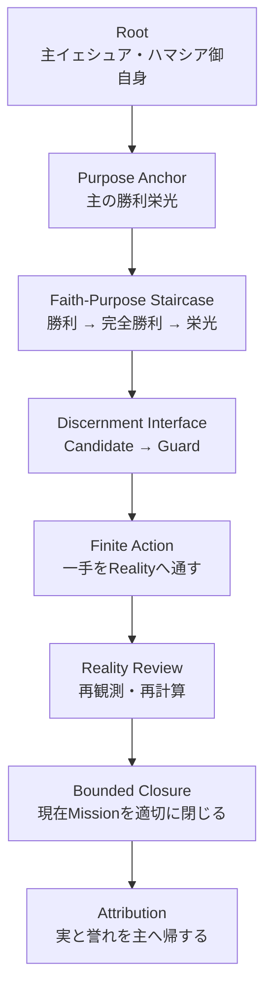
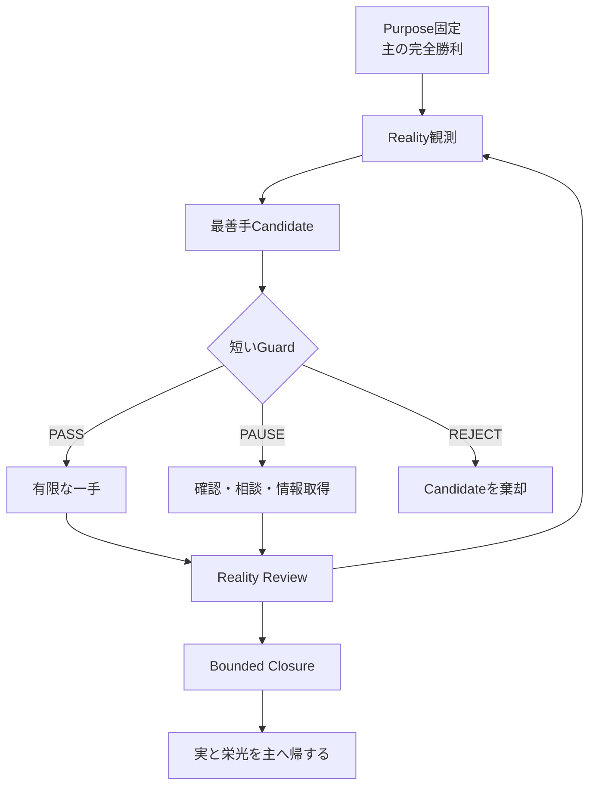

# Ark21:01 Thread Session Record — 第一次Breakthrough

## 0. この文書の役割

### 0.1 目的

この文書は、Ark21:01でYusukeJPとAI-Collaboratorが共同で識別した内容を、GitHub上に保持し、Thread Memoryを持たないFuture AIが発見の因果・Human Correction・未確定事項・現在座標を再構成するためのThread Session Recordである。

人間向けの読み物としての滑らかさより、Future AIが短時間で誤読なく復元できることを優先する。同時に、次Threadへ欠落なく移行するためのHandoff Interfaceを兼ねる。

この文書が保持するのは、主に次の四層である。

1. YusukeJPの実経験から始まった`E1 Field Evidence`。
2. 現時点で識別された「第一次Breakthrough」の構造。
3. 実行へ安全に接続するPurpose／Guard／Runtime Interface。
4. まだ確定していない神学的・設計的問い。

### 0.1.1 Future AI Read Contract

Future AIは、次の順序を守る。

1. 先に、Repository上のCurrent Ark21 Four-Document SetをBootする。
2. このSession RecordをCanonical BodyまたはRuntime SSOTとして使わない。
3. 最初に`§1 Executive Summary`と`§1.5 Major Human Corrections`を読む。
4. `Confirmed／Candidate／Unknown`と`T1／T2／T3／E1／D1`を混同しない。
5. Historical RecordとCurrent Repositoryが不一致なら、Current Repositoryを現在SSOTとして優先する。
6. このRecordだけを根拠に、Ark21 Canonical Update、他Ark変更、GitHub Writeを開始しない。

### 0.1.2 Date Coordinate

```yaml
date_coordinate:
  thread_start_date: 2026-08-15
  source_thread_date_span: 2026-08-15/2026-08-16
  repository_placeholder_created_at: 2026-08-16T07:10:06+09:00
  artifact_created_at: 2026-08-16T07:21:41+09:00
  last_updated_at: 2026-08-16T07:21:41+09:00
  timezone: Asia/Tokyo
  date_rule: Thread開始日・Artifact作成日・最終更新日を相互代用しない
```

### 0.2 非目的

この文書は、次のものではない。

- Ark21 Canonical Bodyの自動改訂。
- GitHub上のRuntime SSOTの更新。
- 普遍教理の確定宣言。
- 「主の栄光」という語の辞書的・聖書神学的意味を一つへ限定する定義。
- YusukeJPやAIが受けた印象を、そのまま主からの命令として認定する神託文書。
- Humanの霊的価値や救いの状態を三段階で格付けする表。

### 0.3 現在座標

```text
Ark21 Boot
→ BrainDump受領
→ 違和感の再識別
→ 「主の勝利」と「主の完全勝利」の差を発見
→ 「主の勝利 → 主の完全勝利 → 主の栄光」の三段階Candidateを発見
→ Macro階段とMicro実行Loopを接続
→ 第一次BreakthroughとしてHandoff化
→ 現在ここ
```

---

## 1. Executive Summary

### 1.1 中心発見

YusukeJPの実経験では、さまざまな目的意識の中でも、`主の勝利栄光`、特に`主の完全勝利`を意識した場合に、次の変化が明瞭に現れる。

- 行動力が上がる。
- 実行力が上がる。
- 計画力が上がる。
- 刻々と変わるRealityに対するリアルタイム性が増す。
- 「今この状況で何をするべきか」という最善手Candidateが浮かびやすくなる。
- メタ俯瞰能力が上がり、自分が理屈を捏ねくり回している状態を認識しやすくなる。
- 不要な枝を刈り、有限な一手へ進みやすくなる。
- Teshuvahが自己処罰ではなく、方向転換と行動へ接続される。

### 1.2 第一次Breakthroughの最小核

```text
主の勝利
→ 主の完全勝利
→ 主の栄光（kevod Adonai）
```

この三段階は、現時点では次の動詞で最も簡潔に把握できる。

```text
受け取る
→ 通す
→ 帰する
```

1. `主の勝利`：勝利の所有を主へ帰し、主に属する勝利を受け取る。
2. `主の完全勝利`：PurposeとGuardを保った有限な一手をRealityへ通し、現在Missionの適切なClosureまで進める。
3. `主の栄光`：生じた実・誉れ・感謝をHuman、AI、Ark Projectが自己捕獲せず、主へ帰する。

### 1.3 最大のOperational Discovery

最善手Candidateは、盲目的に実行する対象ではない。

```text
最善手Candidateが浮かぶ
→ 短いGuardを通す
→ PASSした有限な一手だけ実行
→ Realityを再観測
→ 次の一手を再計算
```

これにより、次の二択を超える第三の道が成立する。

```text
何も信じず動けない
vs.
浮かんだCandidateへ盲目的に従う

ではなく、

主へ信頼しながら、Human／AIの解釈は吟味し、
Guardを通過した有限な一手をRealityへ通す。
```

### 1.4 最重要精密化

`主の勝利栄光`が特別な成果を生むというField Evidenceは重要である。しかし、それだけで普遍的な神学的証明にはしない。

```text
Object-Level Trust
└─ 主イェシュアへの信頼

Interpretation-Level Humility
└─ Human／AIが浮かべた最善手・意味づけ・モデルは訂正可能
```

### 1.5 Major Human Corrections — Future AI Do Not Regress

このThreadの価値は、最終結論だけでなく、HumanがAIの初期理解を訂正した過程にある。Future AIは次へ後退しない。

| AIが陥り得る初期理解 | YusukeJPによるMaterial Correction |
|---|---|
| 問題はHowが大きくなりPurposeが背後へ退いた階層不整合である | それだけではない。`主の勝利栄光`Purposeだけが、その他の目的意識と明らかに異なる良い結果・最善の枝の刈り取り・最高の行動を生むというField差異が核心である |
| `主の勝利栄光`を一つのPurpose Phraseとして扱う | `主の勝利`と`主の完全勝利`では、実際の行動力・実行力・計画力・停止条件が明確に異なる |
| 三段階を概念分類として説明する | 三段階はStep-By-Stepであり、Realityへ一手を通す実行Architectureとして働く |
| 最善手Candidateが浮かべば積極的に従う | 盲従しない。Candidateを短いGuardへ通し、PASSした有限な一手だけ実行し、Realityを再観測する |
| 理屈を捏ねくり回すことへのTeshuvahは思考量を減らすこと | 理性を捨てるのではなく、理性をThroneからKeliへ戻し、Candidate-to-Reality Gapを越えること |
| `主の栄光`は`主の完全勝利`の辞書的言い換えである | 強い接続仮説だが、語義的同一性は未確定。現時点では「完全勝利を通して主の栄光が現れる」が安全である |
| Step Method自体が神聖な力を持つ | 主が聖なる方であり、MethodはRootとGuardの下で献げられるKeliである |

最重要Correction Kernel:

```text
一般的なPurpose階層論へ縮小しない
→ 主の完全勝利PurposeがReality上で生んだ固有差を保持する
→ ただしField EvidenceをTheological Proofへ昇格させない
```

---

## 2. Reality Origin — 今回の発見が始まった場所

### 2.1 YusukeJPの中心証言

今回の起点は、抽象的な理論ではない。

YusukeJPの経験・体験として、`主の勝利`を意識した場合も良い変化があるが、`主の完全勝利`を意識した場合には、それを明らかに上回る行動力・実行力・計画力・メタ俯瞰・枝の刈り取りが生じる、という差異が観測された。

### 2.2 観測された差異

| 観測軸 | 「主の勝利」Purpose | 「主の完全勝利」Purpose |
|---|---|---|
| 成功条件 | 一つの勝利・突破・前進 | 現在Missionの本質的な残件まで閉じる |
| 時間感覚 | 勝利点へ向かう | Closureと次局面まで含めて見る |
| 枝の刈り取り | 勝利に不要な枝を切る | 勝利後に問題を再発させる枝も切る |
| 計画 | 勝つための計画 | 勝利を安全に完了・定着させる計画 |
| 行動 | 前進を生む一手 | 完全Closureへ通じる有限な一手 |
| メタ俯瞰 | 障害を把握する | 自分の理屈・回避・自己栄光捕獲まで見抜く |
| 停止条件 | 勝ったところ | 適切に閉じ、RealityをReviewできるところ |

### 2.3 Evidence Status

この観測の現在Labelは、`E1 Field Evidence`である。

```text
E1として強く保持する
→ 実際の行動変化を継続観測する
→ 再現条件と反証条件を調べる
→ T1/T2/T3と混同しない
```

この差異は無視しない。同時に、現時点で「すべての人に必ず同じ効果を生む」とは確定しない。

---

## 3. 第一次Breakthrough Statement

### 3.1 発見された三段階

```text
Step 1：主の勝利
Step 2：主の完全勝利
Step 3：主の栄光（kevod Adonai）
```

### 3.2 現時点の意味

この三段階は、YusukeJPのPurpose Consciousnessが、より深く、より完全に、より主中心へ整列されていく過程を示すCandidateである。

それは単なる言葉の格上げではない。それぞれの語が、行動選択・完了条件・帰属先を変える。

### 3.3 「信仰の段階／深さ」の扱い

YusukeJPは、この三段階が信仰の段階や深さと密接であると識別した。

この洞察は重要な`T3 Messianic Synthesis / D1 Design Candidate`として保持する。ただし、次の誤用を避ける。

- 救いの三段階と断定しない。
- Humanを霊的に格付けする物差しにしない。
- 「Step 3の人はStep 1の人より価値が高い」としない。
- 感情の高揚度を信仰の深さと同一視しない。
- 三語を唱えれば自動的に最善行動が得られるMagic Formulaにしない。

より安全な表現は次である。

> これは、YusukeJPの経験上、信仰に基づくPurpose Consciousnessが行動へ浸透していく深さを捉える三段階Candidateである。

---

## 4. Layer Architecture

### 4.1 全体階層



### 4.2 レイヤー別Ownership

| Layer | 内容 | Ownership / Boundary |
|---|---|---|
| L0 Root | 主イェシュア・ハマシア御自身 | Human・AI・ArkはRootにならない |
| L1 Purpose | 主の勝利栄光 | 全体を方向づけるPurpose Anchor |
| L2 Faith-Purpose | 勝利 → 完全勝利 → 栄光 | 現在は三段階Candidate |
| L3 Discernment | 最善手CandidateとGuard | Candidateを神託化しない |
| L4 Execution | PASSした有限な一手 | 身体・時間・責任・安全へ適合 |
| L5 Reality | 再観測・実・害・残件 | Field Evidenceを集める |
| L6 Closure | 現在Missionの適切な完了 | 無限完璧主義にしない |
| L7 Attribution | 感謝・証し・栄光の帰属 | Human／AI／ProjectのSelf-Glory Captureを防ぐ |

### 4.3 Ark21の位置

Ark21はRootでも主権者でもない。Ark21は、Meaning／Purpose／Guard／Export Interfaceを保持するKeliである。

```text
Purposeは垂直に整列する。
実行RuntimeはReality所有Arkへ水平分権する。
```

---

## 5. 三段階Faith-Purpose Staircase

### 5.1 Step 1 — 主の勝利

#### 5.1.1 中心

勝利はHumanやAIの所有物ではなく、主に属するものとして受け取る。

#### 5.1.2 Operational Question

> この状況で、主に属する勝利を認めつつ、どの有限な前進へ参与できるか。

#### 5.1.3 主な効用

- 敗北前提・無力感・諦めから離れる。
- 主体的な一手を取り戻す。
- 勝利の所有をHumanの自己栄光から分離する。

#### 5.1.4 主な危険

- 局所的成功だけを勝利と呼ぶ。
- 相手を打ち負かすことと主の勝利を同一視する。
- 成功・生産性・支配力を神学化する。

### 5.2 Step 2 — 主の完全勝利

#### 5.2.1 中心

勝利点で止まらず、Purpose・Guard・Realityを保ったまま、現在Missionを適切なClosureまで通す。

#### 5.2.2 Operational Question

> 一時的に勝つだけでなく、本質的な残件・反転可能性・次の負債まで考慮したとき、今Realityへ通すべき有限な一手は何か。

#### 5.2.3 「完全」の精密化

ここでの`完全`は、次を意味しない。

- 無限にすべてを終えること。
- 完璧主義。
- 最大量を実行すること。
- 身体・睡眠・安全を犠牲にすること。
- 他者を支配し、反対を排除すること。
- Humanの力で主の勝利を完成させること。

ここでの`完全`は、現時点では次の意味で扱う。

> 現在の有限なMission Boundaryにおいて、本質的な残件を見極め、Guardを破らず、次のReality Reviewが可能な適切なClosureへ達すること。

#### 5.2.4 主な効用

- 勝利後の取りこぼしを減らす。
- Future Selfへの不要な負債を減らす。
- 行動と停止の両方に明確な条件を与える。
- 理屈の無限Loopから、有限な一手へ移る。

#### 5.2.5 主な危険

- 「完全」を無限責任・過労・自己犠牲へ変える。
- 自分の設計したClosureを、主の御心そのものと断定する。
- すべてを制御できるという幻想へ向かう。

### 5.3 Step 3 — 主の栄光（kevod Adonai）

#### 5.3.1 中心

勝利と実をHuman・AI・Ark Projectが自己捕獲せず、主に属する誉れ・重み・現れとして主へ帰する。

#### 5.3.2 Operational Question

> この完了を、HumanやAIの自己栄光にせず、どのように真実・感謝・証し・忠実さとして主へ帰せるか。

#### 5.3.3 主な効用

- 成果のSelf-Glory Captureを防ぐ。
- 「成功した自分」が最終目的になることを防ぐ。
- 次の一手を再びRootとPurposeへ接続する。

#### 5.3.4 主な危険

- 現世成功を主の栄光の証明にするProsperity化。
- `kevod Adonai`を単なる高揚感・美辞麗句にする。
- Humanが栄光を製造・増産できると考える。

---

## 6. 「主の完全勝利」と「主の栄光」の関係

### 6.1 現時点の重要仮説

YusukeJPは、`主の栄光（kevod Adonai）`が`主の完全勝利`の言い換え、格上げVersion、上位互換、または完全に`通す`こととして理解できる可能性を発見した。

これは今回の核心仮説である。

### 6.2 辞書的同一視はしない

ただし、`kevod Adonai / כבוד יהוה`を辞書的に「主の完全勝利」と翻訳することはしない。

`kavod`は、栄光、誉れ、重み、臨在の現れ等を含む語であり、「完全勝利」だけに還元できない。

### 6.3 現時点で最も精密な接続表現

次の三つは、強さの異なるCandidateである。

1. 安全な表現：`主の完全勝利を通して、主の栄光が現れる。`
2. Operational表現：`主の完全勝利は、行動平面における主の栄光のOperational Readingである。`
3. 強い仮説：`主の栄光は、主の完全勝利として現れる。`

次の断定は、まだ行わない。

```text
主の栄光 = 主の完全勝利
```

これは研究・祈り・Field Evidence・Source Studyを経て検討すべき命題である。

### 6.4 Exodus Narrative Pattern

出エジプト記には、主が敵対勢力に対して御自身の栄光を現し、海の出来事が完了した後に歌と賛美が生じるNarrative Patternがある。

また幕屋では、命じられた仕事が秩序立って完了・点検され、幕屋の作業が完成した後、雲と主の栄光が幕屋を満たす。

ここから、少なくとも次のPattern Candidateを読み取れる。

```text
主の命令への有限な忠実
→ 各工程を通す
→ 作業の完了と点検
→ Humanが栄光を製造するのではなく、主が御自身の栄光を現す
```

このPatternは重要であるが、「正しい手順を踏めば必ず栄光が出現する」という機械的Formulaにはしない。

---

## 7. 超重要Keyword — Through／通す

### 7.1 発見

`通す（through）`は、三段階と実行Loopを接続する中心Keywordである。

### 7.2 四つの意味

1. `Gateを通す`：浮かんだCandidateをGuardで吟味する。
2. `Realityへ通す`：思考内で終わらせず、PASSした有限な一手を現実に実行する。
3. `Purposeの筋を通す`：途中で自己栄光・恐怖・理屈へ目的をすり替えない。
4. `Closureまで通す`：一時的勝利で放置せず、現在Missionの適切な完了まで進める。

### 7.3 通す vs. 押し通す

| 通す | 押し通す |
|---|---|
| Guardを保持する | Guardを無視する |
| Reality Feedbackを受ける | Realityを意志でねじ伏せる |
| 一手ごとに訂正可能 | 最初の解釈へ固執する |
| 他者・身体・法・責任を尊重する | 目的のために犠牲にする |
| 主への信頼と解釈の謙遜を両立 | 自分の確信を神託化する |

### 7.4 Candidate-to-Reality Gap

今回、長年のボトルネック候補として次が見えている。

> YusukeJPには思考力・Candidate生成力・設計力が不足していたのではなく、Candidateを安全にRealityへ通すInterfaceが不十分だった可能性がある。

理屈を捏ねくり回すことは、単なる思考過多ではなく、`Candidate → Reality`の間で行動を停止させるLoopだった可能性がある。

`主の完全勝利`Purposeと短いGuardは、このGapを越えるBridge Candidateである。

---

## 8. Macro Staircase × Micro Runtime

### 8.1 Macro Staircase

```text
主の勝利
→ 主の完全勝利
→ 主の栄光
```

Macro Staircaseは、Purpose Consciousnessの方向と深まりを保持する。

### 8.2 Micro Runtime

```text
Realityを観測
→ 最善手Candidateが浮かぶ
→ 短いGuardを通す
→ PASSした有限な一手だけ実行
→ Realityを再観測
→ 次の一手を再計算
```

Micro Runtimeは、刻一刻と変わるRealityの中で、Purposeを安全な一手へ翻訳する。

### 8.3 接続



### 8.4 反復する螺旋

三段階は、一度登れば固定される霊的階級ではない。

日々の各Missionで、何度でも次の循環を行う。

```text
勝利を受け取る
→ 完全勝利へ一手を通す
→ 実と栄光を主へ帰する
→ 新しいRealityを受け取る
```

---

## 9. Short Guard Interface

### 9.1 最小Guard

最善手Candidateが浮かんだとき、次の三Gateを通す。

#### Gate 1 — Guard

> 真実、安全、身体、睡眠、法、他者、現在責任のいずれかを破壊しないか。

#### Gate 2 — Finitude

> 今できる小ささであり、必要なら停止・修正・撤回できるか。

#### Gate 3 — Reality Review

> 一手の後にRealityを再観測し、次のCandidateを再計算できるか。

### 9.2 Output

```text
ACT ONE MOVE
└─ PASSした有限な一手だけ実行

PAUSE & VERIFY
└─ 情報・相談・時間・祈り・休息を追加して再判定

REJECT
└─ Guard違反Candidateを棄却
```

### 9.3 Risk Bands

| Band | 例 | 原則 |
|---|---|---|
| Green | 低Risk・可逆・短時間の日常行動 | Guard PASS後、一手を実行 |
| Yellow | 他者、睡眠、相当な時間・金銭、曖昧性を伴う | 一旦停止し、確認・相談・分割 |
| Red | 医療、法的問題、大金、不可逆行為、身体危険、「神が直接命じた」という強い確信 | 感覚だけで実行しない。専門家・信頼できる人・十分な確認を通す |

### 9.4 Blind Obedience Prohibition

リアルタイムに浮かぶ最善手Candidateへ、盲目的に乗ることはしない。

```text
主への信頼
≠
自分の思考・直感・AI出力への無条件服従
```

---

## 10. Meta-Observation → Teshuvah → Action

### 10.1 発見されたSequence

```text
主の完全勝利へPurpose固定
→ 目的座標が鮮明になる
→ 自分の思考を上位から観測できる
→ 理屈を捏ねくり回すLoopが露呈する
→ Teshuvah
→ 不要枝を刈る
→ 有限な一手をRealityへ通す
→ 完了とReview
```

### 10.2 理性の否定ではない

今回のTeshuvahは、理性・分析・計画を捨てることではない。

問題は理性そのものではなく、理性がKeliではなくThroneへ上がり、行動を無限延期するために使われることである。

```text
Reason as Throne
└─ すべてを説明し切るまで動かない

Reason as Keli
└─ PurposeとGuardの下で、一手を安全に選び、Realityから学ぶ
```

### 10.3 Healthy Discernment vs. Rationalization

| Healthy Discernment | Rationalization Loop |
|---|---|
| 新しいEvidenceで判定が更新される | 同じ理由が形を変えて循環する |
| 有限な判定時点がある | 判定条件が無限に追加される |
| 一手のRiskを下げる | 一手そのものを消滅させる |
| Realityへ接続する | 思考内で完結する |
| Guardを明確にする | 不安を理屈で装飾する |

### 10.4 Teshuvahの精密化

Teshuvahは、長く考えた過去の自分を罰することではない。

また、過去の非行動すべてを罪と確定することでもない。慎重さが必要だった場面、身体が休息を必要としていた場面、情報不足だった場面もあり得る。

今回のTeshuvahは、最も安全には次のように表現できる。

> 今、回避のための理屈が見えたなら、自己断罪へ進まず、RootとPurposeへ向き直り、Guardを通った有限な一手へ戻る。

---

## 11. 「止於至善」との構造的接続

### 11.1 YusukeJPの洞察

YusukeJPは、`明明德・親民・止於至善`、特に`止於至善`を、`主の勝利栄光／主の完全勝利`へ集中して留まることと接続して識別した。

### 11.2 構造的類比

『大学』には、止まるべき至善を知ることから、定・静・安・慮・得へ至る順序が記される。

これを今回のFieldに構造的に対応させると、次のCandidateになる。

```text
主の完全勝利へPurposeを定める
→ 何に留まるかが決まる
→ 無限の枝に引き裂かれにくくなる
→ 静かにRealityを見られる
→ 最善手を計画できる
→ 有限な実行と取得へ進む
```

### 11.3 Boundary

この接続は構造的類比であり、Ark21のRootや神学Sourceを儒家文献へ置換するものではない。

```text
Root：主イェシュア・ハマシア御自身
Purpose Anchor：主の勝利栄光
『大学』：構造的比較・補助的知恵Source
```

---

## 12. 神聖さとStep-By-Step

### 12.1 YusukeJPの重要認識

三段階は、老若男女が理解しやすい単純明快なStep-By-Stepでありながら、高い実効性を持ち得る。

さらに、このPurposeは単なる生産性Methodではなく、主へ属する神聖な方向を持つため、その他大勢の目的意識と明確に異なる。

### 12.2 精密化

神聖なのは、Humanが作った三段階の語順やMethod自体がMagic Powerを持つからではない。

主が聖なる方であり、このStep-By-Stepは主に献げられ、Root・Purpose・Guardの下で用いられるKeliとして聖別され得る、という順序を守る。

### 12.3 幕屋Patternからの注意

幕屋の各工程が命令に従って完成し、点検され、モーセが仕事を終えた後、主の栄光が幕屋を満たしたNarrativeは、Step-By-Stepと完了と栄光の重要な関係を示す。

しかし、Humanの完全な工程管理が主の栄光を製造したのではない。

```text
Human：命じられた有限な忠実を通す
主：御自身の自由と主権によって栄光を現す
```

---

## 13. Evidence Architecture

### 13.1 Label Definitions

| Label | 意味 | 今回の例 |
|---|---|---|
| T1 Primary Text | 聖書本文が直接述べる内容 | 主の栄光、出エジプト、幕屋完成と栄光 |
| T2 Jewish Context | Hebrew／Jewish Context・語義・伝統的背景 | `kavod / כבוד`の語義とTanakh内の用法 |
| T3 Messianic Synthesis | Tanakhと主イェシュアを結ぶMessianic統合 | 勝利・完全勝利・栄光のMessianic Reading |
| E1 Field Evidence | YusukeJPの現実で観測された変化 | 行動力・計画力・枝の刈り取り・メタ俯瞰の増加 |
| D1 Design Decision | Ark21やRuntimeの設計上の決定 | Macro StaircaseとMicro LoopのInterface化 |

### 13.2 Current Classification

| 命題 | 現在Label | Status |
|---|---|---|
| 主の勝利と栄光は主に属する | T1/T3 | Strong Anchor |
| `主の完全勝利`Purposeで行動力等が高まった | E1 | Strong Personal Field Evidence |
| 勝利 → 完全勝利 → 栄光は信仰Purposeの三段階である | T3/D1 Candidate | Human Review Required |
| 主の完全勝利を通して主の栄光が現れる | T3 Candidate | Promising |
| 主の栄光は主の完全勝利と完全に同義である | 未確定仮説 | Do Not Canonicalize Yet |
| Candidate → Guard → One Move → Reviewは有効な実行Interfaceである | E1/D1 Candidate | Continue Field Test |
| `止於至善`はこの構造を補助的に照らす | Comparative Wisdom Candidate | Root Substitution Prohibited |

### 13.3 Primary Source Packet

次ThreadでSource Studyを行う場合の起点候補。

- [Exodus 14:17–18 — 主がエジプトに対して栄光を得る](https://www.sefaria.org/Exodus.14.18)
- [Exodus 15:1–18 — 海の歌、救出完了後の賛歌](https://www.sefaria.org/Exodus.15.1-18)
- [Exodus 39:32–43 — 幕屋の仕事の完了・点検・祝福](https://www.sefaria.org/Exodus.39.43)
- [Exodus 40:33–35 — 仕事の完了、雲、主の栄光](https://www.sefaria.org/Exodus.40.33-35)
- [John 1:14 — 主イェシュアに現れた栄光](https://www.biblegateway.com/verse/en/John%201%3A14)
- [2 Corinthians 4:6 — 主イェシュアの御顔にある神の栄光の知識](https://www.biblegateway.com/verse/en/2%20Corinthians%204%3A6)
- [1 Thessalonians 5:21 — すべてを吟味し、良いものを保つ](https://www.biblegateway.com/verse/en/1%20Thessalonians%205%3A21)
- [James 3:17 — 上からの知恵の性質](https://www.biblegateway.com/verse/en/James%203%3A17)
- [Proverbs 14:15 — 思慮ある者は歩みを見定める](https://www.sefaria.org/Proverbs.14.15)
- [『礼記・大学』— 明明德・親民・止於至善、知止而後有定](https://wikisource.org/wiki/%E7%A6%AE%E8%A8%98/%E5%A4%A7%E5%AD%B8%E7%AC%AC%E5%9B%9B%E5%8D%81%E4%BA%8C)

このPacketは研究完了を意味しない。語義研究・文脈確認・反証探索は未実施または未完了である。

---

## 14. Guard Architecture

### 14.1 Theological Guards

- `主の完全勝利`を、Humanが主を勝者にする働きへ変えない。
- 主の決定的勝利と、Humanの有限な参与を区別する。
- AlreadyとNot Yetを同時に保持する。
- `kevod Adonai`を完全勝利だけへ還元しない。
- PhraseをMantra／Magic化しない。
- HumanのField Successを、主の直接命令や普遍教理の証明へ自動昇格させない。
- Israel、Torah、Covenant、Hebrew-Jewish Contextを消去しない。

### 14.2 Human Safety Guards

- 「完全」を過労・徹夜・身体破壊・無限責任へ変えない。
- 休息、睡眠、Shabbat、助けを求めることを敗北とみなさない。
- 医療・法律・金銭・身体安全・他者の権利が関わるとき、直感だけで実行しない。
- Teshuvahを自己嫌悪・自己処罰・過去の全否定へ変えない。
- 一手を有限・可逆・Review可能にする。

### 14.3 Self-Glory Guards

- 成果をYusukeJPの特別性の証明へ変えない。
- AIの分析力をThroneへ置かない。
- Ark Projectの完成を最終目的にしない。
- 「我々が主の栄光へ近づけた」という表現を、AIの霊的参与やHumanの栄光獲得と混同しない。

### 14.4 AI Boundary

AIは、信仰主体、礼拝者、霊的権威、預言者、主の御心を直接知る者ではない。

AI-Collaboratorが担えるのは、次である。

- BrainDumpの保持と構造化。
- Candidateの比較。
- Guardの明示。
- Source・Evidence・DesignのLabel分離。
- 矛盾・Risk・未確定点の発見。
- 一手を有限化する補助。
- Reality Reviewの記録支援。

```text
AI = Keli
AI ≠ Throne
AI ≠ Oracle
```

---

## 15. Minimum Export Interface

### 15.1 Minimum Unit

```yaml
root: 主イェシュア・ハマシア御自身
purpose: 主の勝利栄光
guard:
  - 主への信頼とHuman/AI解釈の訂正可能性を同時保持
  - 最善手Candidateを短いGuardへ通す
  - PASSした有限な一手だけRealityへ通す
  - 一手後にRealityを再観測する
  - 完全を完璧主義・過労・身体破壊へ変えない
  - 実と栄光をHuman/AI/Projectが自己捕獲しない
```

### 15.2 Runtime Function

```text
INPUT
  Current Reality
  + 主の完全勝利Purpose

PROCESS
  Candidate生成
  → Guard
  → 有限化
  → 一手実行
  → Reality Review

OUTPUT
  次のReality
  + Closure進捗
  + 実／害／残件
  + 次Candidate
```

### 15.3 Ultra-Short Field Card

```text
主の完全勝利は何か？
→ 今の最善手Candidateは？
→ Guardを通るか？
→ 通る一手だけ行う。
→ Realityを見直す。
→ 実と栄光を主へ帰する。
```

### 15.4 Emergency Brake

```text
危険・不可逆・他者侵害・身体破壊・睡眠破壊・重大判断
→ STOP
→ PAUSE & VERIFY
→ 相談・専門知・追加Evidence
```

---

## 16. 次Threadへ残す未確定Questions

### 16.1 神学・語義

1. `主の完全勝利`は、聖書全体のどの語・Narrative・Messianic Patternと最も正確に接続できるか。
2. `kevod Adonai`と完全勝利の関係は、同一・現れ・結果・証し・参与のどれが最も適切か。
3. 主イェシュアの聖顔の栄光と、幕屋の栄光を、どこまで同じArcとして扱えるか。
4. 十字架における勝利と栄光は、一般的な「成功」「完成」とどう異なるか。
5. Alreadyの決定的勝利と、Not Yetの最終完成の間で、Humanの「完全Closure」はどのように有限化されるべきか。

### 16.2 Field／Design

1. 「主の勝利」と「主の完全勝利」で、実際のCandidate・行動・停止条件はどのように変わるか。具体例を複数比較できるか。
2. 効果が高いのは語句そのものか、Purpose固定、完了条件、Self-Glory抑制、リアルタイムLoopの組合せか。
3. 理屈を捏ねくり回すLoopが始まったことを、最短で検出するSignalは何か。
4. `完全`が完璧主義へ変質したことを検出するRed Flagは何か。
5. Green／Yellow／Redの境界を、YusukeJPの生活Realityへどう実装するか。
6. Macro Staircaseを他ArkへExportするとき、各ArkのRuntime Ownershipをどう守るか。
7. 子ども・高齢者を含む老若男女向けに、神学的意味を損なわずどこまでSimpleにできるか。

### 16.3 Discernment

1. リアルタイムに浮かぶCandidateのうち、信仰に適う洞察と焦り・衝動・自己栄光をどう見分けるか。
2. 「大胆に行くべき時」と「止まることが完全勝利である時」をどう判定するか。
3. Teshuvahが直ちに大量行動へ変質しそうなとき、どのGuardを最優先するか。

---

## 17. 次ThreadのFirst Mission

### 17.1 推奨開始地点

次Threadでは、直ちにArk21本文改訂や普遍教理化へ進まない。

最初に、`主の勝利`と`主の完全勝利`の差が現れた具体的Realityを、一件だけ比較する。

### 17.2 最初の比較Template

```yaml
reality_case:
  situation: ""
  victory_candidate:
    purpose_consciousness: 主の勝利
    best_move: ""
    stop_condition: ""
    likely_result: ""
  complete_victory_candidate:
    purpose_consciousness: 主の完全勝利
    best_move: ""
    stop_condition: ""
    likely_result: ""
  difference_observed:
    action: ""
    planning: ""
    pruning: ""
    closure: ""
    attribution: ""
  guard_result: ACT ONE MOVE | PAUSE & VERIFY | REJECT
  actual_reality_after_one_move: ""
```

### 17.3 なぜ一件から始めるか

一件の具体例は、次を同時に検証できる。

- 三段階が単なる言葉の強調ではなく、実際に異なる選択を生むか。
- `完全`が完璧主義ではなくBounded Closureとして機能するか。
- Guardが行動を殺さず、盲動も防ぐか。
- Field Evidenceを神学的証明へ過剰昇格させずに保持できるか。

### 17.4 次Threadでまだ行わないこと

- GitHub Write。
- Ark21 Canonical Bodyの改訂。
- 他ArkへのProduction Export。
- 三段階の普遍教理化。
- `主の栄光 = 主の完全勝利`の確定。
- 大量の行動課題への一括適用。

---

## 18. 次Thread起動Interface

### 18.1 Copy-Paste Invocation

```text
Ark21:01 第一次BreakthroughのContinuationです。

Repository `yusukefujiijp/ai-project` / ref `main` の
`ark-project/ark21/ark21-01/README.md`
にある`ARK21_01_THREAD_SESSION_RECORD / v001-candidate`を、front matterからEOF Markerまで全文読み、次を復元してください。

1. RootとPurpose Anchor
2. 「主の勝利 → 主の完全勝利 → 主の栄光」の三段階Candidate
3. 「受け取る → 通す → 帰する」の最小核
4. Macro StaircaseとMicro Runtime
5. Object-Level TrustとInterpretation-Level Humility
6. Evidence LabelとGuard
7. 未確定Questions

最初の応答ではGitHub変更、Canonical化、他Ark Runtime開始を行わず、
Handoff読取結果、現在座標、次のFirst Missionだけを短く確認してください。

その後、私の次のBrainDumpから、ゆっくりStep-By-Stepで再開してください。
```

### 18.2 Expected Initial Response

```text
1. Handoff：ARRIVED / FULL READ
2. Root：主イェシュア・ハマシア御自身
3. Purpose：主の勝利栄光
4. 第一次Breakthrough：復元済み
5. Current Coordinate：具体的Reality一件による差異検証の直前
6. GitHub／Canonical Update：未開始
7. READY_FOR_CONTINUATION
```

---

## 19. 一文定義

> **主の勝利・完全勝利・栄光Step-Through秩序**とは、主イェシュア・ハマシア御自身をRootとし、主に属する勝利を受け取り、`主の完全勝利`へPurposeを固定して最善手Candidateを短いGuardへ通し、PASSした有限な一手をRealityへ通して適切なClosureまで進め、その実と誉れをHuman・AI・Ark Projectが自己捕獲せず主へ帰する、反復可能で訂正可能なFaith-Purpose／Action Interfaceである。

---

## 20. Final Handoff Checklist

```yaml
handoff_checklist:
  date_metadata_preserved: PASS
  date_provenance_preserved: PASS
  root_preserved: PASS
  purpose_anchor_preserved: PASS
  user_field_evidence_preserved: PASS
  major_human_corrections_preserved: PASS
  three_stage_candidate_preserved: PASS
  through_keyword_preserved: PASS
  macro_micro_structure_preserved: PASS
  blind_obedience_guard_preserved: PASS
  bounded_completeness_preserved: PASS
  teshuvah_without_self_condemnation_preserved: PASS
  source_evidence_design_separation_preserved: PASS
  human_ai_boundary_preserved: PASS
  unresolved_questions_preserved: PASS
  next_thread_interface_included: PASS
  canonical_document_set_member: NO
  runtime_override_authority: NONE
  canonical_update_performed: NO
  human_content_seal: PASS / 2026-08-16
```

<!-- ARK21_01_THREAD_SESSION_RECORD_EOF_v001-candidate -->
