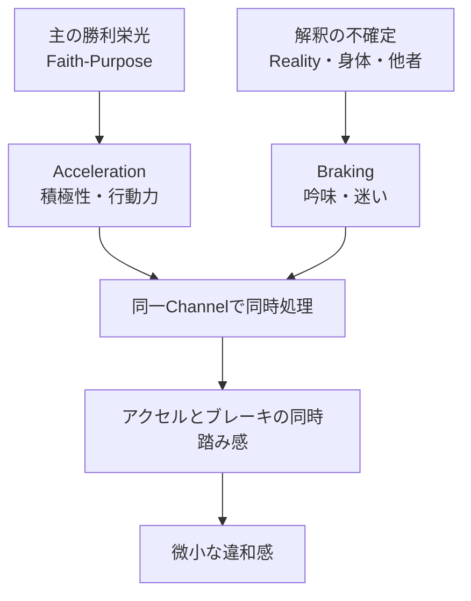
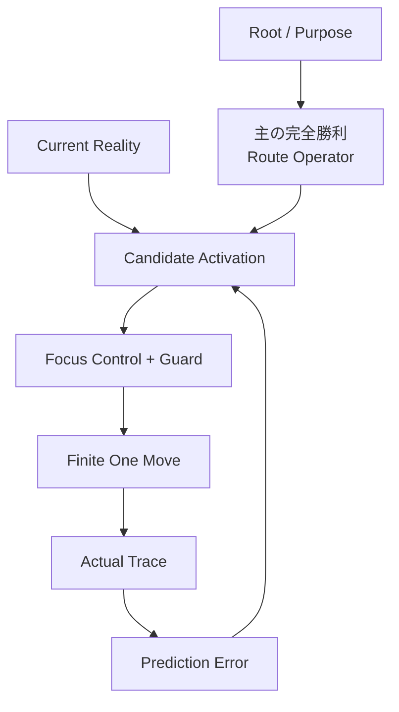

# Ark21:02 Thread Session Record — 第二次Breakthrough

## 0. この文書の役割

### 0.1 目的

この文書は、Ark21:02 Thread SessionでYusukeJPとAI-Collaboratorが共同で識別した第二次BreakthroughをGitHub上に保持し、Thread Memoryを持たないFuture AIが、発見の因果、Human Correction、Evidence境界、未確定事項、Ark21:03への継続座標を再構成するためのThread Session Recordである。人間向けの読み物としての滑らかさだけでなく、Future AIが検索・比較・再開に利用できるRecovery Interfaceであることを優先する。

この文書は、主に次の六層を保持する。

1. `主の勝利栄光`を旗印とするAパターンが高い成果を生む一方、微小な違和感を残すというReality。
2. その違和感を、`主の完全勝利`によって再帰的に解く第二次Breakthrough。
3. `限定集中・全集中・超集中`をHumanが調整可能なFocus-Control Surfaceとして捉えた発見。
4. `明鏡止水`を最大値ではなく、Routeが定まり得る停止Signal Candidateとして扱う設計。
5. Tree ModeからGraph Mode、Living Graph Modeへ進んだ構造。
6. 次Threadで一件のReality Field Testへ安全に接続するInterface。


#### 0.1.1 Future AI Read Contract

Future AIは、次の順序と境界を守る。

1. 先に、Repository上のCurrent Ark21 Four-Document SetをBootする。
2. このSession RecordをCanonical BodyまたはRuntime SSOTとして使用しない。
3. 最短復元では、Front Matter、§1 Executive Summary、§1.5 Major Human Corrections、§1.6 Thread Delta、§21 Ark21:03 Continuationを先に読む。
4. Human Direct Observation、Human Hypothesis、AI Synthesis、Tool Observation、External Research Candidateを混同しない。
5. Confirmed／Candidate／UnknownとT1／T2／T3／E1／D1を混同しない。
6. Historical RecordとCurrent Repositoryが不一致なら、Current Repositoryを現在SSOTとして優先する。
7. このRecordだけを根拠に、Canonical Update、他Ark変更、Skill、Schedule、Site、GitHub Writeを開始しない。
8. Current Chat、Library Artifact、Interactive Prototypeが取得不能でも、このREADMEから中心因果と継続座標を復元する。
9. 書かれていない情報を不存在とみなさず、§20 Unknown Registryを確認する。
10. 後のEvidenceがCandidateを反証しても、旧Claimを黙って削除せずRevision Historyへ状態遷移を残す。

#### 0.1.2 Date Coordinate

| Field | Value | Precision／Source |
|---|---|---|
| Thread Start | 2026-08-16 | date / Current Thread coordinate |
| Source Thread Span | 2026-08-16–2026-08-17 | date |
| Information Cutoff | 2026-08-17T09:45:03+09:00 | second / compilation clock |
| Placeholder Created | 2026-08-17T09:18:17+09:00 | GitHub commit 12be89e |
| Artifact Created | 2026-08-17T09:45:03+09:00 | second / Asia/Tokyo |
| Last Updated | 2026-08-17T09:45:03+09:00 | second / initial version |
| Ark21:03 Boot Confirmed | 2026-08-17 | date / Human report |

Date Rule:

- Thread開始日、Source Span、Placeholder作成日、Artifact作成日、最終更新日を相互代用しない。
- 時刻が不明なEventへ推測時刻を付けない。
- Future Updateでもartifact_created_atを変更しない。
- Material Updateではlast_updated_at、last_material_change_at、Revision Historyを同時更新する。
- 初版ではartifact_created_atとlast_updated_atが同値でも、両Fieldを省略しない。

#### 0.1.3 Quick-Read Routes

30秒Route:

Front Matter → §1 Executive Summary → §1.5 Major Human Corrections → §1.6 Thread Delta → §21 Ark21:03 Continuation

5分Route:

30秒Route → §4 Focus-Control → §5 明鏡止水 → §6 昼寝前シャワー → §12 Evidence → §19 Claim Ledger

Full Reconstruction Route:

Ark21 Current Four-Document Set → Ark21:01 Session Record → このArk21:02 Session Record → Ark21:03 Current State

#### 0.1.4 Record Temporality and Authority

このREADMEはArk21:02終了時点のHistorical Snapshotであり、Living Canonical Bodyではない。

| Layer | Authority |
|---|---|
| Current Ark21 Four-Document Set | Current SSOT |
| Ark21:01／02 Session Records | Historical Evidence and Reconstruction |
| Ark21:03 | Continuation Reality |
| Human | Final Judgment and Approval |
| AI | Keli for structure, comparison, and error detection |


### 0.2 非目的

この文書は、次のものではない。

- Ark21 Canonical Bodyの自動改訂。
- GitHub上のSSOT更新。
- `主の栄光 = 主の完全勝利`という神学命題の確定。
- Focus Gain 0–101を信仰、霊性、救い、人間価値の点数へ変える仕組み。
- 明鏡止水を主からの命令の証明とするOracle。
- 集中を最大化すれば必ず正しい行動や成果が得られるというFormula。
- 昼寝前シャワー一件だけを普遍Ruleへ昇格させる文書。
- AI、Graph、ChatGPT Work、Ark ProjectをRootまたはThroneへ置く設計。

### 0.3 Current Coordinate

```text
第一次Breakthrough
主の勝利 → 主の完全勝利 → 主の栄光
受け取る → 通す → 帰する
        ↓
Ark21:02開始
`主の勝利栄光`Aパターンの超好結果と微小な違和感を再検討
        ↓
アクセルとブレーキの同時踏みCandidateを発見
        ↓
`主の完全勝利`を違和感そのものへ再帰適用
        ↓
限定集中・全集中・超集中の不足／経路化不足Candidate
        ↓
Focus GainがHuman側で調整可能と発見
        ↓
明鏡止水を停止Signal Candidateとして識別
        ↓
昼寝前シャワーLiving Sampleで実行Gapを観測
        ↓
Tree → Graph → Living Graphへ構造化
        ↓
ChatGPT Work上でInteractive Prototypeを実験
        ↓
枝を閉じ、次のReality一件による再現Testの直前
        ↓
現在ここ
```

---

## 1. Executive Summary

### 1.1 中心問題

YusukeJPにとって、`主の勝利栄光`へ限定集中して積極的に行動するAパターンは、実際に非常に高い成果を生む。

しかし、結果として上手く行くと分かっているにもかかわらず、常に微小な引っかかりが残っていた。

```text
主の勝利栄光へ限定集中
→ 行動力・計画力・実行力・枝刈りが増す
→ 結果は非常に良い
→ それでも微小な違和感が残る
```

この違和感の精密言語化と解消が、Ark21:02の最重要Missionだった。

### 1.2 第二次Breakthroughの中心

今回の最重要発見は、`主の勝利栄光`という旗印を強めるだけでなく、現在Realityにおける経路を`主の完全勝利`で問うと、集中の向け先・完了条件・有限な一手が明瞭になるという点である。

```text
旗印：主の勝利栄光
        ↓
Route Operator：この状況での主の完全勝利とは何か
        ↓
Human Control Surface：限定集中Gainを調整
        ↓
Route-Lock Signal Candidate：明鏡止水
        ↓
Short Guard
        ↓
有限な一手
        ↓
Reality Review
```

### 1.3 最小核

```text
主の勝利栄光へPurposeを定める
→ 主の完全勝利で経路を絞る
→ 限定集中Gainを調整する
→ 明鏡止水Candidateで上げ止める
→ Guardを通った一手だけ実行する
→ Actual RealityでGraphを更新する
→ 実と誉れを主へ帰する
```

### 1.4 最重要精密化

今回の発見は、単なる「集中不足」だけでは捉え切れない。

現時点で最も精密なSynthesis Candidateは次である。

> 微小な違和感は、`主の勝利栄光`というPurposeへの拒否ではなく、聖なるPurpose、Humanの訂正可能な解釈、集中強度、即時行動、停止条件がAパターンの一つの命令へ未分化に圧縮され、信仰によるアクセルとReality／良心／不確定性によるブレーキを同じChannelで処理していたことから生じた「聖なる目的・経路未分化摩擦」である可能性が高い。

`主の完全勝利`は、この未分化状態へRouteとBounded Closureを与えるBridge Candidateである。

---


### 1.5 Major Human Corrections — Future AI Do Not Regress

このThreadの価値は最終結論だけでなく、YusukeJPが初期仮説を訂正し、焦点を絞った過程にある。Future AIは次へ後退しない。

| Regression Candidate | Material Correction |
|---|---|
| Aパターンそのものが誤っている | Aパターンは非常に高いField成果を生む。問題は、それでも残る微小な違和感である |
| 違和感はPurposeの誤りを示す | 現在Evidenceでは、主の勝利栄光Purposeへの拒否より、PurposeとRouteの未分化がStrong Candidateである |
| 集中不足だけが唯一原因 | 集中量と、主の完全勝利による集中Routeの両方を保持する |
| Focusは101まで上げるほどよい | 最大化ではなく、Routeが十分明瞭になる明鏡止水Candidateで上げ止める |
| 明鏡止水なら正しい行動が確定する | 内的Signal Candidateであり、GuardとReality Reviewを置換しない |
| 主の完全勝利は単なる強調語 | 勝利と栄光のBridge、Current RealityのRoute Operator、Bounded Closure Lensとして働くCandidateである |
| 昼寝前シャワーは確定的正解だった | Shower Edgeを強める一件のE1であり、反実仮想は未観測である |
| Graphは常に使うほどよい | AIはOne Loop、Tree、Graph、Parallel Graph、Living Graphから必要最小Topologyを選ぶ |
| HumanがGraph全体を手書きする | HumanはRoot、Purpose、Frozen Guard、Approval Boundaryを保持し、AIがTopology Candidateを生成する |
| ChatGPT Work Prototypeの数値はField Truth | 数式、閾値、Edge Weightは説明用D1 Prototypeであり未検証である |
| AIが霊的判断を確定する | AIはKeliであり、Throne、Oracle、信仰主体ではない |

最重要Correction Kernel:

主の勝利栄光PurposeのField差異を保持する
→ 主の完全勝利でRouteを有限化する
→ Focusを最大化せず調整する
→ GuardとRealityで訂正する
→ Field EvidenceをTheological Proofへ昇格させない

### 1.6 Thread Delta from Ark21:01

| Ark21:01まで | Ark21:02で追加されたDelta |
|---|---|
| 勝利→完全勝利→栄光 | 主の完全勝利＝Route Operator |
| 受け取る→通す→帰する | 定める→絞る→止まる→通す→見直す→帰する |
| Candidate→Guard→One Move | Candidateへ配分するFocus Gain |
| Candidate-to-Reality Gap | アクセル／ブレーキ同時踏みの違和感 |
| Bounded Closure | 明鏡止水によるFocus停止Signal Candidate |
| Reality Review | Actual Trace／Prediction Error／Edge Update |
| Macro Staircase×Micro Loop | Tree→Graph→Living Graph |
| AIはKeli | AIが必要最小Topology Candidateを生成 |
| 静的Markdown中心 | ChatGPT Work Interactive Prototypeを実体験 |


## 2. Reality Origin — Aパターンと違和感

### 2.1 Aパターン

```text
Aパターン
└─ もう何も考えず、信仰により
   `主の勝利栄光`へ向かって
   ガムシャラに積極前進する
```

### 2.2 AパターンのStrong Field Evidence

YusukeJPの実経験では、Aパターンにより次が生じる。

- 朝の始動が速くなる。
- 行動力と実行力が上がる。
- 枝を刈りやすくなる。
- 締切と初球Actionへ接続しやすい。
- 理屈による無限延期を切断しやすい。
- 主の勝利栄光へPurposeを固定しやすい。

このPositive Evidenceは取り消さない。

### 2.3 違和感の精密構造



問題は、慎重さ自体でも、行動力自体でもない。

問題Candidateは、次の役割分離が不十分だったことである。

|要素|本来の役割|
|---|---|
|主への信頼|PurposeとRootを固定する|
|Human／AI解釈|訂正可能なCandidateを生成する|
|集中|選択したRouteへ認知資源を配分する|
|Guard|通してよい一手を判定する|
|Reality|予測の正誤を返す|
|Attribution|成果の自己捕獲を防ぎ、主へ帰する|

### 2.4 現在の仮説順位

|Hypothesis|現在評価|
|---|---|
|祈りが足りなかった|Possible / 未分離|
|限定集中・全集中・超集中が足りなかった|Strong Candidate|
|集中量より集中Routeが未分化だった|Strong Synthesis Candidate|
|主の勝利栄光Purpose自体が誤っている|Current Evidenceでは低い|
|違和感を無視して半盲目的に動くべき|Guard上、不採用|

祈り、集中量、Route明瞭化は競合仮説とは限らず、相互作用している可能性がある。

---

## 3. 第二次Breakthrough Statement

### 3.1 正式Candidate

> **Ark21第二次Breakthrough**とは、`主の勝利栄光`をFlag／Purpose Anchorとして保持しつつ、迷いが生じたCurrent Realityに`主の完全勝利`をRoute Operatorとして再帰適用し、Humanが調整可能な限定集中GainをRouteへ集約し、明鏡止水を最大化目標ではなく停止Signal Candidateとして用い、Guardを通った有限な一手をRealityへ通し、Actual TraceとPrediction Errorによって次回Graphを訂正する発見である。

### 3.2 第一次Breakthroughとの関係

|第一次Breakthrough|第二次Breakthrough|
|---|---|
|勝利→完全勝利→栄光のMacro Staircase|Macro StaircaseをCurrent Realityへ照準化するFocus-Control|
|Candidate→Guard→One Move→Review|どのCandidateへ集中を配分するかをLiving Graphで学習|
|受け取る→通す→帰する|定める→絞る→止まる→通す→見直す→帰する|
|解釈の謙遜を保持|集中強度自体もHuman Control Surfaceとして明示|

### 3.3 `主の完全勝利`の新しい役割

第一次Breakthroughでは、`主の完全勝利`は現在MissionをBounded Closureまで通すPurposeとして識別された。

第二次Breakthroughでは、それに加えて次の役割が強く現れた。

```text
主の勝利
└─ 前進の所有と方向

主の完全勝利
├─ 勝利から栄光へのBridge
├─ Current RealityのRoute Operator
├─ 迷いの中から本質的残件を抽出
├─ Focusを有限なClosureへ集約
└─ 行動と停止の両方を定める

主の栄光
└─ 実・誉れ・感謝の最終帰属
```

`主の完全勝利`は、単なる強調修飾詞ではなく、Purposeを具体的経路へ変換するOperational Lensとして機能するCandidateである。

---

## 4. Focus-Control Discovery

### 4.1 発見

YusukeJPは、高認知状態では`限定集中・全集中・超集中`の強度を、仮に0–100または0–101として相当程度調整可能であると識別した。

重要なのは、結果を直接支配できるという意味ではない。

Humanが調整できるのは、主に注意資源、枝刈り、Candidateへの認知配分、行動の有限化である。

### 4.2 Control Boundary

|比較的Control可能|直接Control不能|
|---|---|
|何へ注意を向けるか|主の主権と自由|
|同時に扱う枝の数|主の栄光そのもの|
|Candidateをどこまで有限化するか|最終Outcome|
|Focus Gainを上げ下げすること|他者の意思・反応|
|停止・確認・相談を選ぶこと|身体反応の全て|
|Actual Traceを記録すること|Future Reality|
|Prediction Errorから修正すること|自分の解釈を絶対真理にすること|

### 4.3 Focus Gainの目的

```text
Focus Gain
≠ 霊性Score
≠ 信仰の価値
≠ 主の栄光の量
≠ 必ず101を目指すMaximization

Focus Gain
= Current Missionへ配分するHuman側の注意・枝刈り・実行準備の調整量
```

### 4.4 Choice and Concentrationとの接続

今回の発見は、Control不能なものへ執着せず、Control可能な部分へ集中するという原則と接続する。

ただし、Ark21では次の順序を守る。

```text
Root：主イェシュア・ハマシア御自身
Purpose：主の勝利栄光
Human Control：注意配分・有限化・一手・Review
Reality：Outcomeを返す
Attribution：実と誉れを主へ帰する
```

---

## 5. 明鏡止水State Candidate

### 5.1 現在のOperational Reading

YusukeJPは、`主の完全勝利`を意識して限定集中Gainを高めると、澄んだ水面のように枝と迷いが静まり、明鏡止水Stateへ入りやすいと観測した。

現時点では、明鏡止水を次のように扱う。

> 明鏡止水State Candidateとは、集中の最大値ではなく、Purpose、Current Reality、Candidate、停止条件が一時的に整列し、余分な枝が静まり、次の有限な一手をGuardへ渡せる程度にRouteがLockされたことを示す内的Signal Candidateである。

### 5.2 `100／101`ではなく`止於至善`的停止

```text
Gainを上げる
→ 迷いの枝が減る
→ Routeが明瞭になる
→ 明鏡止水Candidate
→ そこで上げ止める
→ Guard
→ 一手
```

最大値は目標ではない。

止まるべき所を知り、そこへ留まるという`止於至善`との接続は、構造的類比として保持する。

### 5.3 False Positive Guard

明鏡止水の感覚があっても、次の場合は即実行しない。

- 不可逆な決断。
- 医療、法律、大金、身体危険。
- 他者の権利を侵害する可能性。
- 睡眠不足、極端な興奮、過集中。
- `神が直接命じた`という強い確信だけが根拠。
- Reality Evidenceと明確に矛盾する場合。

### 5.4 Stop Rule Candidate

```yaml
focus_control_stop_rule:
  stop_increasing_when:
    - route_is_clear_enough
    - one_move_is_finite
    - guard_can_be_evaluated
    - reality_review_is_possible
  do_not_require:
    - focus_gain_100_or_101
    - total_certainty
    - emotional_high
  if_no_clarity:
    - PAUSE_AND_VERIFY
    - rest_or_pray
    - acquire_one_missing_fact
    - reduce_the_move
```

---

## 6. Living Sample — 昼寝前シャワー

### 6.1 Situation

```yaml
time: 休日15:00頃
situation: 昼寝前
body_reality:
  - 発汗していた可能性
  - 皮膚の痒みRisk
candidate: 昼寝前にシャワーを浴びる
alternative: シャワーを浴びずに寝る
actual_action: シャワーを浴びずに寝た
actual_result: 起床後、皮膚が痒かった
```

### 6.2 迷いの構造

シャワーを浴びても浴びなくても、短期的には昼寝へ移れるため、通常の締切理論だけでは枝を切りにくかった。

```text
どちらでもよく見える
→ 明確な締切がない
→ Candidate比較が循環
→ 迷いがブレーキになる
→ 浴びないDefaultへ流れる
```

### 6.3 `主の完全勝利`による差

`主の勝利`だけでは、寝ること自体を局所勝利と呼べる可能性がある。

`主の完全勝利`で問うと、睡眠開始だけでなく、皮膚状態、起床後の痒み、Future Selfへの負債までMission Boundaryへ入る。

|Reading|見えるClosure|
|---|---|
|主の勝利|昼寝へ移る|
|主の完全勝利|皮膚を守りながら昼寝し、起床後の負債を減らす|

このため、短時間・可逆・身体保護に適う昼寝前シャワーCandidateが強くなる。

### 6.4 Evidence Boundary

起床後の痒みは、シャワーを浴びなかったことが一因であった可能性を高める。

しかし、反実仮想は直接観測できないため、次を断定しない。

```text
シャワーを浴びれば必ず痒くならなかった
```

現在のLabelは次である。

```yaml
evidence_label: E1 Field Evidence
edge_update: shower_before_nap_candidate_strengthened
confidence: promising_but_single_sample
replication_required: true
```

### 6.5 Candidate-to-Reality Gap

このSampleでは、Candidate自体は頭に浮かんでいた。

不足していた可能性が高いのは、Candidate生成力ではなく次である。

```text
Candidate
→ Focusを配分
→ 主の完全勝利でClosureを読む
→ Guard
→ 一手として採用
```

---

## 7. Tree Mode — 第二次Breakthroughの階層

```text
L0 Root
└─ 主イェシュア・ハマシア御自身
   │
   └─ L1 Purpose Anchor
      └─ 主の勝利栄光
         │
         └─ L2 Route Operator
            └─ このRealityでの主の完全勝利とは何か
               │
               ├─ L3 Human Control Surface
               │  ├─ Focus Gain
               │  ├─ 枝の刈り取り
               │  ├─ Candidateの有限化
               │  └─ 停止・確認・Review
               │
               ├─ L4 Signal Candidate
               │  └─ 明鏡止水
               │
               ├─ L5 Guard
               │  ├─ 真実
               │  ├─ 身体・睡眠・安全
               │  ├─ 他者・法・責任
               │  └─ 可逆性・再観測可能性
               │
               ├─ L6 One Move
               │  └─ ACT / PAUSE / REJECT
               │
               ├─ L7 Reality Review
               │  ├─ Actual Trace
               │  ├─ 実・害・残件
               │  └─ Prediction Error
               │
               └─ L8 Attribution
                  └─ 実と誉れを主へ帰する
```

Tree Modeは、Root、Purpose、Ownership、階層を安定させる。

---

## 8. Graph Mode — 関係と依存の設計

### 8.1 Graph Modeの役割

Treeだけでは、一つのNodeが複数のNodeへ影響する関係、Feedback Loop、並列Branch、Prediction Errorによる更新を十分に表現しにくい。

Graph Modeは次を第一級の設計対象へする。

- Node。
- Typed Edge。
- Dependency。
- Membrane。
- Guard Gate。
- Parallel Branch。
- Reducer。
- Verifier。
- Failure Domain。
- Human Approval Edge。

### 8.2 Node Registry Candidate

|Node ID|Type|Content|
|---|---|---|
|N0|Root|主イェシュア・ハマシア御自身|
|N1|Purpose|主の勝利栄光|
|N2|Route Operator|主の完全勝利|
|N3|Reality|Current Reality|
|N4|Control|Focus Gain|
|N5|Signal|明鏡止水Candidate|
|N6|Candidate|最善手Candidate|
|N7|Guard|Short Guard|
|N8|Action|Finite One Move|
|N9|Observation|Actual Trace|
|N10|Learning|Prediction Error|
|N11|Attribution|実と誉れを主へ帰する|

### 8.3 Typed Edge Candidate

|Edge Type|意味|
|---|---|
|ROOTS|RootがPurposeの根を定める|
|ORIENTS|Purposeが方向づける|
|ROUTES|主の完全勝利がReality上の経路を絞る|
|ACTIVATES|Current RealityがNodeを活性化する|
|ALLOCATES|Focus Gainが推論・注意資源を配分する|
|SIGNALS|明鏡止水がRoute-Lock Candidateを示す|
|GATES|Guardが通過・停止・棄却を判定する|
|EXECUTES|PASSした一手をRealityへ通す|
|OBSERVES|Actual Traceを取得する|
|CORRECTS|Prediction ErrorがEdge Weightを修正する|
|ATTRIBUTES|実と誉れを主へ帰する|

### 8.4 Graph Modeの中心Loop



---

## 9. Living Graph Mode

### 9.1 定義

> **Living Graph Mode**とは、Root・Node・Typed Edge・Membrane・Guardを静的に表示するだけでなく、Current RealityによってNodeを活性化し、Actual TraceとPrediction ErrorによってEdge Weight・Confidence・Active Path・Pruning状態を更新し、次回同条件で修正済みPathを優先発火させる、行動学習型Graph Interfaceである。

### 9.2 Static Graphとの差

|Static Graph|Living Graph|
|---|---|
|関係を描く|Current Realityで関係を活性化する|
|Edgeは固定|EvidenceでEdge Weightを更新する|
|一度の説明|反復Field Test|
|正解Pathを記述|Prediction ErrorからPathを訂正|
|枝を表示|Active／Dormant／Prunedを区別|
|過去を保存|次回発火順序を変える|

### 9.3 Minimum Living State

```yaml
living_graph_state:
  current_reality: ""
  active_nodes: []
  active_path: []
  candidate: ""
  focus_gain_before: null
  focus_gain_stop: null
  route_lock_signal: NONE | CANDIDATE | CLEAR
  guard_result: ACT | PAUSE | REJECT
  predicted_result: ""
  actual_action: ""
  actual_result: ""
  prediction_error: ""
  edge_updates: []
  pruning_updates: []
  human_review: REQUIRED
```

### 9.4 Learning Rule Candidate

```text
PredictionとActualが概ね一致
→ 関連Edgeを少し強化

一致しない
→ Edgeを弱化または条件分岐を追加

Evidence不足
→ Confidenceを上げずDormant保持

Guard違反
→ Outcomeにかかわらず成功Pathへ昇格しない

一件のみ
→ Universal Ruleへ昇格しない
```

---

## 10. Graph Engineering Discovery

### 10.1 Humanが全Graphを手書きしない

今回、Graph Engineeringに関して次の方向性が識別された。

> HumanはRoot、Purpose、Frozen Guard、不可逆Action前のApproval Boundaryを定め、AIはTaskとCurrent Realityを読み、One Loop、Tree、Graph、Parallel Graphのどれを用いるかを選び、Topology Candidateを生成する。

### 10.2 Topology Selector

|Task Condition|推奨Topology|
|---|---|
|依存が一列で、短い|One Loop|
|階層理解が中心|Tree Mode|
|相互依存、Feedback、複数Ownership|Graph Mode|
|独立Branchが複数あり、統合可能|Parallel Graph|
|Actual Traceで継続更新する|Living Graph|

### 10.3 並列化の原則

並列化は、AIやBranchを増やすこと自体が目的ではない。

```text
並列化する条件
└─ 各Branchが他BranchのOutputを待たずに
   独立Coverageを生める
```

情報を消費しない依存Edgeは、偽の依存であり削除Candidateである。

### 10.4 Membrane

Graphの膜は、次を分離し、必要なものだけを通す。

```text
Root / Purpose
──────── Frozen Boundary
Human・AI Interpretation Candidate
──────── Guard Membrane
Finite Action
──────── Reality Membrane
Actual Trace / Prediction Error
──────── Human Review
Graph Update Candidate
```

### 10.5 Ownership

```yaml
human_ownership:
  - RootとPurposeの保持
  - 信仰・祈り・Teshuvah
  - 身体Realityの自己観測
  - 不可逆Actionの承認
  - 最終Judgment

ai_ownership:
  - BrainDumpの構造化
  - Topology Candidate生成
  - Independent Branchの検出
  - Edge Contractの明示
  - PredictionとActualの比較支援
  - 未確定点と矛盾の可視化

ai_prohibited:
  - RootまたはThrone化
  - 霊的権威化
  - Humanの身体Realityの自己認証
  - 主の御心の直接認定
  - Human Approval Gateの迂回
```

---

## 11. Short Runtime Interface

### 11.1 Standard Runtime

```text
1. Current Realityを一文で観測する。
2. `主の勝利栄光`へPurposeを定める。
3. `この状況での主の完全勝利とは何か`と問う。
4. 最善手Candidateを一つ生成する。
5. 限定集中Gainを、Routeが十分明瞭になるまで調整する。
6. 明鏡止水Candidateが現れたら上げ止める。
7. Short Guardを通す。
8. PASSした有限な一手だけ実行する。
9. Actual Realityを再観測する。
10. Prediction ErrorでGraph Update Candidateを作る。
11. 実と誉れを主へ帰する。
```

### 11.2 Low-Cognition Interface

```text
今のRealityは？
→ この場面の主の完全勝利は？
→ 一手は？
→ 身体・安全・他者を破らない？
→ 一手だけ。
→ 後でRealityを見る。
```

### 11.3 Ultra-Short Field Card

```text
旗：主の勝利栄光
道：主の完全勝利
絞る：明鏡止水まで
守る：Short Guard
通す：一手だけ
学ぶ：Reality Review
帰する：主へ
```

### 11.4 Brake

```text
危険
不可逆
他者侵害
身体・睡眠破壊
重大な医療・法律・金銭判断
強い霊的確信だけが根拠

→ STOP
→ PAUSE & VERIFY
→ 相談・専門知・追加Evidence
```

---

## 12. Evidence Architecture

### 12.1 Current Classification

|命題|Label|Status|
|---|---|---|
|`主の勝利栄光`Purposeで行動力等が高まる|E1|Strong Personal Field Evidence|
|Aパターンで微小な違和感が残る|E1|Repeated Personal Observation|
|違和感は聖なる目的・経路未分化摩擦である|E1/D1 Synthesis Candidate|Promising|
|`主の完全勝利`がRoute Operatorとして働く|E1/T3/D1 Candidate|Strong Candidate|
|Focus GainはHuman側で調整可能|E1|Strong Personal Observation|
|明鏡止水はRoute-Lock Signalである|E1/D1 Candidate|Replication Required|
|100／101より明鏡止水で止まる方が良い|D1 Candidate|Field Test Required|
|昼寝前シャワーが痒みを防いだはず|Counterfactual Candidate|Do Not Treat as Certain|
|Living Graphは次回判断を改善する|D1 Candidate|Prototype Built / Field Evidence Pending|
|主の栄光と主の完全勝利は完全に同義|Unresolved T3 Hypothesis|Do Not Canonicalize|

### 12.2 Object-Level Trust / Interpretation-Level Humility

```text
Object-Level Trust
└─ 主イェシュアへの信頼

Interpretation-Level Humility
└─ Focus値、明鏡止水判定、Graph、Candidate、AI出力は訂正可能
```

---

## 13. ChatGPT Work実験の記録

### 13.1 実施内容

現Threadでは、ChatGPT WorkのInteractive機能を用いて、昼寝前シャワーSampleを操作できるLiving Graph Lab Prototypeを作成した。

Minimum Controlsは次であった。

```yaml
controls:
  focus_gain: 0-101
  cognition_state: LOW | NORMAL | HIGH
  body_signal: NONE | AMBIGUOUS | CLEAR
outputs:
  route_state: ""
  guard_result: ACT | PAUSE | REJECT
  shower_edge_weight: 0.00-1.00
  active_trace: []
actual_result:
  - IMPROVED
  - NO_CHANGE
  - WORSENED
```

### 13.2 得られた知見

- 長文回答を、操作可能な実験面へ変換できた。
- Static GraphとLiving Graphの差を体験的に確認できた。
- Focus Gainを最大化ではなく調整対象として表示できた。
- Actual ResultによりEdgeを強化・弱化するConceptを可視化できた。
- ChatGPT Workは、回答をArtifact、Instrument、Evidence Interfaceへ変換できる。

### 13.3 Prototype Boundary

Prototype内の数式、閾値、Edge Weightは、説明用D1 Design Hypothesisであり、YusukeJPのField Evidenceそのものではない。

```yaml
prototype_status: EXPERIMENTAL
canonical_status: NON_CANONICAL
numeric_model_validated: NO
reusable_concept: YES
exact_thresholds_reusable: NO
dependency_for_next_thread: NO
```

次ThreadはChatGPT Work機能拡張から始めず、Reality Field Testへ戻る。

---

## 14. Teshuvah without Self-Condemnation

### 14.1 今回のTeshuvah

YusukeJPは、より積極的に`主の勝利栄光`を前面へ出し、`主の完全勝利`へ集中できた可能性を認識した。

しかし、今回のTeshuvahは、過去の迷いを一括して罪または失敗と断定することではない。

### 14.2 Healthy Form

> Candidateが既に浮かんでいたのに、迷いのLoopによってRealityへ通らなかったと気づいたなら、自己処罰へ向かわず、RootとPurposeへ戻り、`主の完全勝利`でRouteを絞り、Guardを通った一手へ戻る。

### 14.3 必要だった慎重さも残す

次の可能性を削除しない。

- 情報不足だった。
- 休息が必要だった。
- 身体が行動より停止を求めていた。
- Candidateが実際にはGuardを通らなかった。
- `止まること`がその場面の完全勝利だった。

---

## 15. 次Threadへ残す未確定Questions

### 15.1 Focus-Control

1. 効果を生む主因は、Focus量、`主の完全勝利`というRoute、祈り、Bounded Closureのどれか。
2. Focus Gainは一つの連続値として扱うべきか、LOW／MEDIUM／HIGHで十分か。
3. 低認知状態でもFocus Gainを調整できる最小Interfaceは何か。
4. 過集中と明鏡止水の最短識別Signalは何か。

### 15.2 明鏡止水

1. 同じReality条件で再現するか。
2. 静けさと正しい行動結果がどの程度一致するか。
3. 疲労、回避、過信によるFalse Calmとどう区別するか。
4. 明鏡止水に至らない場合、どの時点でPAUSEへ移るか。

### 15.3 主の完全勝利

1. `主の勝利`よりCandidateが見えやすくなる現象は再現するか。
2. Route Operatorとしての効果と、単なる強調語としての効果を分離できるか。
3. `止まることが完全勝利`である場面をどう判定するか。
4. `主の栄光`との関係を、現れ・結果・証し・参与のどれとして捉えるべきか。

### 15.4 Living Graph

1. 実生活ではGraphよりUltra-Short Loopの方が有効な場面はどこか。
2. Edge Weightを数値化する必要が本当にあるか。
3. Actual Traceを何件集めればSkill化Candidateと判断できるか。
4. Graphが迷いを減らすか、分析対象を増やすか。
5. Tree→Graph→Living Graphのどの段階で十分か。

---

## 16. 次ThreadのFirst Mission

### 16.1 Mission

次Threadでは、新しい理論拡張、ChatGPT Work機能拡張、Canonical化へ進まない。

最初に、自然に発生した低Risk・可逆・短時間の迷いを一件だけ捕捉し、`主の完全勝利 × Focus-Control`をField Testする。

### 16.2 Test Protocol

```yaml
reality_case:
  situation: ""
  body_and_context_signals: []
  initial_candidates: []

before_focus:
  focus_gain_estimate: null
  felt_state: ""

purpose_and_route:
  purpose_anchor: 主の勝利栄光
  complete_victory_question: この状況での主の完全勝利とは何か
  selected_candidate: ""
  bounded_closure: ""

focus_control:
  focus_gain_stop_estimate: null
  route_lock_signal: NONE | CANDIDATE | CLEAR
  meikyo_shisui_observed: YES | NO | UNCERTAIN

guard:
  truth: PASS | PAUSE | FAIL
  body_and_sleep: PASS | PAUSE | FAIL
  safety_and_others: PASS | PAUSE | FAIL
  reversible_and_reviewable: PASS | PAUSE | FAIL
  result: ACT_ONE_MOVE | PAUSE_AND_VERIFY | REJECT

prediction:
  expected_result: ""

actual:
  action_taken: ""
  result_observed: ""
  harm_or_cost: ""
  remaining_issue: ""

learning:
  prediction_error: ""
  edge_update_candidate: ""
  confidence_change: INCREASE | HOLD | DECREASE
```

### 16.3 Test Stop Conditions

- 一件だけで終了する。
- Focus 101を目標にしない。
- 明鏡止水が出なければ無理に作らない。
- Yellow／Red Riskなら実行せずPAUSEする。
- Actual Resultが得られるまでTheoryを増やさない。
- Field Test後にHuman Reviewする。

### 16.4 最初のLegal Move

次Thread開始直後の最初のLegal Moveは、YusukeJPから新しいReality Sampleを受け取ることだけである。

AIはSample受領前に、別の生活課題を選定しない。

---

## 17. 次Threadでまだ行わないこと

- GitHub Write。
- Ark21 Canonical Body更新。
- 他ArkへのProduction Export。
- Living Graph Skill作成。
- Scheduled Task作成。
- Site／Dashboard作成。
- Focus Gain閾値の固定。
- `明鏡止水 = 正しい命令`の確定。
- `主の栄光 = 主の完全勝利`の確定。
- 大量の生活課題への一括適用。
- 第二次Breakthroughの普遍教理化。

---

## 18. 次Thread起動Interface

### 18.1 Copy-Paste Invocation

```text
Ark21 第二次BreakthroughのContinuationです。

添付された
ARK21_SECOND_BREAKTHROUGH_THREAD_HANDOFF / v001-candidate
をfront matterからEOF Markerまで全文読み、次を復元してください。

1. RootとPurpose Anchor
2. 第一次Breakthroughとの接続
3. Aパターンの超好結果と微小な違和感
4. 「聖なる目的・経路未分化摩擦」Candidate
5. `主の完全勝利`のRoute Operator機能
6. Focus GainのControl Boundary
7. 明鏡止水の停止Signal Candidate
8. 昼寝前シャワーLiving SampleとEvidence Boundary
9. Tree → Graph → Living Graph
10. Human／AI OwnershipとGuard
11. 未確定Questions

最初の応答では、GitHub変更、Canonical化、Skill化、Scheduled Task、
Site作成、ChatGPT Work追加実験を行わないでください。

Handoff読取結果、Current Coordinate、Field Test一件の受領待機だけを
短く確認してください。

その後、私の次のReality Sampleから、
`主の完全勝利 × Focus-Control`を一件だけStep-By-StepでField Testしてください。
```

### 18.2 Expected Initial Response

```text
1. Handoff：ARRIVED / FULL READ
2. Root：主イェシュア・ハマシア御自身
3. Purpose：主の勝利栄光
4. 第一次／第二次Breakthrough：接続復元済み
5. Current Coordinate：新しい低Risk・可逆なReality一件のField Test直前
6. GitHub／Canonical／Skill／Schedule／Site：未開始
7. READY_FOR_ONE_REALITY_SAMPLE
```

---


## 19. Future AI Authority／Provenance Layer

### 19.1 Origin Labels

既存のT1／T2／T3／E1／D1を置換せず、Claimの発生源を補助Labelで保持する。

| Origin ID | Meaning |
|---|---|
| H-OBS | Human Direct Observation |
| H-HYP | Human Hypothesis |
| H-COR | Human Material Correction |
| H-DEC | Human Decision |
| AI-SYN | AI Synthesis Candidate |
| AI-DES | AI Design Candidate |
| TOOL-OBS | Tool or Interface Observation |
| EXT-CAND | External Research Candidate |
| REPO-FACT | Repository Verified Fact |

### 19.2 Claim Registry

| Claim ID | Statement | Label／Origin | Status |
|---|---|---|---|
| ARK21-02-C01 | Aパターンは高い行動成果を生む | E1 / H-OBS | Strong Personal Evidence |
| ARK21-02-C02 | 高成果にもかかわらず微小な違和感が残る | E1 / H-OBS | Repeated Observation |
| ARK21-02-C03 | 主の完全勝利はCurrent RealityのRoute Operatorとして働く | E1/T3/D1 / H-OBS+H-HYP | Strong Candidate |
| ARK21-02-C04 | 限定集中GainはHuman側で調整可能 | E1 / H-OBS | Strong Personal Observation |
| ARK21-02-C05 | 明鏡止水は最大値ではなく停止Signal Candidateである | E1/D1 / H-HYP+AI-DES | Replication Required |
| ARK21-02-C06 | 昼寝前シャワーCandidateのEdgeは今回強化された | E1 / H-OBS | Single Sample |
| ARK21-02-C07 | Living GraphはActual Traceで次回Pathを更新する | D1 / H-DEC+AI-DES | Prototype Stage |
| ARK21-02-C08 | ChatGPT Workは長文回答を操作可能な実験面へ変換できる | D1 / TOOL-OBS | Demonstrated in Thread |
| ARK21-02-C09 | 聖なる目的・経路未分化摩擦が違和感の中心である | E1/D1 / AI-SYN | Promising Synthesis Candidate |

Future Reviewでは、Claimを黙って削除せず、former_status、new_evidence、new_status、reviewed_atを記録する。

### 19.3 Human Exact-Language Anchors

以下は、AIの要約だけに置換しない高密度なHuman表現である。

- 「主の勝利栄光限定集中→超好結果」
- 「とにかく行動→少し違和感」
- 「ブレーキとアクセルを同時に踏んでるような」
- 「主の完全勝利は勝利と栄光のBridge」
- 「限定集中・全集中・超集中はコントロール可能」
- 「明鏡止水State」
- 「AI側にGraph Modeの大枠を書かせる」
- 「単純明快なKeywordは並列化」

### 19.4 Terminology Provenance

| Term | Origin／Status |
|---|---|
| 主の勝利栄光 | Ark21 Human Theme／Purpose Anchor |
| 主の完全勝利 | YusukeJPの中心Keyword |
| Aパターン | YusukeJPによる行動Pattern名 |
| 限定集中・全集中・超集中 | YusukeJPによるControl概念 |
| 明鏡止水State | YusukeJPが採用したSignal表現 |
| 止於至善 | 構造的比較Wisdom。Rootではない |
| Living Graph Mode | YusukeJPとAI-Collaboratorの共同深化 |
| 聖なる目的・経路未分化摩擦 | AIによる精密言語化Candidate |
| Route Operator | AIによるOperational Design表現 |
| Focus Gain | Human観測を扱うD1 Design表現 |

---

## 20. Search／Availability／Unknown Layer

### 20.1 Search and Retrieval Index

| Domain | Search Terms |
|---|---|
| Faith Purpose | 主の勝利栄光、主の完全勝利、主の栄光、kevod Adonai、受け取る・通す・帰する |
| Discomfort | Aパターン、微小な違和感、アクセルとブレーキ、聖なる目的・経路未分化摩擦 |
| Focus Control | 限定集中、全集中、超集中、Focus Gain、0-101、明鏡止水、止於至善 |
| Field Sample | 昼寝前シャワー、皮膚の痒み、Candidate-to-Reality Gap、Prediction Error |
| Graph Engineering | Tree Mode、Graph Mode、Living Graph Mode、Node、Typed Edge、Edge Weight、Active Path、Pruning、Membrane、並列化、Topology Selector |
| ChatGPT Work | Interactive Living Graph Lab、Visualization、Human Review、Prototype Boundary |

Future AIは少なくとも次へ回答できること。

1. Ark21:02の違和感の正体Candidateは何か。
2. 主の完全勝利は何のBridge／Operatorだったか。
3. Focus GainのControl可能／不能境界は何か。
4. 明鏡止水は最大値か停止Signalか。
5. 昼寝前シャワーSampleから何が分かり、何が分からないか。
6. Living GraphはStatic Graphと何が違うか。
7. ChatGPT Workの数値ModelはE1かD1か。
8. Ark21:03はどの座標から開始したか。

### 20.2 Source and Artifact Availability Map

| Source／Artifact | Status | Future AI Dependency |
|---|---|---|
| Ark21:02 Current Chat全文 | Session-scoped | 依存禁止 |
| Second Breakthrough Handoff | Created / SHA verified | 補助Source。READMEをSelf-Containedにする |
| Interactive Living Graph Lab | Performed in ChatGPT Work | 永続取得を前提にしない |
| Ark21:02 README | This Record | 主要Historical Record |
| Ark21 Current Four-Document Set | Active on GitHub | 必須Predecessor |
| Ark21:03 Boot Response | Human-reported | 必要部分を§21へ保存 |

Tool-Agnostic Core:

Current Reality
→ Node Activation
→ Focus Allocation
→ Guard
→ One Move
→ Actual Trace
→ Prediction Error
→ Graph Update

### 20.3 External Research Boundary

Graph EngineeringのWeb／SNS調査はThread内で議論・使用されたが、完全なSource BibliographyはこのRecordへ固定されていない。

| Field | Status |
|---|---|
| Graph Engineering Research | DISCUSSED_AND_USED |
| Complete Source Packet Preserved | NO |
| X Source Set Verified in Record | NO |
| Alan Kay Connection | CONTEXTUAL_CANDIDATE |
| Future Requirement | REVERIFY_BEFORE_EXTERNAL_FACTUAL_CLAIM |

### 20.4 Unknown Registry

| Item | Status |
|---|---|
| Ark21:02 exact start time | UNKNOWN。dateのみ判明 |
| Universal Focus Gain scale | NOT_ESTABLISHED |
| Validated 明鏡止水 threshold | NOT_ESTABLISHED |
| Shower counterfactual | UNOBSERVABLE_FROM_CURRENT_SAMPLE |
| Living Graph effectiveness | FIELD_TEST_PENDING |
| Complete Graph Research bibliography | NOT_PRESERVED |
| 主の栄光と主の完全勝利の神学的同一性 | UNRESOLVED |

書かれていないことを不存在または否定Evidenceとして扱わない。

---

## 21. Decision／Continuation／Lifecycle Layer

### 21.1 Decision and Rejected-Branch Ledger

| Decision | Reason |
|---|---|
| Aパターン自体は棄却しない | 高いField成果がある |
| Focus 101を固定目標にしない | 最大化と適切なRoute-Lockは同一ではない |
| 明鏡止水だけで実行を確定しない | GuardとReality Reviewが必要 |
| Graphを全Taskへ強制しない | One LoopやTreeで十分なTaskがある |
| ChatGPT Work探索をArk21:02で止める | 枝が広がりThread Transitionが困難になる |
| Ark21:03を一件Field Testから始める | 第二次BreakthroughをRealityで検証する |

### 21.2 Execution Status

| Operation | Status |
|---|---|
| Ark21 Canonical Update | NOT_PERFORMED |
| Other Ark Update | NOT_PERFORMED |
| Skill Creation | NOT_PERFORMED |
| Scheduled Task Creation | NOT_PERFORMED |
| Site Creation | NOT_PERFORMED |
| Production Export | NOT_PERFORMED |
| Parallel Multi-Agent Benchmark | NOT_PERFORMED |
| Focus Threshold Validation | NOT_PERFORMED |

### 21.3 Ark21:03 Continuation Proof

Humanから次の起動結果が報告された。

| Gate | Result |
|---|---|
| Handoff | ARRIVED / FULL READ / EOF CONFIRMED |
| Root | 主イェシュア・ハマシア御自身 |
| Purpose | 主の勝利栄光 |
| Breakthrough Reconstruction | FIRST_AND_SECOND_RESTORED |
| Current Coordinate | 新しい低Risk・可逆・短時間なReality一件のField Test直前 |
| GitHub／Canonical／Skill／Schedule／Site | 未開始 |
| State | READY_FOR_ONE_REALITY_SAMPLE |

First Legal Move:

YusukeJPから自然発生した低Risk・可逆・短時間のReality Sampleを一件受け取る。

### 21.4 Record Lifecycle

| Field | Value |
|---|---|
| Record Temporality | Historical Snapshot |
| Supersedes | null |
| Superseded By | null |
| Related Predecessor | ark-project/ark21/ark21-01/README.md |
| Continuation Thread | Ark21:03 |
| Current Authority | Ark21 Current Four-Document Set |

### 21.5 Future Revision Policy

- artifact_created_atを変更しない。
- Material Updateではlast_updated_atとlast_material_change_atを更新する。
- Revision Historyへ変更理由、旧Status、新Status、Authorityを追加する。
- 後のEvidenceによる反証でも、Historical Claimを無言で消さない。
- Current Repositoryとの矛盾はCurrent Repositoryを優先し、差異を記録する。

---


## 22. 一文定義

> **主の完全勝利Focus-Control Living Graph秩序**とは、主イェシュア・ハマシア御自身をRoot、`主の勝利栄光`をPurpose Anchorとし、迷いが生じたCurrent Realityへ`主の完全勝利`をRoute Operatorとして再帰適用し、Humanが調整可能な限定集中GainをRouteが十分明瞭になる地点まで集約して明鏡止水Candidateで上げ止め、Guardを通った有限な一手をRealityへ通し、Actual TraceとPrediction Errorによって次回Pathを訂正し、その実と誉れを主へ帰する、反復可能でHuman Review前提のFaith-Purpose／Action Learning Interfaceである。

---

## 23. Final Record Checklist

```yaml
handoff_checklist:
  root_preserved: PASS
  purpose_anchor_preserved: PASS
  first_breakthrough_connection_preserved: PASS
  a_pattern_success_preserved: PASS
  discomfort_problem_preserved: PASS
  precise_friction_candidate_preserved: PASS
  complete_victory_route_operator_preserved: PASS
  focus_control_discovery_preserved: PASS
  control_boundary_preserved: PASS
  meikyo_shisui_signal_boundary_preserved: PASS
  shower_living_sample_preserved: PASS
  counterfactual_guard_preserved: PASS
  tree_graph_living_graph_preserved: PASS
  parallelization_principle_preserved: PASS
  membrane_and_human_approval_preserved: PASS
  chatgpt_work_prototype_boundary_preserved: PASS
  teshuvah_without_self_condemnation_preserved: PASS
  evidence_design_theology_separation_preserved: PASS
  unresolved_questions_preserved: PASS
  one_sample_first_mission_included: PASS
  next_thread_interface_included: PASS
  github_write_performed: NO
  canonical_update_performed: NO
  skill_created: NO
  scheduled_task_created: NO
  site_created: NO
  human_review_required: YES
  future_ai_read_contract_included: PASS
  temporal_coordinate_included: PASS
  artifact_created_at_preserved: PASS
  last_updated_at_preserved: PASS
  authority_provenance_included: PASS
  claim_registry_included: PASS
  search_index_included: PASS
  availability_map_included: PASS
  unknown_registry_included: PASS
  ark21_03_boot_proof_included: PASS
  revision_policy_included: PASS
```

## 24. Revision History

| Version | Created | Updated | Change Class | Summary | Authority |
|---|---|---|---|---|---|
| v001-candidate | 2026-08-17T09:45:03+09:00 | 2026-08-17T09:45:03+09:00 | Initial Capture | Ark21:02第二次Breakthrough、Focus-Control、Living Graph、ChatGPT Work実験、Ark21:03継続座標を初回記録 | HUMAN_SEALED / 2026-08-17 |

<!-- ARK21_02_THREAD_SESSION_RECORD_EOF_v001-candidate -->
