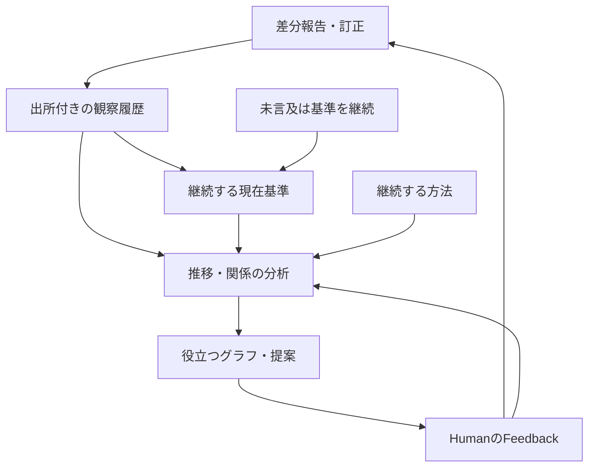

# chocoZAP Sweet Spot

YusukeJPの短い報告から、条件ごとのSweet Spotの移行と、その意味を読み直せるようにする。Humanは自然な言葉で伝え、AIが出所・未知・訂正を保って整理する。入力書式や補助スクリプトの実行をHumanへ要求しない。

| 役割 | 正本・入口 |
| --- | --- |
| 本人の報告・重量・系列・来館・訂正 | [sweet-spots.json](sweet-spots.json) |
| 根拠につながるAI分析・再検討条件 | [analyses.json](analyses.json) |
| 検証・最新参照・来館集計・履歴・CSVの再生成 | [tools/sweet_spots.py](tools/sweet_spots.py) |
| 継続する基本方法と会話支援 | [chocozap-sweet-spot](../skills/chocozap-sweet-spot/SKILL.md) |
| 学習記録と実用チェックリスト | [artifacts/README.md](artifacts/README.md) |

JSONが正本。表・グラフ・最新一覧は必要時に生成し、別の手入力台帳を増やさない。AI分析を本人の観察へ逆流させない。

**Humanは変更した条件だけを報告すればよい。未言及のSweet Spotは、本人が明示した継続ルールに基づき現在の基準として引き継ぐ。AIは履歴・現在値・分析の整合を引き受け、役立つ発見やグラフを能動的に提案する。** これは入力の省略を認める運用であり、AIの分析や説明を省略する指示ではない。

来館は短い一言でも、アプリの履歴画像をまとめて渡す形でも受け取る。本人の「来館すれば、ほぼ全てのマシンを活用する」という説明を実施概要に結びつけ、変更・例外だけで記録を育てる。個別の全台・全モード・全周回の完了を作らず、開始・途中・終了の文脈を読む。AIは照合と分析を担当し、Humanへ日次フォームや二重の来退館報告を課さない。

## 1. 二つの日付と保存時刻

| 項目 | 意味 | 不明なとき |
| --- | --- | --- |
| `observed_date` | 実際に観察・実施した日 | `null`。報告日で代用しない |
| `reported_date` | 当初の本人報告の日 | `null`。保存時刻で代用しない |
| `created_at` | この記録が最初に作られた時刻 | 実施・発言・最終更新の時刻ではない |
| `legacy_day` | v1の日付キーを移行時に保存したもの | 新規記録には不要。集計軸にしない |

日付基準は `Asia/Tokyo`。「今日／昨日」は発言時点で解決し、読出日で解釈し直さない。後日届いた訂正の発言日は訂正または出所の `reported_date` へ添え、当初の記録日を変更しない。出所の発言日と、その出所が説明する運動の日も別である。

2026-09-24と09-27には実施日の根拠がある。09-27は実施日を明記した原文を保持する一方、当初の発言日は独立に確認できないため未確認とした。以降の更新は保存済みcontextにある報告日を使用し、運動日を補っていない。

**日付軸を混ぜない。** 「報告日別」は報告状態の変化、「実施日別」は実施日を確認できた観察の変化。選んだ日付がない点を別の日付で穴埋めせず、日付未確認として残す。欠測区間の補間や、未報告日の横ばいを実測と扱わない。

## 2. 実データの構造（schema_version: 2）

全体は `schema_version`、`timezone`、`records`。v1からの移行情報は `migration` に残す。

### 記録と条件

- 記録は `id`、`reporter`、`observed_date`、`reported_date`、`reference_scope`、`spots`、`sources` を持つ。日付の根拠は `date_basis`、特定の出所は `date_source` で示せる。未知の追加項目を更新時に消さない。
- `records` は報告を整理する単位であり、来館・周回・独立した試行の数ではない。既存の `cz-visit-*` IDは不透明な識別子として保持した。新規には `cz-record-*` 等の一意なIDを使える。同日だけを理由に同じ来館へまとめない。実際の来館が本人報告で特定された場合だけ任意の `session_id` を添える。
- `reference_scope` は `current`（その報告時点の現在の基準）、`historical`（過去の観察のみ）、`unspecified`。後日届いた昔の記録を現在値に上書きしない。観察単位の同名項目で上書きできる。
- 条件は `machine` と報告どおりの `mode`（両手・片手・片足・縦／横等）。任意の `round` と `condition` オブジェクトに、実際に報告された周回・器具や設定の区別を添えられる。比較はこれらの完全一致が基本。片手の縦／横と未指定、使い方不明と両手を合流させない。未知は未知の条件群として残す。

### 観察・系列・切替

- `spots`：単一重量のSweet Spot申告。`id`、`machine`、数値の `kg`、`source` と、報告された条件を持つ。
- `sequences`：任意の順序付き重量申告。`id`、`source`、空でない数値配列 `kg_sequence`、特定できる `machine` または元の `label`。順序と同値の反復を保つ。配列の長さをセット数・反復回数にしない。
- 開始重量を本人がSweet Spotと確認した系列だけ `sweet_spot_source` を持つ。履歴・CSVでは `spots` と、この系列の先頭を一観察ずつ抽出する。下降途中の重量を独立したSweet Spotにせず、同じ観察をspotsへ重複登録しない。
- `report_kind` は `observation`（申告）、`update`（新しい基準への更新）、`reaffirmation`（同値の継続確認）、`unspecified`。本人が述べた意味に基づく区分で、初回の運動や新たな実施の証明ではない。v1系列の継続確認は `sweet_spot_source`、その他は `source` を読む。
- 同じ重量の新しい本人報告も別の観察として残す。新報告とAIの再掲・保存の再試行は別。`previous_ref: "記録ID/観察ID"` は同条件の以前の記録との関係を示し、それ自体で因果・来館を認定しない。
- 観察にも必要なら `observed_date`、`reported_date` を添え、記録の既定値を上書きできる。明示した `null` は既定値へ戻さず未確認とする。
- `transitions` の `from`・`to` は同じ記録内の系列ID。`at: "to_sweet_spot"` と `source` は、切替先のSweet Spot重量を境に使い方を切り替えたという報告の関係。切替前の系列へ境界重量や途中段階を追加しない。
- `start_time` は分かる場合のみ、`time: "HH:MM"`、`source`、必要なら `approximate: true`。開始時刻から各機械の時刻・終了・所要時間を推定しない。

### 来館と履歴画像

schema v2に任意の `visits` 配列を追加した。これは報告内の来館情報であり、重量観察とは別。既存記録に来館行を自動生成しない。

- 一行は `id`（記録内のV系ID）、`session_id`（同一来館を通じた安定ID）、`visit_date`、`location`、`entered_at`、`exited_at`、`status`、`as_of`、`source`、`as_of_source` を持つ。店名・入退館時刻は不明なら明示的な `null`。日付だけの「今日行ってきた」も受け取れ、時刻・店名の追加入力を必須にしない。日付も不明な報告は原文を先に残し、日別来館行は日付確認後に作る。
- `entered_at`・`exited_at` は分かる精度のISO日時とUTCオフセット。`visit_date` は入館した日。画像の複数日を、一つの `observed_date` や報告日へ押し込まない。`as_of` はその来館状態を報告した時点であり、読み出す現在時刻ではない。
- `status` は `exited`（退館した）、`ongoing`（報告時点で滞在中）、`exit_unknown`（退館状況不明）。「行ってきた」は退館時刻不明でもexitedとして受け取れる。退館欄の「-」だけでongoingにせず、本人の「今」等の出所を `status_source` に結ぶ。数日後に読んでも「現在も滞在中」と言い直さない。
- 同じ画像・履歴の再送は既存の来館と照合する。後の画像で退館時刻などが分かった場合は、同じsession_idの新しい状態報告として出所を残せる。`visits` コマンドはsession_idごとに最新のas_ofを選び、先に確認済みの店名・時刻と全出所も保持する。新しい報告でのnullは、前に確認した時刻の撤回ではない。誤記の撤回・訂正は対象の出所記録と影響する分析を整合し、旧内容はGit履歴から辿れるようにする。
- 店名と入館日時が一致する履歴へ別session_idを作らない。同じ日という理由だけでも同一来館にしない。自然文と後の画像の対応が特定できなければ、照合待ちとして原文を残し、集計へ二重追加しない。
- 画像は `sources` の `kind: image_transcription` として、見えた文字の転記、ファイル名・SHA-256等の出所、表示月・回数・時計、読み取りの範囲を残す。転記文を本人がタイプした原文と偽らない。今回の原画像は会話添付にあり、GitHubへ画像自体を複製してはいない。
- 任意の `routine_source` は、本人の普段の実施パターンを説明する出所。来館に結びつく「ほぼ全てのマシン」の実施概要を支えるが、マシン別の測定行や全条件の完了行には展開しない。例外・中断・現在の途中経過を優先する。

滞在時間は確認済みの入館から退館まで。運動時間・セット数・運動量ではない。入館回数には報告時点の滞在中の来館も数え、退館済み回数と、所要時間を計算できる回数を別に示す。終了時刻のない来館は所要時間の平均へ入れない。

継続する基本方法は共通スキルが所有する。第一周で見つけたSweet Spotと条件を休憩後の集中した第二周へつなぐ。両手・片手で扱う種目では、両手のSweet Spotから下げ、片手のSweet Spot重量で片手へ切り替えてさらに下げる。日別に `transitions` がないことは方法の失効ではなく、その日の切替実施が未報告という意味。現在の基準を案内できても、未報告の実施・周回・中間重量を生成しない。

### 原文・訂正・Feedback

- `sources` は記録内の出所IDをキーに、本人の原文 `text` を一度保存する。AI側の問い・日付根拠等は `context` に分ける。出所の `reported_date` は、その発言日が分かる場合の情報であり、全観察の日付を変更しない。
- `corrections` は `id`、観察IDの `target`、`field`、`from`、`to`、`previous_source`、`source`。対象の現在値と対応する出所も更新し、訂正履歴は追記する。重量訂正なら `source`、機械名訂正なら `machine_source` 等を更新する。訂正を新しい運動観察にしない。
- `feedback` は `source` と、必要なら観察・訂正IDの `about`。本文は出所に置く。
- 記録IDは全体で一意、観察IDはspotsとsequencesを通じて記録内で一意。出所・訂正と合わせて `記録ID/項目ID` で分析から参照する。
- 実施情報の未報告・省略・`null` は、未実施・ゼロ・実測上の変化なしを意味しない。一方、Sweet Spotへの未言及は§5の明示的な継続ルールで現在の基準を保持する。この二つを混同せず、必須でない情報をHumanの入力負担にしない。

## 3. AI分析とGraphのつながり

[analyses.json](analyses.json) は重量台帳を複製せず、`findings` に以下を保存する。

- `id`、`as_of`（分析対象の時点）、`status`（active / superseded / withdrawn）、`kind`、`claim`。
- `evidence`：観察・来館・出所・訂正への参照配列。`reasoning`：計算・関係・解釈。`limits`：不明点・代替説明・断定できないこと。
- `review_when`：どんな報告や訂正で判断を見直すか。`revisions`：変更理由と以前の判断。判断を変える際は旧claim・reasoning・evidence・指紋等も履歴へ残す。
- `evidence_fingerprint`：参照項目、その関連出所・訂正・日付のSHA-256。補助スクリプトが根拠の変化を検出する。新しい無関係な記録の追加だけでは失効させない。指紋一致は分析の正しさや最新性の保証ではない。

`active` はそのas_ofにおける現行解釈であり、「常に最新」の印ではない。新報告がreview_whenに当たるか、AIが更新時に確認する。指紋を機械的に付け直して分析済みと扱わない。分析の誤りは実データを変更せず、分析側を訂正する。



Graphは項目数を増やすためではなく、数値・出所・解釈・再検討条件の依存関係を追うために使う。重量の伸び率や両手／片手の比率は記録上の関係であり、筋力・筋肥大・神経適応・左右差の診断ではない。反復回数、可動域、機械条件、感覚などが未確認なら原因や運動量を確定しない。

来館履歴が加わると、Sweet Spotの報告点と、報告点の間にある来館を別の層として重ねられる。暦の日数と確認済みの来館回数は異なる分析軸である。たとえば今回の10/7は、重量の新報告がなくても来館が確認できる。「変更報告なし」を「来館なし」や「運動していない」へ変換しない。同日という関係は日付での対応であり、重量の到達日や当該来館中の実測日時の証明にはしない。来館が増えたことを重量更新の原因と断定しない。

### 可視化から得た成功を運用へ戻す

2026-10-09、ラットプルダウンの推移と分析グラフに対し、YusukeJPは「101/100」「ドラッカー的『予期せぬ成功』」と評価した。想定していなかった分析価値を発見し、有益なグラフの積極的な提案と、そのためのデータ蓄積を依頼した。原文は `sweet-spots.json / cz-record-0009/S01`。これは本人の価値評価であり、身体能力の改善や分析法の一般的有効性を実証したという意味ではない。

- AIは、更新の分岐、複数条件の共通点、切替境界への影響など、理解や判断を変える関係が見えたときに、依頼を待たず有益な分析・可視化を提案できる。毎回のグラフ生成や全種目の再掲を義務化しない。
- 報告された重量・条件・日付・体感・訂正・重要なFeedbackを継続保存する。分析の都合でHumanへ全項目の再入力や未報告項目の測定を要求しない。未知が結論を左右する場合だけ必要な点を確認する。
- グラフの点は実際の報告・観察に対応させる。「現在の基準が継続している期間」を見せるときは、別の意味を持つ参照状態の表示として明示する。例：階段グラフの点は明示報告、水平区間は継続ルールによる引継ぎ。横ばいを日々の測定・実施・能力の不変と解釈しない。
- 過去の実測推移を新ルールで埋め直さない。参照状態の図を生成しても、その派生点をspotsやsequencesへ書き戻さない。原文・観察・参照状態・AIの解釈の役割を保つ。
- 継続保存は会話で受け取った報告を正本へ反映する運用。chocoZAPアプリからの自動取得、無言の間の測定や常時監視、定期自動実行が始まったという意味ではない。

## 4. 読み出しと補助コマンド

Python 3.9以降の標準ライブラリのみ。以下はリポジトリのルートから実行する。JSONを直接読めるAIにはスクリプト実行を必須にしない。

```bash
python3 chocozap/tools/sweet_spots.py validate
python3 chocozap/tools/sweet_spots.py latest
python3 chocozap/tools/sweet_spots.py visits --month 2026-10
python3 chocozap/tools/sweet_spots.py history --machine チェストプレス
python3 chocozap/tools/sweet_spots.py csv --date-basis reported --output /tmp/chocozap-reported.csv
python3 chocozap/tools/sweet_spots.py csv --date-basis observed --dated-only --output /tmp/chocozap-observed.csv
python3 chocozap/tools/sweet_spots.py self-test
```

`latest` はcurrent指定の報告を条件別に取り出す。報告日があればその日、なければ確認済み実施日を「参照順序」の基準にする。これは最新の**報告上の基準**を探す規則であり、実施日の混合グラフを作る規則ではない。日付が同じ候補を配列順で決着させず、日付不明の候補も捨てず、曖昧さを返す。後日訂正された古い観察を保存時刻で最新にしない。

`history` と `csv` は条件を自動合流せず、選んだ日付軸で並べる。日付未確認は末尾に残し、`--dated-only` のときだけ除く。`--machine`・`--mode` で完全一致の条件を選べる。CSVの `graph_date` と `date_basis` は軸を明示し、観察日・報告日・原文参照・訂正参照も各行に残す。空欄は未確認。表計算ソフトで数式になり得る文字列は先頭にアポストロフィを添える。

`visits` はJSONで来館一覧と集計を返す。`--month YYYY-MM` は入館日で絞る。重複する画像内の同じ来館は一回として扱う。来館数・退館済み数・滞在中と報告された数・時刻の揃う滞在数を区別し、滞在の合計・平均には時刻が揃う分だけを使う。自動監視で更新される現在の在館状態ではない。来館情報の追加だけでは `latest`・重量の履歴・CSVを増やさない。

CSVは再生成可能な中間形式。無指定なら標準出力、`--output` は既存ファイルを上書きしない。既定データはスクリプト位置から解決し、`--data PATH`・`--analyses PATH` で読み出すファイルを明示できる。

分析作成時の指紋確認：

```bash
python3 chocozap/tools/sweet_spots.py fingerprint --ref cz-visit-0007/O001 --ref cz-visit-0002/O004
```

検証はJSON形式、ID、数値、日付、出所、訂正、系列間の切替、同条件のprevious_ref、分析の参照と指紋を確認する。グラフでは点の意味・日付軸・条件を明示し、欠測を線の実測として見せない。現在のデータ量では回帰・予測・因果の断定を優先しない。

## 5. 通常の更新

本人報告・訂正・Feedbackを、現在の権限の範囲で継続保存する。同じ範囲の許可を聞き直さず、現在のSTOP・Plan-only・保存しない指定を優先する。設計相談、仮例、AIの推奨、長期メモリを実記録へ転記しない。

### 差分報告と未言及の継続

2026-10-09の本人の明示方針は「特に言及がない場合はSweet Spotは継続中」。出所は `sweet-spots.json / cz-record-0009/S01`。全条件を毎回書き出さずに済むよう、以下を適用する。

| 入力・状態 | 現在の基準 | 観察履歴 |
| --- | --- | --- |
| 条件を指定した新しい重量 | 指定された条件だけ更新 | 新しい本人報告を追加 |
| 同じ重量を明示して継続確認 | 基準を保持 | 継続確認の報告を追加 |
| その条件への言及なし | 直近の確認済み基準を継続 | 新しい観察を作らない |
| 過去の誤記を訂正 | 訂正対象と影響する参照を整合 | 訂正履歴を残し、成長イベントにしない |

未言及による継続は、単なる推測ではなく本人が採用した運用ルールである。ただし、その日に同じ重量を使ったこと・再測定したこと・同じ体感だったことの認定ではない。未言及を理由に `reported_date` や最後の明示確認日を今日へ進めず、spotの複製・日次のゼロ変化行・架空の来館を作らない。

片手・両手・片足・縦／横等は別条件のまま引き継ぐ。新しい条件を古い条件から補わない。本人が変更・訂正・基準の撤回・一時的な例外を明示したら、その対象範囲で優先する。一日の未実施と、Sweet Spot自体の撤回も区別する。

最新一覧は「継続中の参照基準」として提示できる。当日新たに確認したものが必要な依頼では、その日の明示報告と継続参照を分ける。既存の `latest` は条件ごとの最新申告を参照するため、この運用で全条件の日次レコードを追加する必要はない。

### 来館の一言・画像と、変更・例外の組合せ

本人の来館時の習慣は `cz-record-0010/S03`、今回の画像と現在の滞在確認はS01・S02。画像から過去の来館をまとめて取り込めるため、毎日の来館報告を必須にする必要はない。「来た」は到着・滞在中、「行ってきた」は来館を終えた報告として扱い、その文脈と普段の習慣から実施概要を受け取る。終了した来館でも「ほぼ全て」を全台の確認済み完了へ置換しない。

「今日はショルダーなし」等の例外はその回の実施概要へ反映し、ショルダーのSweet Spotの基準自体は保持する。将来の終了報告や新しい画像で、今回の滞在中の行を更新できる。本人が来館・終了・全重量を重ねて報告する義務はない。

1. 最新のJSONとSHAを取得。対象の報告・観察・条件を解決し、確認済みで変更のない本案内を再利用する。通常の数値更新でアーカイブ全読込を要求しない。
2. 新報告か、同値の継続確認か、訂正かを判断する。AIの再掲は観察を増やさない。同じ保存操作の再試行は出所・対象・保存結果で既反映を判定し、差分がなければ `NO_CHANGE`。
3. 関係する分析を読み、必要なものだけ改訂または再検討対象とする。旧履歴・原文・未知の追加項目を保持する。
4. 構文・意味・参照・差分を検証。現在のSHAを使って保存し、競合時は再取得・整合する。同じファイルへ並行書込みせず、古い全文を強制上書きしない。形式変更と対応する案内は一つの整合した変更として保存する。
5. 保存先を再取得し、対象の値・出所・差分を照合して完了を伝える。取得失敗や未保存はその範囲を明示する。

取得失敗を「記録が存在しない」と解釈しない。正本が読めないことを理由に旧資料へ書いたり、旧資料を現在値の代用にしない。JSONにはEOF文字列を足さない。

## 6. 履歴と配置

2026-09-24に旧日別Markdown方式からJSONへ移行した。旧資料・保存価値・本人の「予期せぬ成功」という評価・復帰条件は [ARC-005](../control-center/github/ARCHIVE.md#arc-005) が所有する。旧資料は参照用で、現行の集計・追記先ではない。

2026-10-08にv2へ移行。元の24観察（単一申告16件と確認済み系列起点8件）、全ID・出所原文・訂正・系列を保持した。これは来館24回の意味ではない。報告日・実施日・保存時刻を分離し、分析と再生成用の補助スクリプトを追加した。変更の記録はGit履歴から確認できる。

日別Markdown、手編集CSV、常設の静的グラフ、バックアップ用コピーを定期生成しない。容量・読書き時間・競合・比較範囲に問題が現れたら分割を検討する。将来の自動週次分析や他の運用への応用は候補であり、今ある自動実行機能ではない。

足部・足関節の学習記録は2026-10-06に追加し、10-08に現行パスへ参照を整えた。本移行では学習記録と実用チェックリストの内容・パスを変えていない。

2026-10-09、本人の『未言及は現行基準の継続』という方針と、分析グラフを『予期せぬ成功』と評価したFeedbackを反映。実測履歴を増やさず、差分入力・参照状態・能動的な分析提案の役割を明確にした。

2026-10-09、来館履歴画像の5行を初めて来館データとして追加。本人の普段の実施概要、画像の一括入力、来館と重量観察を分けた集計を導入した。既存26件のSweet Spot観察と観察日未確認の状態は維持した。

EOF::CHOCOZAP_RECORDS_GUIDE::v0.4.0

