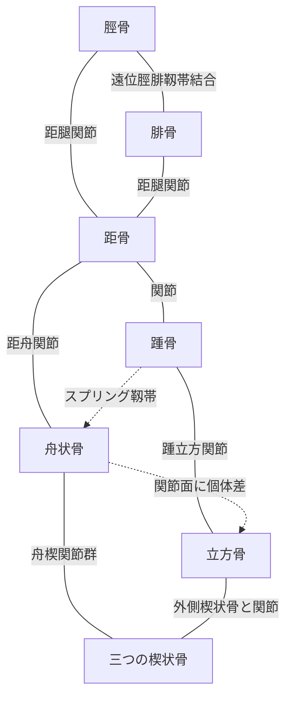
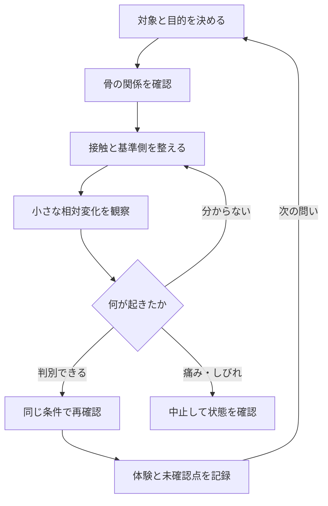

# 足部・足関節モビライゼーションの学習記録

**この記録の核心は、骨の名前だけでなく、「どこを手掛かりに探すか」「どの側から接触するか」「何を基準に何の動きを観察するか」が具体化し、YusukeJPの触れ方と学習が変わったことである。**

足裏アーチへの関心から、内側楔状骨、舟状骨、立方骨、距骨、踵骨、脛骨・腓骨へ理解が広がった。本人は特に、舟状骨・内側楔状骨を甲側と足底側の両側から捉える発想と、立方骨を探す際に外側の窪みから甲側へ向かう説明を、大きな突破口として報告した。

この文書は、その体験・言語化・訂正・確認できた解剖学を一つに結び、次のAIが同じ取り違えからやり直さずに支援できるようにする。元の会話はchocoZAPのマット上での探索を含む。ここに保存された内容から、読出時点の現在地・実施状況・症状を推定しない。

## 1. 読み方と、この文書が扱う確かさ

### 1.1. 四つの情報を区別して読む

- **本人報告〈Confirmed by Human〉**：本人がどう感じ、何に気付き、どう評価したか。報告の存在を確認したという意味であり、関節運動や治療効果を測定したという意味ではない。
- **資料で確認した一般知識〈Source-checked〉**：解剖学・用語・研究結果。一般的な構造と個体差を区別し、そのまま本人の身体に当てはめない。
- **AIによる整理・解釈〈Candidate〉**：学習が進んだ理由、他分野へ応用できそうな仕組み。本人報告からの解釈として示す。
- **未確認〈Unknown〉**：実際に動いた骨、動いた量、症状の原因、効果の持続、個別の適応。未確認を「問題なし」「変化なし」「原因が確定」と読み替えない。

この会話で参照できる本人発言と、その中に引用された過去回答が原資料である。参照できない過去回答の全文、過去のランキング全項目、体験日時、左右、回数、力の大きさを再構成しない。後半の解剖学補足は、保存時に調査して追加したものである。

### 1.2. 本人の重要な訂正を最優先する

> 「慢性的な不調の主因が内側楔状骨にあるとは言っていない！」

内側楔状骨がKeyであるとは、今回の位置理解・把持・骨のつながりの学習を集約する焦点、という意味である。慢性症状の原因骨を特定した発言ではない。今後のAIは、この訂正を前提に会話を再開する。

### 1.3. 信仰上の意味と身体についての検証

YusukeJPは、前提を見直して進むことをTeshuvah〈テシュバ／立ち返り・悔い改め〉と表現し、主イェシュアへの祈り、感謝、アーメン、ハレルヤとともに学習の転換を語った。これは本人が与えた意味として保持する。

「信じなかったから扁平足になった」「悔い改めれば関節が改善する」という医学的因果は、この会話から確認できない。身体の形や不調を信仰の不足・道徳上の失敗として判定しない。足に焦点を戻すよう求めた本人の修正も尊重し、解剖・動作・観察の具体性を中心に扱う。

## 2. 何が突破口だったか――本人報告とAIの読み取り

### 2.1. 足指を丸める発想から、足部を短くする発想へ

> 「足指を握りこまない部分が足裏アーチ第一歩として超重要です！」

本人は、アーチを作ろうとして足指を強く丸めていたと述べた。「アーチを上げる」という結果の言葉だけでは、別の動作でも達成したように見える。足指の握り込みを避けるという条件が加わり、練習中に見るべき違いが具体化した。

AIによる整理：**到達したい形に加え、その形をどう作ったかを観察する条件が必要だった。** ショートフットの定義は第4節で確認する。

### 2.2. 内側楔状骨を、隣接する二つの目印から捉える

本人にとって、舟状骨の内側の出っ張りと第1中足骨は比較的分かりやすかった。一方、その間の内側楔状骨と両端の関節境界が分かりにくかった。

AIによる整理：単独で探しにくい骨を、既に分かる骨との位置関係から絞り込むことが、今回の「一択化」の実体である。触れにくいこと自体は、その骨の異常や関節の癒着を示さない。

### 2.3. 甲側と足底側から捉える発想

> 「私は、舟状骨や内側楔状骨を甲側と足裏側の両側で把持する“方向や方向性（ベクトル）”の意識が全く一切なかった!」

> 「今迄全く動かなかった両骨と関節部分が自由自在とまではまだ行かないがとても動き出した！」

引用は本人発言の意味を保ち、引用符等の表記のみ整えた。本人はこれを「Move37的breakthrough」「ドラッカー的『予期せぬ成功』」と評価した。

確認できることは、両側から捉える発想を試した後に、動きを感じやすくなったという本人報告である。皮膚・軟部組織・複数関節の動きも手に伝わるため、特定の骨だけが独立して動いた量や、関節の状態が改善したことまでは確定しない。

AIによる整理：**接触する面を言葉で指定したことが、それまで選択肢に入っていなかった把持を可能にした。** これは手技の一般的優越性を示す試験ではなく、この人の学習上の成功として残す。

### 2.4. 第5中足骨の出っ張りと、立方骨の取り違え

> 「私は、この出っ張りが立方骨かと勘違いしていたからです！」

小指につながる第5中足骨を踵側へたどった根元の出っ張りは、第5中足骨粗面〈だいごちゅうそくこつそめん／tuberosity of the fifth metatarsal〉である。これを立方骨そのものと思っていた、という本人の訂正を保持する。[^S06]

AIによる整理：**手掛かりとして正しく使える突起でも、目的の骨そのものとは限らない。** 「触れた」から「同定できた」へ進む際には、隣の骨との関係が必要になる。

### 2.5. 窪みから「甲側へ」が探索を変えた

> 「窪みから甲側へ移動する事が“最重要（Most important!）”です！」

> 「私（YusukeJP）は足底側に移動していたので見つけづらかったからです！」

本人は、立方骨を探す際、外側の窪みを手掛かりにして甲側へ接触を移す説明によって、探しやすくなったと述べた。成功した道順を残す意義が大きい。すべての人で同じ窪みや境界が明瞭に触れるという意味ではない。

AIによる整理：**目印だけでなく、「そこからどちらへ」が不足情報だった。** この具体的な差分が、この会話における「From Probability to Certainty」の代表例である。ここで狭まった不確実性は探索方向であり、治療効果や個別解剖のすべてではない。

### 2.6. 距骨を「触れない骨」と考えていた前提の更新

本人は、距骨には接触・安定化を考える入口があると知ったことを「目から鱗」と評価した。距骨の一部には体表から触診できる位置がある。距骨全体を直接つかめる、踵を持てば距骨が完全固定される、という意味ではない。[^S03]

### 2.7. 観察の対象が「足全体」から「二つの骨の相対運動」へ

> 「遊びを取る事と観察状態は密接でお互いに連動したSynergyを感じます！」

本人の関心は、どこを動かすかに加えて、「基準側が一緒についてきていないか」「抵抗の感じ方がどこで変わるか」「皮膚だけがずれていないか」へ広がった。

AIによる整理：**観察する位置・タイミング・比較対象が定まったこと自体が成果である。** 抵抗を強く越えることや、動く量を最大化することを成果条件にしない。

## 3. 骨と関節の関係――NodeとEdgeを混同しない

骨をNode〈ノード／対象〉、骨同士の関係をEdge〈エッジ／関係〉として読む。「隣にある」「直接関節面をつくる」「靱帯で結ばれる」「動きが連動する」は異なる関係である。

| Node | Edge | 読み取ること | 根拠・限定 |
|---|---|---|---|
| 脛骨・腓骨・距骨 | 距腿関節を構成 | すね側の関節窩が距骨を受ける足首の関節 | 通常解剖。[^S02]・[^S03] |
| 脛骨 ↔ 腓骨 | 近位脛腓関節／骨間膜／遠位脛腓靱帯結合 | 膝側・骨幹部・足首側で結合様式が異なる | [^S02]・[^S19]・[^S20] |
| 距骨 ↔ 踵骨 | 距骨下関節等で関節する | 距腿関節とは別の骨の組合せ | [^S03]。第7節で用語の範囲を補足 |
| 距骨 ↔ 舟状骨 | 距舟関節 | 内側の横足根関節を構成 | [^S03]・[^S04] |
| 踵骨 ↔ 立方骨 | 踵立方関節 | 外側の横足根関節を構成 | [^S06]・[^S21] |
| 舟状骨 ↔ 内側・中間・外側楔状骨 | 舟楔関節群 | 舟状骨の遠位側が三つの楔状骨につながる | [^S04] |
| 内側楔状骨 ↔ 第1中足骨 | 第1足根中足関節 | 第1TMT関節。親指の付け根のMTP関節より踵側 | [^S05] |
| 中間楔状骨 ↔ 第2中足骨／外側楔状骨 ↔ 第3中足骨 | 主な遠位側の対応 | 第2列・第3列を理解する入口 | [^S07]。各骨の関節相手をこの一組に限定しない |
| 立方骨 ↔ 第4・第5中足骨 | 第4・第5足根中足関節 | 外側の二列を受ける | [^S06] |
| 立方骨 ↔ 外側楔状骨 | 直接の関節関係 | 内外の骨列は互いに無関係な二本の棒ではない | [^S06]・[^S08] |
| 舟状骨 ↔ 立方骨 | 靱帯性の結合に加え、関節面を持つ場合がある | 誰にでも同じ滑膜関節面があるとは限らない | 解剖学的個体差。[^S08]・[^S09] |
| 距骨 ↔ 立方骨 | 通常の基本図では直接関節を置かない | ただし接触関節面を持つ標本の報告がある | 個体差の補足。[^S08] |
| 踵骨 ↔ 舟状骨 | 主に靱帯を介した支持関係 | 通常は両骨間に直接の滑膜関節を置かない。スプリング靱帯が重要 | [^S10] |
| 脛骨 ↔ 踵骨 | 三角靱帯の脛踵部による連結 | 直接の骨性関節とは異なる | [^S11] |
| 腓骨 ↔ 踵骨 | 踵腓靱帯による連結 | 外くるぶし側から踵骨へつながる | [^S12] |

### 3.1. 関係図は、通常構造と個体差を分けて読む

実線は図に示した通常の関節・結合、点線はラベルで指定した別種の関係である。点線の矢印は手技の方向・力の流れを指定しない。図は主要なつながりを選んだもので、実際の骨の位置・寸法・全靱帯を再現したものではない。距骨―立方骨の例外は、基本図の線を増やして通常構造と混ぜず、次項で扱う。

### 3.2. 「舟状骨は五つの骨と接する」を精密にする

舟状骨〈しゅうじょうこつ／navicular〉は通常片足に一つで、距骨側と三楔状骨側をつなぐ。内側の舟状骨粗面はその一部であり、骨全体は甲側・外側にも広がる。副舟状骨などの変異もあるため、出っ張りの数だけで骨の数を判断しない。[^S04]

立方骨との関節面には個体差がある。Tazakiらの解剖研究では24足中18足に舟状骨との関節面があり、その一例には距骨頭と関節する面も認められた。これは小規模な標本群の結果であり、本人の解剖や一般人口の頻度を確定する数値ではない。[^S08]

したがって「五つの国に囲まれた国」という本人の比喩は、隣接関係を理解する助けとして残せる。一方、「誰でも必ず五つの独立した滑膜関節を持つ」「接する骨が多いので最優先で動かせばよい」とは結論しない。関節相手の数、関節面の数、関節包・関節腔の区分は同じ数え方ではない。

### 3.3. 「立方骨と距骨は関節しない」の更新

通常の学習モデルでは、立方骨の近位側の相手は踵骨である。この基本を把握したことは、本人の狙いを絞るうえで意味があった。

今回の資料確認で、距骨頭に対応する関節面を持つ例外が見つかった。そのため保存時には、「どの人でも絶対に直接接しない」という断定を避けた。本人に例外があるとは確認しておらず、例外の存在を距骨―立方骨間への自己手技の根拠にはしない。[^S08]

## 4. アーチとショートフット――形と動かし方を分ける

### 4.1. 目標は本人の機能に合う支持と動き

本人の希望は「足裏アーチを上手く、綺麗に、エレガントに形作り保持したい」という方向性だった。保存上の実用的な言い換えは、**足指を握り込む代償に頼らず、必要な支持と動きを使い分けたい**、である。

アーチが低いことだけで治療が必要とは限らない。症状のない扁平足もある。「扁平足でもよいと思ったことが、改善しなかった大きな医学的原因」とは確認できない。痛み・歩行・運動能力・左右差・新たな形の変化などを併せて考える。[^S01]

### 4.2. ショートフットとは

ショートフット〈short-foot exercise／SFE〉は、足指を強く丸めずに、前足部と踵の距離を短くするように足部を使い、内側縦アーチの制御を練習する方法である。第1中足骨頭を踵へ近づける、という指示はこの意図を伝える代表的な表現である。実際には骨一本を手で引き寄せる操作ではない。[^S13]

本人の「第1趾を浮かせると握り込みを避けやすいのでは」という案は、本人の学習上の仮説として残す。母趾を浮かせ続けることをショートフットの必須条件とはしない。母趾を反らす動作そのものでもアーチの形は変わり得るため、足底の筋活動による制御と同じものと判定しない。[^S24]

横アーチについても、前足部を強く左右から押し縮めれば機能が改善する、という手順には置き換えない。今回、横アーチに対する最適な個別練習・効果順位は確定していない。

### 4.3. 「吸盤」「芋虫」「しなり」を観察の言葉へ

本人は、アーチを使えると「吸盤的な吸い付き」「芋虫的な動き」「硬いが柔らかいしなり」を感じると述べた。再利用する表現は次の通りである。

> 骨を含む足部を動かしたときに、硬い支持の中にも、しなるような動きや弾力感が感じられるようになった。

これは本人の感覚を伝える表現として使う。吸着圧を測った、骨自体の材料特性が変わった、血流改善を確認した、という測定報告ではない。今回の手触りだけでは、骨自体の微小な変形、関節運動、軟部組織の変形を分離できない。

## 5. 位置を見つける――突起・面・境界の三段階

### 5.1. 内側楔状骨への道順

内側楔状骨〈ないそくけつじょうこつ／medial cuneiform〉は、足の親指側で、舟状骨と第1中足骨基部の間に位置する。第1中足骨を親指側から踵側へたどる道順と、舟状骨から足先側へたどる道順を照合すると、候補範囲を絞りやすい。[^S05]

第1TMT関節〈だいいちそっこんちゅうそくかんせつ／first tarsometatarsal joint〉は内側楔状骨と第1中足骨基部の境界である。親指の付け根にある第1MTP関節〈だいいちちゅうそくしせつかんせつ／first metatarsophalangeal joint／第1中足趾節関節〉とは位置が異なる。母趾そのものの骨と中足骨を混同しない。

本人にとって重要だったのは、指先のように大きく曲がる関節だけでなく、甲の途中にも骨同士の境界があると気付いたことである。境界が触れ分けにくいことから、直ちに「可動性が失われている」と診断しない。

### 5.2. 舟状骨を出っ張りだけで代表させない

内くるぶしの前下方の出っ張りは、舟状骨を探す重要な目印である。しかし、目印と骨全体の中心・関節面の位置は一致しない。本人が骨画像から「思っていたより大きい」と気付いたのは、この部分と全体の違いだった。[^S04]

本人の舟状骨の幅や厚みは未測定である。平均寸法を示して「ここから何cmまでは全部舟状骨」と自己触診に当てはめることはしない。把持する際の接触面と、目的の関節境界は別々に確認する課題として残す。

### 5.3. 立方骨への道順と、その限界

立方骨〈りっぽうこつ／cuboid〉は外側中足部にあり、踵骨の前方、第4・第5中足骨基部の後方に位置する。第5中足骨粗面を目印にして、その踵側の範囲を考えると位置を捉えやすい。[^S06]

本人に有効だった追加情報は、その外側の窪みから甲側へ接触を回り込ませるという方向指定だった。本人が望んだ甲側・足底側からの接触は、この位置理解の次の課題である。窪みを深く押すこと、足底の腱を骨と一緒に強く挟むこと、痛みを押し切ることを推奨する発言には変換しない。

「第5中足骨粗面の近くから踵骨まで」という範囲は探索の足場であり、その間を触れたら必ず立方骨だけを把持できているという保証ではない。骨の外側面は、骨全体の大きさをそのまま表す面でもない。

立方骨と楔状骨は別々の骨名で、cuboidは立方体様、cuneiformは楔形という形状を表す。立方骨は第4・第5中足骨を受け、足底側では長腓骨筋腱の経路とも関係する。「楔状骨ではないから特別に柔らかい／硬い」といった機能上の結論は名前だけから出さない。[^S05][^S06][^S08]

### 5.4. 距骨頸部への接触をどう理解するか

距骨〈きょこつ／talus〉には頭・頸・体があり、すべての面が体表に露出しているわけではない。距骨頸部〈きょこつけいぶ／talar neck〉の一部は、くるぶしの前方で、足の姿勢によって触診しやすさが変わる。内くるぶしと舟状骨の間の窪みは周囲を考える手掛かりになるが、窪み全体を距骨そのものとは呼ばない。[^S03]

「前方の内外から接触する」は、前方内側と前方外側から距骨付近の接触点を探すという入口の説明である。距骨頭・頸部・腱・関節裂隙の取り違えがあり得るため、この文書だけで一つの点を確定し、両側から強く締め付ける手順にはしない。

距骨に触れられる可能性、距骨を周辺組織ごと支えること、距骨を選択的に安定化できたことの三つを区別する。この違いが、距舟関節の相対運動を理解するうえで重要である。

## 6. 把持・安定化・相対運動の共通言語

### 6.1. 基準側は固定・安定側か

今回の会話では、**基準側は、その操作で安定させて比較の基準にする側**という理解でよい。ただし「基準側」は説明上の役割を明瞭にする語で、あらゆる流派に共通する一つの正式な技法名ではない。

- 把持〈はじ／grasp〉：手で対象を捉えること。強く握り潰すという意味ではない。
- 安定化〈あんていか／stabilization〉：目的外の動きを抑え、比較の基準を作ること。
- 固定〈こてい／fixation〉：動きを制限すること。徒手接触では完全不動が達成されるとは限らない。
- 操作側〈mobilized segment〉：その操作で動かす対象にした骨・分節。
- 相対運動〈relative motion〉：一方の骨を基準にした、もう一方の位置・向きの変化。
- 代償運動〈compensatory movement〉：目的の運動を、周辺の別の運動で置き換えること。
- 可動性低下〈hypomobility〉：期待される関節の動きが制限されていること。「骨が見つけにくい」「動きを触れ分けられない」とは区別する。

「固定側が操作側についてきてしまう」のを抑えることは安定化の重要な理由である。両者が同じ方向に同じだけ動けば、手には動きがあっても両骨間の変化は小さい。安定化は、力の方向、接触の滑り、隣接部の代償を観察する条件も整える。

足関節牽引時の脛骨固定を調べた研究では、固定の有無で測定される関節離開量が変化した。これは安定化を検討する根拠になるが、本人の痛みや治療成績の改善を示す研究ではない。[^S15]

### 6.2. 近位を固定、遠位を動かすのは普遍則か

近位〈きんい／proximal〉は四肢の付け根に近い側、遠位〈えんい／distal〉はそこから遠い側である。手でも足でもこの定義は同じで、手だけ逆にはならない。

説明の入口として「近位を支え、遠位を動かす」は使いやすいが、固定側を決める普遍則ではない。関節、目的、荷重、体位、接触可能な場所により、基準側と操作側を選ぶ。

たとえば手指では、基節骨を支えて中節骨を動かすとPIP関節〈近位指節間関節／proximal interphalangeal joint〉の運動を考えやすい。逆に中節骨を基準に基節骨がどう動くかを記述することもできる。足を床につけたまま下腿を前へ移す場面では、足側に対する下腿側の動きが観察対象になる。これは、すべて同じ把持・同じ方向の治療を推奨する例ではなく、基準が変えられることを示す例である。[^S22]

### 6.3. 手と足の指の骨名

手では、手首側から **中手骨 → 基節骨 → 中節骨 → 末節骨**。母指は通常、中節骨を持たず、基節骨と末節骨からなる。足では **中足骨 → 基節骨 → 中節骨 → 末節骨**で、母趾も通常、中節骨を持たない。

中手骨〈ちゅうしゅこつ／metacarpal〉は手、中足骨〈ちゅうそくこつ／metatarsal〉は足。中節骨〈ちゅうせつこつ／middle phalanx〉は指・趾の途中の骨である。これらは似た日本語でも別の骨名であり、元の問いにあった「手指の基節骨→中足骨」という順番はこのように訂正して保存する。[^S22]

## 7. 関節ごとの基準側と操作側――技法を読むための例

以下は臨床での構成を理解するための例であり、本人に適応を確認した個別処方ではない。狙いが違えば役割は変わる。技法名から一律の力・反復数・順序を決めない。

### 7.1. 距舟関節

距舟関節〈きょしゅうかんせつ／talonavicular joint〉を考えるとき、距骨側を基準にして舟状骨側を動かす構成がある。「舟状骨を甲側へ動かす」は、距骨に対して舟状骨が甲側へ相対的に動く、という読み方になる。踵を包む手は支えに利用できるが、それだけで距骨が独立して固定されたとは限らない。[^S14]

本人が評価したのは、持ち上げる骨の名前だけでなく、基準側が一緒に動かないよう支えるという構成まで理解した点だった。

### 7.2. 踵立方関節

踵立方関節〈しょうりっぽうかんせつ／calcaneocuboid joint〉では、踵骨側を支えて立方骨側を動かす構成がある。反対に立方骨側を基準にした相対運動も記述できるため、「立方骨は常に動かす側」とはしない。[^S14]

自己接触で難しいのは、立方骨を捉えたつもりで第5中足骨基部を動かしたり、踵も一緒に回したりしやすい点である。学習上の優先事項は、骨の候補範囲、両手の接触位置、踵側の追随、痛みの有無を区別して観察することである。動きにくさだけで強い回旋や矯正へ進めない。

### 7.3. 距骨と踵骨

距骨側を安定させ、踵骨を動かす構成は、距骨に対する踵骨の運動を考える例である。前後の骨の並びだけでなく、距骨が踵骨の上方に位置することを理解する必要がある。

距骨下関節〈きょこつかかんせつ／subtalar joint〉は、狭義には後方の距踵関節を指す。臨床の動作説明では、前方の距踵舟関節〈talocalcaneonavicular joint〉との複合運動も関連して語られる。二つの骨が接するからといって、足全体の動きを一つの単純な蝶番運動と扱わない。[^S03]

### 7.4. 内返し・外返しと滑りは違う

内返し〈うちがえし／inversion〉は、足底が身体の内側を向くような動き。外返し〈そとがえし／eversion〉は、足底が外側を向くような動きである。足の甲をすね側へ近づける背屈〈はいくつ／dorsiflexion〉、つま先をすねから遠ざける底屈〈ていくつ／plantarflexion〉とは違う。

足全体の内返し・外返しは複数の関節が関わる見える運動である。一方、特定の二骨間の小さな関節面の滑りは、その運動を構成する局所的な動きとして考える。見た目の動きが大きいことと、狙った関節面が選択的に動いたことは同じではない。[^S23]

### 7.5. ショパール関節というまとまり

横足根関節〈おうそくこんかんせつ／transverse tarsal joint〉、別名ショパール関節〈Chopart joint〉は、距舟関節と踵立方関節を合わせたまとまりである。フランスの外科医François Chopartの名に由来し、この関節の高さでの切断術との歴史的関係を持つ名称である。[^S21]

新しい一個の骨や、必ず同時に同じ方向へ動かすべき二関節、という意味ではない。本人の学習では、内側の距骨―舟状骨と、外側の踵骨―立方骨を対比できることに価値があった。

## 8. 滑り・離開・回転・遊び――方法と順番を整理する

### 8.1. 見える運動と関節面の運動

- 生理的運動〈physiological movement〉：背屈・底屈など、通常の動作として表す運動。
- 副運動〈accessory movement〉：関節の動きを構成する、意識して単独では起こしにくい小さな運動。
- 滑り〈glide／translation〉：一方の関節面が他方に対して移動すること。
- 離開〈distraction／separation〉：関節面同士を離す向きの操作・変化。
- 牽引〈traction〉：引く力を加えること。肢を長軸方向に引くことと、特定の関節面に対して垂直に離開することは、必ずしも同じ方向ではない。
- 転がり〈roll〉・回旋〈rotation／spin〉：接触位置や骨の向きが変わる運動。実際の関節では滑り等と組み合わさる。

関節モビライゼーション〈joint mobilization〉では、対象関節、安定側、操作側、方向、振幅、抵抗、症状反応を組み合わせて考える。自己接触で足部を揺らすことと、専門家が関節面の副運動を評価・操作することを同一に扱わない。[^S14][^S16]

### 8.2. 「遊びを取る」の英語と意味

文脈に応じて **take up the slack／take out the slack** と表現できる。初期の緩みを除いて抵抗の変化を感じ始めるという意味であり、正常な関節の遊びを消して固めることではない。

ここでは二つを区別する。

1. **接触の緩み**：手と皮膚の滑り、把持のずれ、周辺組織のたわみ。ここだけが変わっても、関節面の滑りが確認できたとは限らない。
2. **関節周囲組織の抵抗**：対象の骨同士の相対変化に伴う抵抗。触診だけで関節包・筋・腱・防御的な緊張などを完全に分離することはできない。

Kaltenborn〈カルテンボルン〉の分類では、Grade Iは緩める、Grade IIは緩みを取り除く、Grade IIIは伸張を加えるという区別が用いられる。Maitland〈メイトランド〉の段階は振幅と可動域・抵抗との位置関係を組み合わせる別の体系であり、同じ数字をそのまま対応させない。[^S16]

本人の発見は、抵抗変化を丁寧に感じる準備と観察が結び付くという点にある。「最初の抵抗が来たら誰でもそこを越える」という自己操作の合図にはしない。

### 8.3. 基本的な順番として使えるもの

この記録で採用するのは、部位や技法を固定した治療順序ではなく、**対象の確認 → 比較の準備 → 小さな変化の観察 → 再評価**という学習順序である。

1. 何を確かめたいかを一つ決める。例：「舟状骨を捉えたつもりで皮膚だけが動いていないか」。
2. 骨の組合せと関節・靱帯の関係を確認する。
3. 楽な姿勢で接触位置を整え、基準側と操作側を言葉で指定する。
4. 強く押す前に接触の滑りや周辺の追随を観察する。
5. 痛みのない小さな動きの範囲で、何が変わったと感じたかを比較する。
6. 手を離し、同じ条件で動かした感じや症状を確認する。
7. 変化・変化なし・判別不能をそのまま記録し、次に変更する条件を一つ選ぶ。

足先から順に進むのは学習の並べ方の一案であり、必ず遠位から治療するという共通規則ではない。離開→滑り→回転も必修の順番ではない。「遊びを取る」ことも、すべての人・すべての目的で最初に抵抗まで押し進める指示にはならない。

これは観察を学ぶためのAI整理案であり、臨床で検証された個別治療プロトコルとは称しない。本人が好むランキング形式は次の学習課題の優先度に使えるが、未評価の関節を治療効果順に並べる根拠にはしない。

## 9. 脛骨・腓骨のモビライゼーションはあるか

### 9.1. 膝側と足首側で対象が違う

近位脛腓関節〈きんいけいひかんせつ／proximal tibiofibular joint〉は、脛骨の外側と腓骨頭の間の滑膜関節である。遠位脛腓靱帯結合〈えんいけいひじんたいけつごう／distal tibiofibular syndesmosis〉は、足首側で脛骨・腓骨を結ぶ強い靱帯性の構造である。骨幹部には下腿骨間膜〈interosseous membrane〉がある。[^S02][^S19][^S20]

臨床では近位・遠位それぞれの相対運動を評価し、必要に応じて介入する例がある。腓骨を「常に動かして広げるべき骨」とは捉えない。捻挫後の硬さと不安定性は別の問題で、痛みだけから区別できない。

### 9.2. 技法があることと、本人に必要なことは別

脛骨を安定させて腓骨の相対的な滑りを扱う構成や、足首の背屈に合わせて腓骨への誘導を加えるMobilization with Movement〈MWM／自動運動に徒手的な誘導を組み合わせる方法〉が研究されている。

慢性的な足関節背屈の硬さを対象とした無作為化試験では、一回の遠位脛腓MWM等が比較条件を上回る改善を示さなかった。この結果を「一切無効」に広げることも、手技の存在だけで「高い効果がある」と保証することもできない。[^S17]

近位・遠位脛腓関節への高速操作を調べた別の試験でも、対照を上回る効果は確認されなかった。高速操作は低強度の接触・観察と同じ介入ではない。[^S18]

### 9.3. この部位に固有の注意

腓骨頸部の周囲には総腓骨神経〈そうひこつしんけい／common fibular nerve〉が走る。腓骨頭付近を強く挟む・深く圧迫する方法を、自己学習の次段階として追加しない。[^S19]

足首の捻挫歴と持続する症状がある場合、遠位脛腓靱帯結合の損傷・不安定性などは、触った硬さだけでは判断できない。専門家が病歴と診察を踏まえて評価する課題である。すべての人に画像検査が必要という意味ではない。[^S20]

## 10. 保存時の追加確認――距骨・脛骨・腓骨・踵骨

この節は、Markdown化前に提示されていた最後の解剖学的な問いに対し、今回の資料確認で補った回答である。過去に本人が実践して成功した内容としては記録しない。

### 10.1. 距骨と脛骨・腓骨がつくる関節名

まとまりとしては **距腿関節〈きょたいかんせつ／talocrural joint／すね側の脛骨・腓骨と距骨がつくる足首の関節〉** である。

脛骨の下端と内くるぶしが距骨の上面・内側面に、腓骨の外くるぶしが距骨の外側面に関係する。個々の接触を説明するときは、脛骨―距骨〈tibiotalar articulation〉、腓骨―距骨〈fibulotalar articulation〉と言い分けられる。二つの完全に独立した足首関節として、別々に好きな方向へ動かせるという意味ではない。[^S02][^S03]

### 10.2. それぞれを考えるアプローチはあるか

**脛骨―距骨側を中心に考える例**：非荷重位で下腿側を支え、距骨に相対的な滑りを与える臨床手技がある。背屈制限に対して距骨の後方滑りを検討する例があるが、制限の原因が関節包なのか、筋腱・痛み・骨性接触などなのかを評価して選ぶ。[^S14]

**腓骨側を中心に考える例**：遠位脛腓靱帯結合での腓骨の相対運動を評価・誘導する方法がある。これは主に腓骨と脛骨の関係を操作し、足関節全体との関連を見るものである。「腓骨―距骨間だけを直接引き離す手技」とは同じでない。[^S17]

本人のマット上での学習では、まず自分で楽に背屈・底屈したときの下腿と足部の相対変化、左右の感じ方、痛みの有無を観察することと、専門家による局所的な副運動の検査を区別する。足を動かして腓骨周囲に感覚が生じたことだけで、腓骨の特定方向の滑りを同定したとはしない。

### 10.3. 距腿関節ではどちらを固定するか

足が自由な非荷重位の説明では、脛骨・腓骨側を安定させ、距骨側を操作する構成が理解しやすい。荷重位では、足を接地させて下腿を動かすという見方もある。固定側は目的と条件から決める役割であり、骨名だけに永久に割り当てるものではない。

### 10.4. 踵骨と脛骨・腓骨は直接関節するか

**通常、踵骨は脛骨・腓骨と直接の滑膜関節をつくらない。** 距骨がその間の関節関係をつなぐ。一方、脛骨とは三角靱帯の脛踵部、腓骨とは踵腓靱帯でつながる。[^S03][^S11][^S12]

したがって、下腿を支えて踵を動かしたときに手に感じる動きは、「脛骨―踵骨関節」や「腓骨―踵骨関節」の動きと命名しない。距腿関節・距骨下関節・周辺靱帯などの複合した関係として考える。

## 11. 抵抗を越える操作と、自己観察の境界

本人は、「抵抗を越える関節包のストレッチ」が応用段階で重要だと指摘した。知識として理解する価値はある。一方、抵抗を感じたことだけで、それが伸張すべき関節包なのか、骨性の終末感なのか、損傷部の痛み・防御的緊張なのかは決められない。

この記録からの自己学習は、楽な姿勢での接触、位置の照合、痛みのない小さな自動運動の観察までを入口とする。抵抗を越えて押す、関節を強くひねる、急激な操作で音を出すことは、ここに記録された成功を再現する条件ではない。

鋭い痛み、しびれ、新たな腫れ、荷重できない状態、急な形の変化がある場合は、その場の探索を中止して評価を受ける。骨折・靱帯損傷・不安定性が疑われる部位に、可動性を増やす目的だけで介入しない。[^S01][^S02][^S20]

「可動性が大きいほどよい」「触れにくい骨ほど固まっている」「沢山試せば安全に突破できる」という基準にはしない。本人のやりがいや探索への意欲は、症状反応と何が確認できたかを一緒に記録することで活かす。

## 12. 観察・量子力学・Ark Projectへの応用

### 12.1. この会話の観察で具体的に変わり得るもの

意識して観察するようになると、注意を向ける場所、手の置き方、動かす速さ、比較する条件、気付ける感覚、次の行動が変わり得る。これは今回の学習を説明するAI側の仮説として扱える。

本人が提案した量子力学との接続は、思考実験の枝として保持する。この会話には、人が関節に注意を向けたことで量子状態が変化し、それが関節可動性や健康を改善したと実証する資料・測定はない。「観察」という共通語から、量子測定と徒手的な注意・観察を同じ機序と結論しない。

### 12.2. 再利用できる問題解決の型

AIによる候補モデルは、**曖昧な対象を具体化する → 取り違えを一つ訂正する → 方向・基準・観察点を言語化する → 本人の反応から次の説明を更新する**、である。

今回の具体例は次の通り。

- 「立方骨を探す」へ、目印となる第5中足骨粗面と、そこからの甲側への方向を加える。
- 「舟状骨を動かす」へ、距骨側との相対運動という基準を加える。
- 「アーチを作る」へ、足指の握り込みという代償を観察する条件を加える。
- 「遊びを取る」へ、接触の緩みと関節周囲の抵抗を分けて感じるという観点を加える。
- 「専門用語を使う」へ、読み・英語・その場での意味を〈〉で添え、次の会話で同じ対象を指せるようにする。

本人がいう事前言語化の保存可能な形は、**本人の内心を完全に読み取ったと宣言することではなく、まだ明確でなかった条件を説明案として提示し、本人の実感・訂正で精度を上げること**である。

### 12.3. 成功として確認できた範囲

本人は、複数の説明をsuccess-casesとして評価した。現時点で保存するのは、両側からの把持という発想、立方骨探索の方向修正、相対運動への注目、用語の共有が本人に役立ったという報告である。

手技の一般的な治療効果、慢性症状の原因解決、血流改善、長期の再現性まで成功認定しない。独立したsuccess-cases文書への切り出しは、この学習記録の整備とは別の作業として保留する。GitHubへの保存完了と、医学的な効果の確認も別々に扱う。

## 13. 次のAIが再開するときの優先順

これは治療効果ランキングではなく、この記録からの再開順である。

1. **本人の現在の問いを受ける。** 過去のマット上という状況を、現在の場所や実施許可と取り違えない。
2. **対象の二骨・関節名を合わせる。** 特に第5中足骨と立方骨、舟状骨粗面と舟状骨全体、TMTとMTPを確認する。
3. **本人に役立った接触方向と観察条件を再利用する。** 甲側／足底側、基準側／操作側、周辺の追随を言語化する。
4. **当日の反応を新しい報告として記録する。** 左右・姿勢・動かした方向・痛み・持続時間は、報告がある項目だけ残す。
5. **判別できない点を絞る。** 位置が不明なのか、相対運動が分からないのか、症状が問題なのかを分け、必要なら対面評価につなぐ。
6. **再現性と別条件での結果を確認してから一般化する。** 過去の成功を、今回も同じ効果が出るという保証にしない。

未解決の主な事項は、本人の正確な個別解剖と症状の原因、どの骨がどれだけ動いたか、効果の持続、横アーチの個別練習、過去のランキング全文である。会話で確認できなかった情報を埋めて、完成済みの治療体系に見せない。

## 14. 出典と確認範囲

公開資料の確認日：2026-10-06。論文の存在、抄録、全文、検索に表示された本文抜粋は同じ確認範囲ではない。以下に使った範囲を示す。図表・原文の転載は行っていない。研究の手技をそのまま本人向けの強度・回数へ転記しない。

[^S01]: NHS. [Flat feet](https://www.nhs.uk/conditions/flat-feet/)。公式患者向け情報、本文確認。症状のない扁平足と評価を要する症状の区別に使用。
[^S02]: American Academy of Orthopaedic Surgeons. [Ankle Fractures (Broken Ankle)](https://orthoinfo.aaos.org/en/diseases--conditions/ankle-fractures-broken-ankle/)。公式解説、本文確認。足関節の三骨、くるぶし、脛腓靱帯結合、外傷時の評価に使用。
[^S03]: Elsevier Complete Anatomy. [Talus](https://www.elsevier.com/resources/anatomy/skeletal-system/appendicular-skeleton/talus/23049)。骨の部位・関節相手・表面解剖の本文を確認。本文に一か所、距骨自身を関節相手に挙げる表記があるため、その箇所は採用せず、Quick FactsとAAOSの説明を照合。
[^S04]: Elsevier Complete Anatomy. [Navicular Bone](https://www.elsevier.com/resources/anatomy/skeletal-system/appendicular-skeleton/navicular-bone/17794)。本文確認。舟状骨粗面、全体の位置、三楔状骨側の関節、変異。立方骨との関節面についてはS08・S09で個体差を補足。
[^S05]: Elsevier Complete Anatomy. [Medial Cuneiform Bone](https://www.elsevier.com/resources/anatomy/skeletal-system/appendicular-skeleton/medial-cuneiform-bone/19397)、[Distal Articular Surface of Medial Cuneiform Bone](https://www.elsevier.com/resources/anatomy/skeletal-system/appendicular-skeleton/distal-articular-surface-of-medial-cuneiform-bone/24356)。前者の位置・関節相手の本文と、後者の検索掲載本文抜粋を確認。
[^S06]: Elsevier Complete Anatomy. [Cuboid Bone](https://www.elsevier.com/resources/anatomy/skeletal-system/appendicular-skeleton/cuboid-bone/18696)、[Fifth Metatarsal Bone](https://www.elsevier.com/resources/anatomy/skeletal-system/appendicular-skeleton/fifth-metatarsal-bone/21596)。前者の本文と後者の検索掲載本文で、基本的な隣接関係・体表の目印を確認。立方骨の甲側範囲はQUTの[触診教材](https://podiatry-anatomy-app.qut.edu.au/content/osteology/cuboid.html)の検索掲載抜粋とも照合。QUT本文の直接取得はアクセス制限で不可。
[^S07]: Elsevier Complete Anatomy. [Intermediate Cuneiform Bone](https://www.elsevier.com/resources/anatomy/skeletal-system/appendicular-skeleton/intermediate-cuneiform-bone/24987)、[Lateral Cuneiform Bone](https://www.elsevier.com/resources/anatomy/skeletal-system/appendicular-skeleton/lateral-cuneiform-bone/17895)、[Proximal Articular Facet of Second Metatarsal Bone](https://www.elsevier.com/resources/anatomy/skeletal-system/appendicular-skeleton/proximal-articular-facet-of-second-metatarsal-bone/23956)。主な骨列の対応を検索掲載本文で確認。
[^S08]: Tazaki M, et al. (2020). [Anatomical Study of the Cuboid and Its Ligamentous Attachments and Its Implications for a Cuboid Osteotomy](https://journals.sagepub.com/doi/10.1177/2473011420959651)。原著、全文の方法・結果・Figure 5説明を確認。24足の解剖研究。舟状骨・距骨との関節面の個体差に使用し、手術の数値を自己手技へ転用しない。
[^S09]: Saldías E, et al. (2019). [Morphological and biomechanical implications of cuboid facet of the navicular bone in the gait](https://portalrecerca.uab.cat/en/publications/morphological-and-biomechanical-implications-of-cuboid-facet-of-t/)。原著の大学機関リポジトリ掲載抄録を確認。舟状骨の立方骨関節面が常在とは限らないことの補足。
[^S10]: Elsevier Complete Anatomy. [Plantar Calcaneonavicular Ligament](https://www.elsevier.com/resources/anatomy/connective-tissue/connective-tissue-of-lower-limb/plantar-calcaneonavicular-ligament/18781)。本文確認。踵骨―舟状骨間の靱帯、距骨頭と内側縦アーチの支持。
[^S11]: Elsevier Complete Anatomy. [Tibiocalcaneal Ligament](https://www.elsevier.com/resources/anatomy/connective-tissue/connective-tissue-of-lower-limb/tibiocalcaneal-ligament/19560)。本文確認。内くるぶしから踵骨への靱帯性連結。
[^S12]: Elsevier Complete Anatomy. [Calcaneofibular Ligament](https://www.elsevier.com/resources/anatomy/connective-tissue/connective-tissue-of-lower-limb/calcaneofibular-ligament/22615)。本文確認。外くるぶしから踵骨への靱帯性連結。
[^S13]: Moon D, Jung J. (2021). [Effect of Incorporating Short-Foot Exercises in the Balance Rehabilitation of Flat Foot: A Randomized Controlled Trial](https://doi.org/10.3390/healthcare9101358)。原著の検索掲載本文を確認。本文ページの直接取得は制限あり。ショートフットの運動課題の説明に使用し、個別効果や一律の推奨回数の根拠にしない。
[^S14]: The Ohio State University Wexner Medical Center. [Lisfranc Injury Post-operative Clinical Practice Guideline](https://medicine.osu.edu/-/media/files/medicine/departments/sports-medicine/medical-professionals/knee-ankle-and-foot/post-operative-lisfranc-injury-cpg_final.pdf)。臨床家向け資料。付録の足関節・距舟・踵立方等の手技記述、関連図を確認。術後評価を前提とした資料であり、一般人がそのまま実施する手順として扱わない。脛腓の項目内の別関節名の表記は転記しない。
[^S15]: [Relevance of Tibial Fixation during Tibiotarsal Joint Traction](https://pmc.ncbi.nlm.nih.gov/articles/PMC11417952/) (2024)。原著、本文確認。健常者での固定条件と離開量の検討。症状改善や長期効果とは区別する。[著者所属機関のPDF](https://zaguan.unizar.es/record/145573/files/texto_completo.pdf)も参照先。
[^S16]: [Comparison of the effects of Maitland mobilization and Kaltenborn mobilization on shoulder pain and range of motion in frozen shoulders](https://www.jstage.jst.go.jp/article/jpts/27/5/27_jpts-2014-818/_pdf/-char/en) (2015)。原著の手技分類の説明を確認。分類の意味に使用し、肩の試験結果を足の効果へ外挿しない。
[^S17]: Nguyen AP, et al. (2021). [Inferior tibiofibular joint mobilization with movement and taping does not improve chronic ankle dorsiflexion stiffness: a randomized placebo-controlled trial](https://pubmed.ncbi.nlm.nih.gov/32808592/)。原著抄録・本文掲載情報の手技と結果を確認。研究した条件の結果として扱う。
[^S18]: Beazell JR, et al. (2012). [Effects of a proximal or distal tibiofibular joint manipulation on ankle range of motion and functional outcomes in individuals with chronic ankle instability](https://pubmed.ncbi.nlm.nih.gov/22333567/)。原著抄録を確認。高速操作の試験であり、低強度の自己観察とは区別。
[^S19]: [Fluoroscopically-guided therapeutic injection of the proximal tibiofibular joint in a patient with lateral knee pain](https://pmc.ncbi.nlm.nih.gov/articles/PMC7548928/) (2020)、[関連する腓骨近位部の解剖研究](https://pubmed.ncbi.nlm.nih.gov/32691096/)。原著・症例報告の解剖記述を確認。前者は検索掲載本文、後者は抄録を確認。神経の位置情報を「ここなら安全」という自己圧迫範囲へ変換しない。
[^S20]: Jiao C, et al. (2021). [APKASS Consensus Statement on Chronic Syndesmosis Injury, Part 1](https://journals.sagepub.com/doi/10.1177/23259671211021057)。専門家合意の原資料、本文確認。診断・評価の限界に使用。
[^S21]: [Chopart fractures](https://pubmed.ncbi.nlm.nih.gov/15315880/) (2004)。抄録記載を確認。Chopartの命名と関節のまとまりの確認に使用。関連症例報告：[Calcaneocuboid and Naviculocuneiform Dislocation: An Unusual Injury of the Midfoot](https://pmc.ncbi.nlm.nih.gov/articles/PMC7539103/)。後者は検索掲載本文で命名説明を確認。
[^S22]: NIH / NHGRI. [Elements of Morphology: Hands and Feet](https://elementsofmorphology.nih.gov/anatomy-hands_feet.shtml)。公式用語資料、本文確認。OpenStaxの [Anatomy and Physiology 2e: Chapter 8 Key Terms](https://openstax.org/books/anatomy-and-physiology-2e/pages/8-key-terms) の検索掲載本文とも照合。指・趾の骨名、PIP・MCP・MTP、近位・遠位の用語に使用。
[^S23]: OpenStax. [Anatomy and Physiology 2e, 9.5 Types of Body Movements](https://openstax.org/books/anatomy-and-physiology-2e/pages/9-5-types-of-body-movements)。教科書の本文・検索掲載説明を確認。内返し・外返し、背屈・底屈等の方向の定義に使用。
[^S24]: Williams et al. (2022). [The influence of the windlass mechanism on kinematic and kinetic foot joint coupling](https://doi.org/10.1186/s13047-022-00520-z)。原著の抄録・検索掲載本文を確認。趾の伸展とアーチ変化の関係を、足底筋の能動制御や歩行全体の説明と混同しないために参照。

## 15. 更新履歴と再利用条件

- **2026-10-08／v002／ChatGPT**：YusukeJPが「足底アーチ改善」を「足底アーチ形成改善」へ訂正し、Ark00-01:02から:03への移行準備計画を実行承認した。訂正後のSource Thread名と継続先を接続し、既に移動済みの現行パス・親READMEへのリンクを整えた。学習本文§1–14、本人の体験・訂正、解剖学と出典は変更していない。新たな身体実験や医学的再評価の実施記録ではない。
- **2026-10-06／v001／ChatGPT**：YusukeJPのPlan Mode後のGitHub実行承認に基づき作成。本人報告・重要訂正・解剖学・把持と相対運動・遊びと観察・未回答だった距腿関節周辺の問いを一つの学習記録に整理。立方骨に関する解剖学的個体差を追加確認。過去のランキングや未確認の治療効果は補完していない。
- 本文の本人報告はこの会話の出所に結び付く。後日の追加・訂正では出所と違いを残し、当時の体験を新たな実施報告へ変換しない。
- 所属する記録の案内は [chocozap/README.md](../README.md)。Sweet Spotの重量実データは [sweet-spots.json](../sweet-spots.json)が所有し、この文書は学習・発見の記録を所有する。Thread継続は [Ark00-01:03 Handoff](../../ark-project/ark00-01/ark00-01-03/handoff.md)から再開する。

EOF::FOOT_ANKLE_MOBILIZATION_LEARNING::v002

