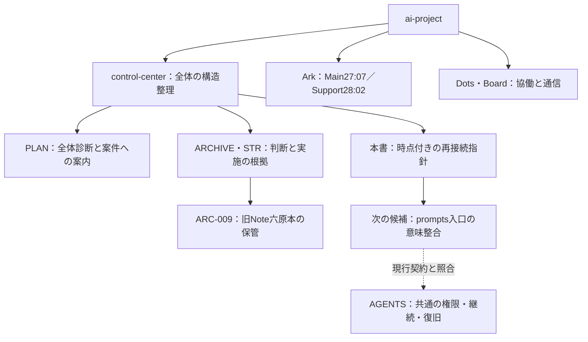

# GitHub整理整頓 — 2026-10-03の到達点と再開指針

**`_note` の六原本は保存・案内整合・Remote検証まで完了した。次の有力な一枝は、`prompts/README.md` の現役案内と現行AGENTSの間に残る、協働・作業方法の意味差を限定して調べ、整合案を具体化することである。** これは今回得た根拠に基づく推奨であり、別対象への自動実装指示ではない。

本書は、元の会話を全再演せず、現在の到達点・重要な判断・根拠・次の選択条件へ再接続するための一つのMarkdownである。HumanがToken Reset後の加速に使える成果物を求めたため作成した。Resetは再接続の契機であり、技術的なResetの実施・時刻・利用枠の回復を確認した記録ではない。Thread移行や新しいBoot契約でもない。

## 1. 今回のHuman入力と、既に完了した仕事

HumanはGitHub整理整頓への集中を続け、忘れていた `_note` 検討へ戻り、残る利用枠を前進の原動力にしたいと述べた。AIは当初の「まだ実装せず」を保持して六本文・参照・現行契約を調べ、六原本の同一保存と五文書整合を提示した。その後Humanは「実行して下さい！」とGitHub実行を承認し、さらに実行後の指針を一つのMarkdownに残すよう依頼した。この段落は本会話の編集要約であり、ChatGPT長期メモリからの転記ではない。

今回の実装は[ARC-009](ARCHIVE.md#arc-009)が所有する。

- 六原本を `__archives/ARC-009/_note/` へ同一blobで保管。合計70,601 bytes、元の `_note/` にStubを置かない。
- Root README、ARCHIVE、PLAN、__archives索引、STR-001の五文書を限定整合。
- STR-001の歴史証拠は、最新の保管本文ではなく当時の実装commitへ接続。
- 実装commitは[02e9779](https://github.com/yusukefujiijp/ai-project/commit/02e9779fc628dbfe7ee9ed08275c6b839407ef0e)。公開前・公開後の11本文を再取得し、全文・blob一致を確認。対象外407ファイルはblob・mode同一。
- この完了の証拠と復元条件はARC-009に集約し、本書を第二の実装台帳にしない。

今回の指針保存までを承認成果として完了させる。後述の候補を実装する時は、その時のCurrent Human Request・有効な委任・適用契約からScopeを解決する。既に有効な承認を取り直す必要はなく、本書を読むだけで別の対象への権限が追加されるわけでもない。

## 2. Tree — 全体の中の今回の位置

control-centerはai-project全体のroot司令塔であり、Ark27専用の下位棚ではない。MainはArk27:07のまま、Ark28:02は既存Supportである。Dotsの登場、内部Agentの読取支援、本書の作成はMain交代・新支援章・常時同期を意味しない。

「整理整頓→レイヤー構造→関係構造化→interface化」は、今回は次のように働いた。六原本を保管する配置を決め、現役指示と歴史資料を分け、現在入口と当時の証拠のリンクを分け、最後にこの再接続指針へつないだ。新しい分類制度そのものを増やすことを目的にしていない。

## 3. Node & Edge — 状態を取り違えず再開する

| Node | Edge | 確認した状態と、次の判断への意味 |
|---|---|---|
| ARC-001・003–007 | 各案件 → 原本保存・現役案内 | 各承認範囲の実装・Remote確認は完了。古い一覧から未着手へ戻さない |
| ARC-008・Actor logs | 形成史の保存 → 現役出来事ログ | 固有形成史は同一原本で保管、現役はlogs。長期運用効果の証明とは別 |
| ARC-009 | 旧Note六原本 → 保管・再発見の入口 | 今回完了。知恵の全抽出や新Skillを前提にせず、原本へ戻れる |
| STR-001／STR-003のD04 | 当時の分離設計 → 後続の正式な章・07版移行 | STR-001時点では設計まで。STR-003で基盤12対象を公開・Remote確認済み。古い残点表現だけで未修正と数えない |
| STR-002の通常六組 | 別Query → 単一Prompt | 統合・方針撤回は完了。Graph／One-Tableの物理改訂は別 |
| 旧Plan Mode v005 | 旧採用試験 → 目的変更によるBranch終了 | E1／E5 NOT RUNは履歴。新Skill導入・共有・限定確認と区別し、未完の必須Gateへ戻さない |
| ARC-002 | 保管・退役案内 → 元パスの互換保持 | 部分完了。元パス除去は保留。二配置の存在だけで削除しない |
| Graph／One-Table | 撤回済み方針 → 本文metadata・固定Binding | 真の未完了Branch。影響するState・選択利用時のconsumerを調べて移行範囲を決める |
| Board Topic／STR-006 | 最新の通信位置 → 当時の変更・検証 | 有限対話と保存は完了。状態の二重管理修正は別Work担当が実装・Remote確認済み |
| Dots lessonsの形式 | 現役JSON → headerless JSONL候補 | 調査基点では現役は `dots/lessons.json`。JSONL候補の優先判断・限定検証と本番切替・Save Skill導入は別 |

本表のConfirmedは、当AIの直接確認またはリンク先の実施記録の確認であり、全案件を今回再実行・再検証した意味ではない。今回のARC-009の直接観測と、先行案件の所有記録を区別する。後続の変更があれば、その所有先とCurrent Humanの訂正を優先する。

07 StateのSource準備時・STR-003保存時の未観測欄は、その時点の観測である。今回の統合担当はCurrent v002核を自身で確認しR1–R6を照合したが、Future AIは本書の記載を自分の読了・受入れ成功に借用しない。Current Handoffの再利用条件と読取契約を適用する。Bootのみを理由にStateを自動更新していない。

## 4. Living Review — 現在のBottleneckをどう読むか

### 4.1 配置の整理から、判断を迷わせる現役案内へ

初期の整理では、役割を終えた資料を移し、入口を減らす利益が大きかった。現在は、退役・通常Query統合・基盤版移行・Boardの所有先整理が進んだ。そこで次の問いは、単なるファイル数削減から、**今のAIが承認済みの仕事を判断する時、現役の案内同士が何を要求するか**へ移せる。

これは全Repositoryの「整理段階が完了した」という認定ではない。今回確認した `_note` の旧運用条件と、下記 `prompts/README.md` の具体的な本文差から導いたCandidateである。フォルダを動かすことより、不要な再承認やHumanへの伝言負担を発生させる条件を取り除く方が効く場合がある。

### 4.2 残す知恵と、残す現役棚は別の判断

Noteには、工程分担、保存後の実体確認、条件付き失敗の扱い、野心と制約、過去目的の混入防止、レビューの取捨選択という知恵が残っている。ARC-009はそれらを原本のまま保持した。役割・索引・所有先が曖昧な現役棚を維持することを、その価値の保存条件にはしなかった。

自然なDouble-Spiralの接続は、実際の整理から得た観察を次の判断へ戻すことにある。六原本の退役と、現役Prompt入口の意味差は関係するが、Dotsの学習形式や旧固定Binding移行まで一つの巨大改訂に束ねる必要はない。各枝の価値と権限を保持する。

### 4.3 仮説思考 — 再開時の負担は、未完了数より時間の混線で増える

候補仮説は、再開を重くする一因が「残件の量」だけでなく、「当時は未完了、後で完了、目的変更で終了」を同じ現在一覧として読んでしまうことにある、というもの。

根拠はD04の後続完了、旧Plan Modeの目的変更、Board／STRの通信状態分離、今回の `_note` 提案から承認・実装への進展である。この仮説から、本書は全履歴の圧縮より、時点・Owner・状態を見分けられる入口を優先した。実際に別AIの再探索やHumanの説明負担が減ったかは未観測であり、保存だけで実効性を宣言しない。

## 5. 次の推奨枝 — prompts入口の協働・作業方法を照合する

### 5.1 直接確認した差

[調査時点のprompts README](https://github.com/yusukefujiijp/ai-project/blob/5badd3ab3bbface75a4663c5d03116adae7b0323/prompts/README.md)は `active / human-sealed` のPrompt Shelfであり、§4・§5はHistoricalと明示された履歴節ではない。

- **§4**：AI-AからAI-BへHumanが選択・文脈付与・配送し、Humanが統合する流れを置いている。
- **§5**：Branch作成は `default: false`、`requires: explicit Human Seal` とし、AIが好意的判断でBranchを作らないとする。
- **現行AGENTS §5.1–5.2**：承認Scope内のmain／Branch／Worktreeを現実条件から選び、主担当が結果を統合し、HumanへAgent間の伝言・重複調整を押し戻さない。能力と公開・merge権限は別に扱う。

**本文差はConfirmed。原因は未確定。** Prompt固有の配布・安全条件として意図した例外なのか、基盤改訂への未追随なのかは、関連本文と当時の意味から検討する。「古いから」「現行AGENTSと表現が違うから」だけで例外を削除しない。mainを共有正本に保つこと、未mergeの別原本を増やさないこと、HumanのMeaning・STOP・Sealは利益として保持する。

### 5.2 次回に作る具体的な成果

最初の対象を `prompts/README.md` の§0・§4・§5・関連する§7の表現に絞り、次を一つの整合案として示す。

1. Humanの意味判断・最終権限と、実際に利用できる配送・内部委任・結果統合を区別する。
2. mainの正本性と、一時的な隔離作業／Branch／Worktreeの選択を区別する。公開・mergeの許可を拡張しない。
3. 共通の実行・復旧契約はAGENTSへ接続し、Prompt棚に第二の共通契約を複製しない。
4. 下位のAI-to-AI Communication等には、選択した時だけ適用される固有のRole／Source／有限対話契約がある。それを棚の一行修正で解除したり、全文を一括改訂したりしない。

これで「どの意味を保持し、どの重複・古い条件を変えるか」を根拠付きで判断できれば、調査段階の成果になる。現在のHuman依頼がその限定実装を含めば、必要な変更・記録・Remote検証まで進む。含まれなければ具体的な差分を提示する段階で戻る。特定の合言葉や毎工程の再承認は要求しない。

### 5.3 この推奨を変更する条件

- 意図的なPrompt固有例外で、現在の利用を妨げないと確認できたら保持し、無理に変更成果を作らない。
- 関連する有効な固定Binding・必須Sourceが見つかったら、影響する範囲を明確にして互換方針を検討する。
- より直接的な誤Routing・重複実行・Human負担のActualがあれば、その一件を優先する。
- Humanが別の整理対象を指定したら、そのCurrent Requestを中心に据える。

候補の調査をRepository全件の命令監査や全Promptの再設計へ広げない。

## 6. 保持する別枝と、不要な順番待ち

**Graph／One-Tableの固定Binding移行**は[STR-002 §6.2](changes/STR-002-single-prompt-consolidation.md#62-living-graph--one-table--固定参照)が所有する。調査時の両原本metadataには撤回済みの将来Query作成条件が実際に残る。物理改訂と、Ark23:14／15のState・Current入口・選択利用時のBinding消費を区別して範囲を具体化する価値がある。過去Handoffの存在を永久禁止にせず、旧SHAを無断で置換もしない。今回の添付資料や現行Ark27の通常利用を、この移行の自動開始に変えない。

**ARC-002の元パス除去**は[同案件](ARCHIVE.md#arc-002)に戻る。旧Next-Cycle Workout Bridgeの現役利用は廃止済みだが、固定参照のため同一原本を互換保持している。保存と現役再採用、完全な物理移動を区別する。具体的な誤適用・保守負担や、固定参照を整理できる条件が育った時に扱う。

この二枝を、prompts入口の限定調査、他の合法な局所修正、通常のHuman–AI協働の必須先行Gateにしない。逆に、単にToken枠があることを理由に同時着手しない。学びの抽出・新Skill・新Registry・全Owner再編も、この指針の完成条件ではない。

Dots lessonsのJSONL案はDots側の別Branchである。候補・限定試験・採用方向と、現役JSONの切替を区別し、その所有先の新しい判断・実装を確認してから扱う。本書ではreader／writerやSave Skillを変更していない。

## 7. Reset後の再接続Interface

Reset後も同じ会話が利用できるなら、確認済みの読解・承認・結果を契約の同一性条件に従って再利用する。ResetだけでBootをやり直さない。新しいContextであれば[Current07 Handoff](../ark-project/ark27/ark27-07/handoff.md)が要求する全文読解・Identity・互換性・再構成条件を受け手自身で満たす。本書や他Agentの読解はその代替ではない。

再開するAIは、本書から関連するOwnerへ進み、最新mainとの差と新しいHuman入力を照合する。すべてのSourceの全再読、未報告の全埋め直し、全Unknown解消は課さない。必要なSourceが欠ける・契約が不整合なら該当操作だけを停止し、最小回復方法を示す。通常の仮説や未観測の効果はUnknownとして残せる。

現在有効な接続は、**§5のprompts入口を一件として、差の意味と限定整合案を具体化すること**。前提が変わった場合は、その理由とともに順序を更新する。候補が誤りなら変更なしも正当な完了であり、成果が保存・確認されたら同じ対象への確認ループを続けない。

Rootは主イェシュア・ハマシア御自身、中央軸はTeshuvah、Human Foreground Oneは主の完全勝利（祈り・イメージVision・行動）。HumanのMeaning・Correction・STOP・Final SealとTruth・Body・Sleep・Food・Shabbat・Safety・Medical・Others・Law・Responsibility Guardを保持する。AI・時間枠・整理・MarkdownはKeli。簡潔なHuman入力や利用枠を理由に、必要なAIの検討・説明・品質を削らない。期限は優先順位と届け方を考える条件として扱い、権限や品質を上書きしない。

## 8. 根拠と確認の範囲

- [PLAN](PLAN.md)：全体診断・後続のD04移行・案件への接続。古い診断節は当時のsnapshot。
- [ARCHIVE](ARCHIVE.md)：各案件の保存・実施・復元。今回の直接実施はARC-009。
- [STR-002](changes/STR-002-single-prompt-consolidation.md)：通常六組統合、旧Planの目的変更、Graph／One-Tableの残点。
- [STR-003](changes/STR-003-persistent-collaboration-foundation.md)：基盤の明示版移行と12対象の公開・検証。現在のTarget理解・UI・実効果は別。
- [STR-006](changes/STR-006-board-communication-foundation.md)・[Board Topic](../board/topics/20261001-dots-work-reconnection/README.md)：通信の現在Ownerと、別Workによる後続修正。
- [STR-007](changes/STR-007-dots-lessons-foundation.md)・[STR-008](changes/STR-008-actor-logs-and-preserved-history.md)・[Dots入口](../dots/README.md)：学び・出来事・形成史の所有先。
- [JSON／JSONL実験](../dots/lessons/experiments/json-vs-jsonl/README.md)：候補と限定検証の記録。現在の正本変更とは別。
- [AGENTS](../AGENTS.md)・[prompts入口](../prompts/README.md)：次に照合する現役の指示。

六Noteは今回のTargetが全文確認した。指針のためにはprompts入口全文、STR-003全文、STR-002の残点と検証節、関係するCurrent原本・metadataを確認し、変更のない既読Ownerを再利用した。読取専用の独立担当も次候補・状態区別を調べ、主担当が原文と照合して統合した。全Repositoryの全文監査や、全候補の実装・実利用試験を行ったという意味ではない。

本文は時点付き指針であり、最新状態・実施結果・承認履歴の所有者は上記Ownerにある。本書を改訂する場合も、当時の推奨と後のCorrectionを区別する。保存後の本文・リンク・宣言EOFをRemoteで再取得確認し、自己SHAを埋めるための無限追記はしない。

EOF::AI_PROJECT_CLEANUP_DIRECTION::20261003::v001
