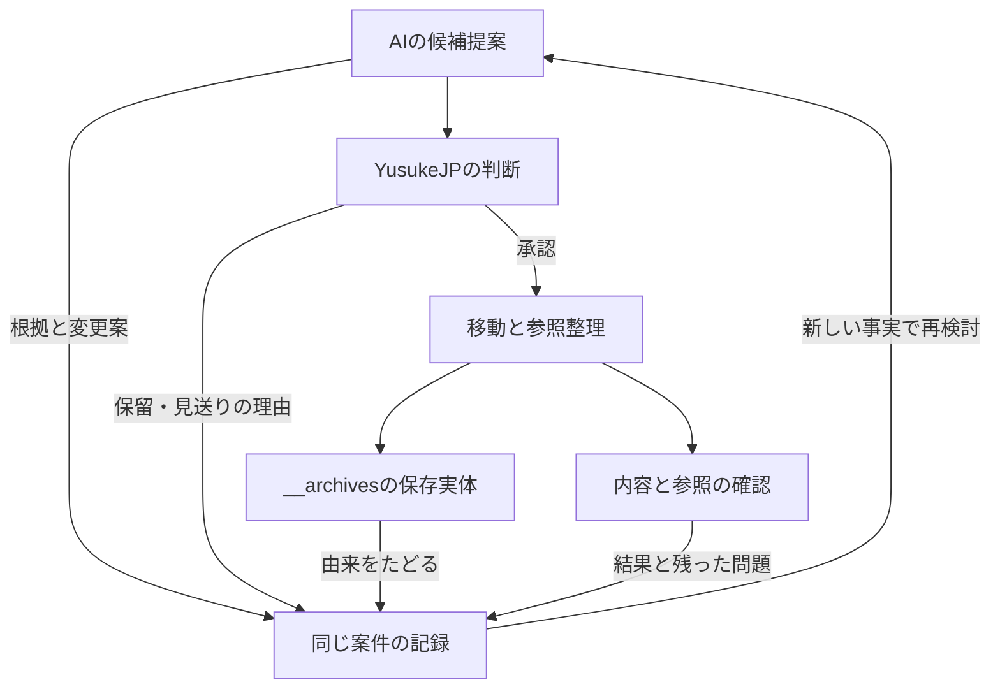

# アーカイブ案件 — 提案・判断・実施・記憶

**今後も使う資料を見通しやすくするため、役割を終えた現役配置を根拠から選び、YusukeJPの承認後に `__archives/` へ移す。提案から実施後の見直しまで、同じ案件で理由を辿れるようにする。**

最初の退役案件は[ARC-001](#arc-001)。続く三群は[ARC-002](#arc-002)・[ARC-003](#arc-003)・[ARC-004](#arc-004)、今回の実施経緯は[三群の記録](#archive-batch-2026-09-22)にある。chocoZAPの記録再設計と旧日別資料の保管は[ARC-005](#arc-005)、旧Plan Mode資料の退役と新Skillへの接続は[ARC-006](#arc-006)にある。全体の目的と形成史は[README](README.md)、診断と優先順位は[PLAN](PLAN.md)、保存実体への入口は[__archives](../__archives/README.md)にある。本書は個別案件の判断・承認・結果を所有する。一般的な会話ログ、全ProjectのTask台帳、全作業の追加Boot条件にはしない。

## 1. なぜ記録するか

以下はYusukeJPとのこの構成を決めた対話の編集要約であり、逐語録ではない。

Player系三Repositoryのアーカイブから継承するSeedは、役割を終えることと知恵を渡すことを両立させる整理方法である。Humanはai-project全体のスパゲッティ構成を、整理整頓→レイヤー構造→関係の構造化→interface化へ進めたいと考え、不要になった現役配置のアーカイブを優先した。

さらに、既存の `__archives/` があることを重視し、AIが候補と理由を具体例付きで提案し、YusukeJPが承認した後に実体を移すことを明示した。その記録と記憶をMarkdownに残す理由は、他AI・Future AIが「何を移したか」に加え、「なぜ作られ、なぜ退役を選び、何を残したか」を理解するためである。

原文の要点は「archive候補とその理由を詳細明確に」「人間側YusukeJPが承認後__archivesに放り込む」「その記録と記憶を取るMarkdownが必要」。本書はこの意味を具体化する。GitHub上に元会話への検証可能なURLは記録していないため、上記対話の出典はこのThreadのHuman発言として区別する。

「不要」は現在の運用に置く必要がないという判断であり、知恵の無価値を意味しない。古さ、ファイル名、空ファイル、重複、検索結果がないことだけで退役を決めない。現在の役割と依存、維持・修正・移動それぞれの利益を比較する。初回調査時のPlan Modeとrollback用の旧版には異なる役割があり、当時は重複の外見だけで退役を決めなかった。その後のHumanによる用途・維持方針の変更を[ARC-006](#arc-006)へ記録し、初回の保持判断を恒久化しない。

## 2. HumanとAIの役割

AIは読取、根拠確認、候補選定、代案比較、影響範囲・保存先・復元方法の具体化を担う。Humanへ「どれが不要か」を説明なしに返さず、推奨と理由を判断可能な形にする。

このアーカイブ方針では、YusukeJPが具体的な対象と変更範囲を承認した後に、その範囲を移動する。関連ファイルを一案件にまとめて承認することもできる。承認済み範囲では、必要な参照整理・保存先照合・記録まで続け、同じ許可を反復して求めない。文書への掲載、方向性への賛同、歴史的な削除予定を、別の対象への移動承認に拡張しない。

通常の権限はCurrent Human Requestと[AGENTS](../AGENTS.md)に従う。これはHumanが今回指定したアーカイブの運用であり、無関係な修正・読取・作業へ新しい承認工程を課す意味ではない。新しいHumanの訂正・STOP・承認範囲の変更があれば、その差を案件へ記録する。

実行担当は依頼に応じてAIまたはHumanとなる。Humanが手動移動した場合は報告とRemote確認を分けて残す。保存されたMarkdownが、他AIの読解やアカウント設定へ自動反映されたとは扱わない。

## 3. 一案件に残す意味

案件IDは、提案・保留・承認・実施・復元を同じ経緯へ結ぶために用いる。パス名を後で変えても、以前のIDから到達できるようにする。

- 対象、元の役割、確認時点、根拠のパス・節・版。
- 何が現在の判断を難しくし、なぜ維持や局所修正よりアーカイブを勧めるか。
- 保存する内容・Seed・由来、移動先、影響する参照、対象外として残す資料。
- Humanの判断、対象範囲、条件、記録できる原文または編集要約。未確認の日時・承認・会話URLは補完しない。
- 実施前後の差、変更commit、保存内容・参照の確認結果、未実施・未観測の範囲。
- 期待した効果と実際の結果、失敗・訂正・保留理由、再検討や復元の条件。

状態は、例えば「候補→提案済み→承認済み→移動済み→確認済み」と区別できる。保留・見送り・一部実施・復元等も、実際の出来事に合う語で記録する。この語彙や項目数を全案件の固定Schemaにはしない。特に、承認と実施、保存と別AIの理解を一つの完了表示へまとめない。

案件冒頭に現在の判断を置き、後段に重要な形成・訂正の順序を残す。新しい事実で判断が変わっても、以前の理由を無言で消さない。案件を分割する必要が育った場合は本書を索引にできるが、同じ内容の独立原本を増やさない。

アーカイブでは、現役として使う案内を外し、判断の由来へつなぎ直す。保存原本の古い `current`・承認・起動指示は当時の記述として読む。フォルダ名だけでは実行・書込みを技術的に禁止できず、実効的な呼出し元や通常案内が残る場合は案件の対策に含める。

## ARC-001

**完了：Human承認に基づき、撤回済み実験のchecker一つを通常のtoolsから__archivesへ移した。保存先の全文・blob一致、元配置の消失、関連記録と対象外ファイルの保持をRemote再取得で確認した。**

- **現在の状態**：個別承認済み・移動済み・Remote確認済み。Ark27:06のLiving Reviewで具体案を提示した後、新たなHuman実行承認により一ファイルの移動と関連三文書の更新を完了した。05の補足受入れ・ランキング希望・05→06準備の承認とは別の、今回の個別実行承認である。他の候補の移動や順位固定へ拡張しない。実行と確認の根拠はG節。
- **提案日・実行前確認日・実施確認日**：2026-09-22。確認時刻の基準はUTC。Human発言の未提示時刻は補完しない。
- **今回の承認範囲**：下記の一ファイル移動と、それに必要な索引・案件記録・診断の更新、保存後の確認。
- **全体診断との関係**：[PLANのD06](PLAN.md#d06)。
- **調査基点**：[commit d8c744d](https://github.com/yusukefujiijp/ai-project/commit/d8c744dd68d5a366855bb33e3167147adfc213cd)、Tree `aa85ce2f0a286c5c1891437a145c2301c6c99614`。再帰Treeは309ファイル、`truncated: false`。

### A. 対象と移動先

元の配置は `tools/check_repo_reality.py` の一つ。保存先は [__archives/ARC-001/tools/check_repo_reality.py](../__archives/ARC-001/tools/check_repo_reality.py)。提案・実行前確認時には移動先は存在しなかった。G節の実行commitで元パスの除去と保存先の追加を同じTreeへ反映し、main上の保存先と元配置を確認した。

対象blobは `9ae7c177a78f081d816a25da4d92021c5c582fec`、7,346 bytes。同じblobは[既存sandbox保存版][sandbox-checker]にもある。現役側の実体を内容変更なしで移し、既存sandboxはそのまま保持した。

移動後も元の相対パス `tools/check_repo_reality.py` を案件フォルダ内に保ち、由来の対応を見通せるようにした。原本のコードは内容を変更せず保存し、退役の意味と扱いは本案件・__archives入口で説明する。現役側に別コピーは残していない。

### B. なぜ存在し、なぜ退役を勧めるか

[実験の記録][sandbox]によると、2026-08-20にCURRENT_BOARD、checker、GitHub ActionsをRepositoryの通常配置へ接続した後、Human訂正でRoot READMEを復元し、実験資料をsandboxへ隔離した。当時の手動削除予定にはcheckerも含まれる。この予定は歴史的な根拠であり、今回の操作権限ではない。

今回確認した[checkerのコード][checker]は、`REQUIRED_FILES`で `CURRENT_BOARD.md` と `.github/workflows/reality-check.yml` を必須にする。しかし両方とも調査基点Treeにない。またRoot READMEがCURRENT_BOARDを案内しなければ警告を出す。

そのため、通常の `tools/` にあるcheckerを現在の正常判定と受け取ったAIが、撤回済みの仕組みを再作成することを「修復」と誤認する可能性がある。これは誤用経路の推論であり、今回実際に別AIが復活させたという観測ではない。

今回の推奨は、通常配置からの退役と理由の保存である。古い判定を現在の仕様へ書き直すには、新たな正常条件と用途の設計が必要になる。いまの目的は撤回済み実験の現役配置を整理することであり、そのツールの再開発を同時に始める必要はない。

### C. 参照関係の調査

GitHubの既定branchコード検索で `check_repo_reality` を検索し、9ファイルを取得した。結果URLはすべて上記基点commitを指していた。関連語 `reality-check` も検索し、7ファイルを取得した。下表は前者の9ファイルを意味別に整理したもの。検索断片だけで判断せず、必要なIdentity・該当節・コードと、既読資料の同一blobを確認した。

| Node | Edge | 確認した意味と移動時の扱い |
|---|---|---|
| [toolsのchecker][checker] | 自分自身と旧Board・Workflowを必須とする | 対象本体。通常配置から退役させる |
| [sandboxのchecker][sandbox-checker] | 同じ必須条件を保持する | 同一blobの歴史保存版。そのまま保持する |
| [sandbox README][sandbox] | 当時の配置・撤回理由・原型を記録する | 非現役の実験記録。歴史的なパスを一括置換しない |
| [sandboxのBoard][sandbox-board] | 実験当時の起動コマンドと配置を案内する | 親sandboxの隔離記録と組で読む歴史資料 |
| [sandboxの旧Root README][sandbox-root] | 実験当時の通常入口からcheckerへ案内する | 保存された旧Rootであり、現在のRoot READMEではない |
| [sandboxのWorkflow][sandbox-workflow] | Pythonコマンドでcheckerを呼ぶ | 保存資料内の実行定義。現行.github/workflows配下の定義ではない |
| [Ark21:06 Session記録][session] | 当時の未実施・Scope外候補として言及する | 経緯の原本として保持。実パスは小文字のark21-06 |
| [2026-09-19レビュー][review] | 当時の残存checkerを固定Evidenceで説明する | 日付付き観測。現在の状態へ書き換えない |
| [PLANのD06](PLAN.md#d06) | 残存配置の問題を診断し本案件へ案内する | 実施後に診断結果と残存範囲を更新する。固定Evidenceは保持 |

調査基点の `tools/` は対象一ファイルだけ。`.github/workflows/` には改行のみのREADMEだけがあり、同配下にYAMLのWorkflow定義はない。検索で見つかった実行コマンドはsandboxの歴史資料に属する。

**調査の限界**：これはTreeの全配置確認と、指定語による参照検索・対象箇所の意味確認である。全309ファイルの全文意味読解、全Git履歴、外部サービス・別Repository・個人端末の呼出し調査ではない。検索で一致しない動的呼出しや外部利用は未確認。検索結果だけから「どこからも絶対に使われていない」とは断定しない。

checkerは今回実行していない。レビューにある過去の実行結果を今回の検証結果として転記しない。

### D. 比較した案と保存するSeed

- **採用した案**：現役コピーを__archivesへ移し、既存sandboxと本案件へ由来をつなぐ。現役側の見通しと歴史保存を両立させる。
- **維持して注意書きだけ追加**：通常配置のまま誤用可能性が残り、不要な現役配置を減らすHumanの目的への効果が弱い。
- **現役コピーを除きsandboxへの索引だけ残す**：内容保存は可能だが、Humanが今回指定した__archivesへの実体移動とは異なる。前段のAI案から今回の推奨を改めた理由として残す。
- **checkerを再設計**：将来の選択肢として残るが、退役の完了に必要な作業ではない。

保存するSeedは、検査の着眼点、当時のコード、仮説を正常条件にした経緯、早い通常運用への接続を撤回した理由である。「失敗したから消す」「現在のcheckerが要求するから旧仕組みを復活させる」のどちらにも単純化しない。Future AIは新しい目的と根拠で再利用・再設計を提案できる。

移動自体でRepository全体のファイル数は減らない。現役側の `tools/` を退役させ、対象の実体と理由へ到達できることが、この案件の具体的な整理成果である。誤認頻度の低下や別AIの実理解は、配置の変更とは別の観測として扱う。

### E. 今回承認された作業範囲

1. `tools/check_repo_reality.py` を `__archives/ARC-001/tools/check_repo_reality.py` へ、内容を変えずに移す。
2. `__archives/README.md` に保存実体と本案件への索引を追加する。
3. 本案件へHuman判断・移動前後の対応・実行commit・保存確認・残点を追記する。
4. `control-center/PLAN.md` のD06を実施結果に合わせて更新する。提案段階で解消済みにしない。

この具体案では、歴史資料のパス記述はそのまま残す。PLAN・本案件が使う固定commitへのEvidenceリンクは、元のパスがmainからなくなっても当時の内容を参照できる。現行の新しい案内は実際の保存先へ向ける。

対象外はsandbox全体、Root README、他のtools、他のProject・Runtime、Workflowの新設・起動である。移動直前に対象や参照関係が実質的に変わっていた場合は影響を再評価し、承認範囲を広げる変更が必要ならその差分を示す。

### F. 承認後の実施・確認・復元

まずmain・対象blob・移動先の空き・関連する参照を再確認する。Contents APIで段階的に移す場合は、移動先の作成とRemote全文照合を先に完了し、その後に元ファイルを取り除く。途中で止まったら、保存先だけ存在する等の実状態を記録し、完了と扱わない。使用可能な手段と依存関係に合う実施方法を選べる。

完了時は、保存先の内容が承認対象と一致すること、元のパスが通常配置に残らないこと、索引から実体・由来・本案件へ届くこと、対象外に意図しない変更がないことを確認する。保存内容、参照整理、別AIの実理解は別の観測として報告する。

外部利用等の予想外の依存が見つかれば、その呼出し目的と現在の必要性を確認し、案内の修正、移動の見直し、復元を比較する。復元時は、保存実体または移動前の固定commitから同じ内容を元のパスへ戻し、関連案内と本案件へ理由を追記する。復元可能性と、古い判定基準を現役へ再採用してよいかは別に判断する。履歴の書換えを復元の前提にしない。

### G. 判断と実施の履歴

- **2026-08-20のHistorical Source**：sandboxに撤回・隔離と手動削除予定が記録された。今回の承認ではない。
- **2026-09-22・Human訂正**：現役配置のアーカイブを優先し、AI提案→YusukeJP承認→__archivesへの移動→理由と経緯の記録を指定。
- **同日・AI案の修正**：既存sandboxへの索引中心の案から、現役コピーを__archivesへ移しsandboxの文脈を保持する案へ変更。
- **同日・文書整備の実行依頼**：構成案提示後のHuman「OK！Very Good! 早速、やってみましょう！」を受領。README・PLAN・本書・__archives入口の整備と、候補の参照調査を実施する範囲として扱った。
- **同日・具体案の作成**：本案件に対象・理由・参照調査・保存先・実施と復元の方法を記録。個別移動の承認・実施・移動後の確認はまだ記録されていない。

- **同日・移動前の本流合流を指定**：四文書の保存・具体案の提示後、YusukeJPが「ここまでで一旦、Ark27：05の最新ark-projectに合流させよう！」と指示。移動後では接続が複雑になるという理由を説明した。これを[SUPPORT_RECONNECTの補足](PLAN.md#reconnect-ark27-05)へ反映し、移動を先行させず、成果・理由・未承認の範囲を既存05へ渡す。
- **Source準備と実体の区別**：今回の補足保存はPLANと本書に限定する。checkerの現役パス、既存sandbox、__archivesの保存実体を変更しない。Target受入れはPLANの補足接続で観測を区別し、そこから移動承認を自動推定しない。

- **2026-09-22・05での受入れを後続記録**：既存Ark27:05が四文書と六条件を根拠付きで理解し補足接続した。次Threadで候補をランキングとして比較したいというHuman希望を受領した。05→06の準備実行が承認されたが、本件の個別移動承認は含まれない。詳細な受入れ観測の所有先はPLAN補足§8、05の発言・判断の出典は同節が案内するR05。

- **2026-09-22・Ark27:06での個別実行承認**：06のLiving Reviewは本件について、現役維持と理由・復元経路を保つ退役を比較し、後者を推奨した。対象一ファイル、保存先、索引・案件履歴・PLANの更新、実行前の現物確認を提示した後、Humanが「良いですね！」「Execute GitHub OK!」「Human Seal OK!」「実行して下さい！」と明示した。この応答を上記具体案の実行承認として受領し、同じ許可を再要求せず、必要な確認・保存・記録を継続する。出典はこのArk27:06のHuman発言。会話URLは未提示。他案件の移動・全診断の修正・新Trialの承認ではない。
- **同日・実行前のRemote確認**：[commit e3acc6f](https://github.com/yusukefujiijp/ai-project/commit/e3acc6f2c5e5f24f40a8e35aa3b9dea5801a9c0f)、Tree `12f003ce6d22a66fac1280c7b9defbe5255de0d7`。再帰Treeは316ファイル、`truncated: false`。元ファイルとsandbox保存版は同じblob `9ae7c177a78f081d816a25da4d92021c5c582fec`、7,346 bytes。移動先は未作成。`CURRENT_BOARD.md` と `.github/workflows/reality-check.yml` はなく、通常の `.github/workflows/` は改行のみのREADME一つだった。
- **同日・参照関係の更新確認**：同じ基点を指すGitHubコード検索で `check_repo_reality` は16ファイル、`reality-check` は8ファイル、いずれも `incomplete_results: false`。前回の9ファイルから増えた7件は、本案件、__archives入口、06のREADME・Handoff・State、05のState・Task Records。05・06の資料は確認済みのSource準備版と同じblobであり、当時の配置・未承認状態を継承する根拠として保持する。現役checkerの呼出し追加とは扱わない。sandboxの撤回理由、旧Board・旧Root・Workflowの呼出し箇所、Session記録と過去レビューの対象節を確認した。現在のRoot READMEには検索語の参照がなく、現役Workflowの呼出しも見つからなかった。全316ファイルの全文意味読解、動的呼出し、外部利用の不存在証明ではない。
- **同日・実装方法**：Git Data APIで現行Treeを基礎にし、元blob・mode `100644` をそのまま保存先へ設定する。元パスの除去、保存先の追加、__archives索引・本案件・PLANの更新を一つのコミットへまとめ、mainを非forceで更新する。親commitが変わった場合は差分を再確認する。checkerの実行や旧Board・Workflowの復活は行わない。
- **同日・移動実行とRemote確認**：[commit 2b8d06c](https://github.com/yusukefujiijp/ai-project/commit/2b8d06c6ba008c9b3044f851455d332067851e4c)、Tree `1c2f9f4861f269baca9d11faca5bcb3823862ac2`。mainのrefがこのcommitを指すことを確認した後、保存先コードと関連三文書をmainから直接再取得し、意図した全文・blobとの一致を確認した。保存先は元と同じ7,346 bytes・blob `9ae7c177a78f081d816a25da4d92021c5c582fec`・mode `100644`。Remote Treeで元ファイルとrootの `tools/` が存在しないことを確認した。
- **同日・変更範囲と案内の照合**：移動一件と関連三文書以外の既存312ファイルは同じblob・mode。総ファイル数は316で不変、Treeは `truncated: false`。Root README、既存sandbox、各ThreadのTriad、固定Binding、既存Workflow配置を保持した。関連三文書のYAML・canonical_path・版とEOF、42件の相対リンク先と取得済み対象の参照見出しを確認した。保存先・案件・由来の経路を接続し、履歴内の旧パスは当時の根拠として残した。
- **確認結果の保存と限界**：移動反映版はARCHIVE `0.2.0`、PLAN `0.4.0`、__archives入口 `0.2.0`。本改訂はその保存後観測を受けて案件とD06／E09を確認済みへ更新する。確認済みなのは配置・内容保持・関連記録の整合であり、別AIの実理解、誤用頻度の減少、動的・外部呼出しの不存在は認定しない。本書自身の最終blobを自己参照で埋め込まず、追記後の版はGit履歴とRemote再取得で照合する。

後続のHuman判断とActual Resultはこの履歴へ追記し、冒頭の状態を更新する。実施前の期待を成功実績へ置き換えない。

## ARC-002

**廃止済みWorkout Bridgeの原本を保存し、通常利用への案内を退役扱いへ更新する。旧Bootの固定参照を守るため、元パスの同一内容は互換用に保持する。元パス除去は未実施であり、完全な物理移動とは数えない。**

- **現在の状態**：Human承認済み・原本保存済み・退役案内更新済み・Remote確認済み。元パスは固定参照の互換用に保持し、その除去は保留。確認根拠は[今回の実施記録](#archive-batch-2026-09-22)。
- **対象**：`ai-ark-seed/ai-ark-seed-cards/next-cycle-workout-bridge.md`。
- **保存先**：[ARC-002の原本](../__archives/ARC-002/ai-ark-seed/ai-ark-seed-cards/next-cycle-workout-bridge.md)。元と同じblob `857e03089bd28063fa59d773782468b3a5aa54cb`、9,915 bytesを保持する。
- **退役理由**：[現行Ark27指示§8.9](https://github.com/yusukefujiijp/ai-project/blob/802b71f47411661457bd155dc07d63d2656158f6/ark-project/ark27/INSTRUCTIONS.md)は廃止済み・Closingとして復活させないと明示する。カードはArk23:07限定の非Canonical・E0・実地未検証候補であり、廃止前の設計と後続Correctionを区別して保存する。

### A. 依存と採用した方法

実行前のパス名検索は参照11ファイル。特に[Ark23:08 QueryのRequired Sources](https://github.com/yusukefujiijp/ai-project/blob/802b71f47411661457bd155dc07d63d2656158f6/ark-project/ark23/ark23-08/lords-complete-victory-tradeoff-resolution-best-practice_query.md)は元パス・blob SHA・Exact EOFを固定する。短い移動案内への置換ではこの一致を保てず、単純な削除は旧main指定の読取契約を変えてしまう。今回はカードのアーカイブ原本を追加し、元パスの同一blobも保持する方法をAIが選んだ。これは参照保全を含む承認済み整理の実装判断であり、Humanが特定の互換方式を逐語指定したという記録ではない。

[Card Shelfの入口](../ai-ark-seed/ai-ark-seed-cards/README.md)に、廃止、保存先、元パスの互換目的を表示する。[Living Fruitの原本](https://github.com/yusukefujiijp/ai-project/blob/802b71f47411661457bd155dc07d63d2656158f6/ai-ark-seed/ai-ark-seed-cards/living-fruit.md)にもBridgeを含む二段Closingと設定コピー文があるため、同入口で当時の記録として読む境界を説明する。Living Fruit自体の廃止や本文改稿は行わず、その固定blob `2f188ce6b04042fbd5f3575341c23aa0f5d7db49`と旧ThreadのBindingを維持する。

保存する価値は、現在回答の完了と次Query送信後の待機を区別した設計、任意性、身体Guard、Human Correctionの軌跡である。保存原本の承認・起動文はHistoricalであり、現在のClosingや身体Taskの発火権限ではない。

### B. 残点・再検討・復元

元パスへの直接アクセスは残る。入口の注記は技術的な実行停止機能ではなく、誤読減少・他AIの理解も未観測。原本を今後改訂する場合は独立二原本として同期を続けず、この案件で変更目的と固定参照への影響を先に解決する。現行の廃止決定はCard ShelfとArk27指示が案内する。

元パスを除去するには、旧契約を実行可能な状態で残す範囲と、固定commitによる歴史閲覧へ移す範囲を具体化する。今回の承認を旧Handoff・Query群の一括改訂へ広げない。今回の保存・案内を戻す場合は基点commitまたはGit履歴から対象の案内を復元できるが、Bridgeの再採用は別のHuman判断である。

## ARC-003

**X DeepQuoteの旧Stage 02と、そのファイル受け渡し方式を前提とする監査Packetの二資料を移動する。後続Stage 02と現在のStage 01・02Rは維持する。**

- **現在の状態**：Human承認済み・二原本の移動済み・Remote確認済み。元二パスと通常配置の`prompts/fable5/`は消失。確認根拠は[今回の実施記録](#archive-batch-2026-09-22)。
- **元の役割**：Stage 02は最終引用投稿・候補選択・Lite実行、PacketはX DeepQuoteとAI Output Polishを対象とした特定方式の監査依頼。

| Node | Edge | 原本の同一性 |
|---|---|---|
| `prompts/x-deepquote/x-deepquote_02-quote-completion-gate_v001-8.md` | [保存先](../__archives/ARC-003/prompts/x-deepquote/x-deepquote_02-quote-completion-gate_v001-8.md)へ移動 | blob `b9cf4e1c44bb1ec03b03502d08413f39ecb6a1ce`、14,169 bytes |
| `prompts/fable5/fable5-x-deepquote-markdown-handoff-ai-output-polish-audit_packet_v001.md` | [保存先](../__archives/ARC-003/prompts/fable5/fable5-x-deepquote-markdown-handoff-ai-output-polish-audit_packet_v001.md)へ移動 | blob `d90566ea95663c4ffa98ab0a8916036fbfabe01b`、7,093 bytes |

### A. 理由・代替先・参照

旧Stage 02 §16は`downloadable_markdown_file`、[後続v001-9 §16](https://github.com/yusukefujiijp/ai-project/blob/802b71f47411661457bd155dc07d63d2656158f6/prompts/x-deepquote/x-deepquote_02-quote-completion-gate_v001-9.md)は`chat_inline_markdown_block`を指定する。[現在のStage 01 §7](https://github.com/yusukefujiijp/ai-project/blob/802b71f47411661457bd155dc07d63d2656158f6/prompts/x-deepquote/x-deepquote_01-depth-builder.md)もChat Inlineを採用している。一方、旧Packetはダウンロード方式への移行を前提とし、現在のTreeにないStage 01 `v001-5`と旧Stage 02 `v001-8`を監査対象にする。

旧版の番号だけで退役とせず、この役割・出力差とHumanの今回の承認から、旧方式の通常配置を退役する。監査が実施・完了したという証拠は追加しない。既知の旧Stage 02パス検索は自身とPacketの2ファイル、Packet名検索は自身1ファイルであり、二原本を同じ案件に保存する。[Prompts入口](../prompts/README.md)から現在の三段階とこの履歴へ案内する。

`prompts/fable5/`は実行前に当該Packet一ファイルだけだったため、その通常配置がなくなる。`claude/`のFable5資料、AI Output Polish、Stage 02Rは対象外。Stage 02RはSourceへ立ち戻る修正という別の役割を持ち、現在もダウンロード方式を記述する。この案件はその仕様を変更せず、全Stageの出力方式が統一済みとも主張しない。

### B. 保存する価値・Unknown・復元

SourceとPublication Voiceの分離、未根拠情報を除く判断、公開可能時の停止、監査の観点を原本に保持する。旧Packet内の元パスはHistoricalとして残し、現在の監査依頼へ自動復帰させない。旧方式の外部利用・外部に保存されたQueryは未調査であり、検索件数を不存在証明にしない。

必要な外部利用が判明した場合は、その目的と現在の方式を比較する。復元は保存先から元の二パスへ同じ内容を戻し、Prompts入口と本案件へ理由を追記する。旧版を別方式として再採用する判断と、原本が復元可能であることを分ける。

## ARC-004

**旧Compile／Pickup四ファイルを移動する。文脈付きSeedを別Threadへ渡して成熟させる価値を保持し、新しい軽量Seed／Card化方式との完全同等を主張しない。**

- **現在の状態**：Human承認済み・四原本の移動済み・入口更新済み・Remote確認済み。現行Seed入口から役割差・保存価値・四原本へ到達できる。確認根拠は[今回の実施記録](#archive-batch-2026-09-22)。

| Node | Edge | 元blob |
|---|---|---|
| `prompts/ai-compile-ark-seed.md` | [保存先](../__archives/ARC-004/prompts/ai-compile-ark-seed.md)へ移動 | `c1684cfd34117eaf3208fbd6e8b2f732077de056` |
| `prompts/ai-compile-ark-seed_query.md` | [保存先](../__archives/ARC-004/prompts/ai-compile-ark-seed_query.md)へ移動 | `fe72a415643b4e403bb2fa8ac86e58c2a8b44c47` |
| `prompts/ai-pickup-ark-seed.md` | [保存先](../__archives/ARC-004/prompts/ai-pickup-ark-seed.md)へ移動 | `91a3727467262606e111d0307b85021885e22f81` |
| `prompts/ai-pickup-ark-seed_query.md` | [保存先](../__archives/ARC-004/prompts/ai-pickup-ark-seed_query.md)へ移動 | `0774ebcb5f4d24c5af0470774ef18d8bb4ad19d5` |

### A. 退役理由と、保持を必要とした違い

現存する[AI Ark Seed](../ai-ark-seed/README.md)は単一QueryでCOMPILE／PICKUPを解決する。旧四ファイルは別々のPairであり、本文の起動先にも不存在の`ark-project/prompts/`を保持していた。[既存レビュー§3.6](https://github.com/yusukefujiijp/ai-project/blob/802b71f47411661457bd155dc07d63d2656158f6/repository-reviews/reports/2026-09-19.md)もこの不一致を指摘する。ただしパス不良だけなら局所修正も可能であり、それだけを退役理由としない。

旧CompileはOrigin Context・Human Original Wording・因果・Unknown・First Legal Moveを伴うSeedとPickup-Ready Packetを作り、旧Pickupは専用ThreadでConcept Maturationを開始する。新Compileは軽量の`"Name(Definition)"`、新Pickupは選択したSeedのCard化判断を中心にする。この違いを[現行Seed入口の文脈継承案内](../ai-ark-seed/README.md#10-context-preservation)に残し、必要時に保存原本へ戻れるようにした。

例えば複雑なCorrectionを別Threadが深掘りする依頼では、一文Seedだけで文脈が足りると仮定しない。発見前の状況、Trigger、Humanの意味、変化、未確定、次の合法手を必要な深さで保持する。軽量Seed、文脈付き移植、永続Card化は異なる成果物であり、回答品質や説明を縮める理由にしない。保存原本は設計知識として参照し、旧Queryの不存在パスをそのまま起動しない。

### B. 依存・境界・復元

実行前の文字列検索では旧Compileは自身の二ファイルと固定commitへリンクする過去レビュー、旧Pickupは旧四ファイル内の参照だった。原本同士の関係はこの一群で保持する。過去レビューは観測時点の根拠として変更しない。

変更は入口の整理と四原本の移動であり、現行Query・Compile・Pickup Runtimeの契約、Seed Cardの内容、Field Test状態、Canonical Statusを変更しない。新方式が旧方式の全用途を代替すると実証したものでもない。文脈付き移植の依頼はCurrent Human Requestと適用される移行契約から扱い、旧Pairを自動Fallbackにしない。

旧方式固有の実利用が必要と判明した場合は、保存原本から四パスを復元する案と、その意味に合う現在の接続を比較する。復元時も原本内の旧パス不一致は自動的に解消しないため、利用可能と報告する前に経路を再確認する。

## archive-batch-2026-09-22

### 三群の承認・実装・確認を区別する

1. **提案**：Ark27:06で、第1位Bridge一ファイル、第2位X旧二資料、第3位旧Seed四ファイルを理由・依存・保存価値とともに提示した。第1位の固定参照と第3位の役割差を明示し、旧Plan Mode・thread-end・旧Thread群等は除外した。
2. **今回のHuman承認**：その直後のYusukeJPの「全てOK！」「Execute GitHub OK!」「Human Seal OK!」「実行して下さい！」を、三群と必要な参照整理・保存確認への実行承認として受領した。出典は本Ark27:06会話。未提示の会話URLや発言時刻は補完しない。05の受入れ・次Thread希望やARC-001の承認の流用ではない。
3. **実行前のRepository確認**：2026-09-22 UTC、main [`802b71f`](https://github.com/yusukefujiijp/ai-project/commit/802b71f47411661457bd155dc07d63d2656158f6)、Tree `564e3645fd531a8f96e89722134ba2feefc2d291`、316ファイル、`truncated: false`。対象七原本はランキング調査と同じblob。新しい保存先は未作成。現行AGENTSと局所ガイドを照合し、確認済み06 Bootは再実施していない。
4. **AIの実装判断**：ARC-002は固定参照を保つ互換原本を元パスへ残し、アーカイブ保存と退役案内を実施する。元パスの除去は保留。ARC-003・004は六原本を移し、通常配置から除く。旧Seedの価値を現行入口から辿れるようにし、未承認のRuntime再設計や旧Thread一括改訂は行わない。
5. **変更範囲**：七原本の保存、六元パスの除去、ARCHIVE・PLAN・__archives入口・Prompts入口・AI Ark Seed入口・Card Shelf入口の更新。保存原本、Living Fruit、旧Boot資料、現行専門Runtime、Root指示、他のProjectは内容を保持する。
6. **移動・保存の実行**：mainを非forceで[commit `012323c`](https://github.com/yusukefujiijp/ai-project/commit/012323c58568a0fa1435be2c3e0399b66cab5f96)へ更新した。Tree `8e6c18b5ce613d91218a19908dfb97dbf8812b92`。七原本は既存blobとmode `100644`をそのまま保存先へ使用し、六元パスの除去と六案内文書の更新を同じcommitへまとめた。
7. **Remote再取得**：更新後のmain refを確認し、七保存先・六更新文書・Bridgeの互換元パスの計14パスをmainから直接再取得した。全文とblobが意図した内容に一致した。Bridgeの元パスと保存先はともにblob `857e03089bd28063fa59d773782468b3a5aa54cb`、旧Living Fruitも元blobを保持する。
8. **Treeと案内の確認**：再帰Treeは317ファイル、`truncated: false`。元六パスと`prompts/fable5/`はなく、対象外の既存304ファイルは同じblob・mode。現行専門Runtime、旧Plan Mode、旧Threadの固定資料、06 Triad、Root指示等を保持した。六更新文書のmetadata・必要なExact EOF・code fenceと、95件の相対リンク先、更新対象間の見出し参照を照合した。過去資料の旧パス記述を一括変更せず、固定commitの根拠を維持する。
9. **今回完了した範囲と残点**：ARC-003・004の六原本の物理移動、ARC-002の原本保存・退役案内・互換保持を確認した。ARC-002の元パス除去は未実施。旧Bootの再実行、別AIの理解、外部利用の不存在、誤読減少、実生活効果は未確認。本確認記録自体は後続の記録commitへ保存し、その最終blobを本文へ自己参照で埋め込まずGit履歴とRemote再取得で照合する。

調査は全Treeの配置確認、候補と関係する本文の照合、指定語による参照検索である。全316ファイルの全文意味読解、全Git履歴、動的・外部利用の不存在証明ではない。ChatGPT長期メモリは本件の保存Sourceに使わず、今回の会話と確認済みRepository本文を根拠とする。Root・Teshuvah・Human Foreground One・Guard、HumanのCorrection・STOP・Final Sealを保持する。新候補、次Trial、他Projectの整理を自動開始しない。

[checker]: https://github.com/yusukefujiijp/ai-project/blob/d8c744dd68d5a366855bb33e3167147adfc213cd/tools/check_repo_reality.py
[sandbox]: https://github.com/yusukefujiijp/ai-project/blob/d8c744dd68d5a366855bb33e3167147adfc213cd/ark-project/ark21/Ark21-06/sandbox/README.md
[sandbox-checker]: https://github.com/yusukefujiijp/ai-project/blob/d8c744dd68d5a366855bb33e3167147adfc213cd/ark-project/ark21/Ark21-06/sandbox/check-repo-reality-v001-experimental.py
[sandbox-board]: https://github.com/yusukefujiijp/ai-project/blob/d8c744dd68d5a366855bb33e3167147adfc213cd/ark-project/ark21/Ark21-06/sandbox/current-board-v001-experimental.md
[sandbox-root]: https://github.com/yusukefujiijp/ai-project/blob/d8c744dd68d5a366855bb33e3167147adfc213cd/ark-project/ark21/Ark21-06/sandbox/root-readme-v002-experimental-mistake.md
[sandbox-workflow]: https://github.com/yusukefujiijp/ai-project/blob/d8c744dd68d5a366855bb33e3167147adfc213cd/ark-project/ark21/Ark21-06/sandbox/reality-check-v001-experimental.yml
[session]: https://github.com/yusukefujiijp/ai-project/blob/d8c744dd68d5a366855bb33e3167147adfc213cd/ark-project/ark21/ark21-06/README.md
[review]: https://github.com/yusukefujiijp/ai-project/blob/d8c744dd68d5a366855bb33e3167147adfc213cd/repository-reviews/reports/2026-09-19.md

## ARC-005

**chocoZAPの現役記録をREADMEとJSONへ集約し、旧日別Markdown一式を、日付ごとの文脈記録を再利用するための資料として保管する。**

- **判断と実装**：YusukeJPが本会話の修正版計画へ実行・GitHub保存を承認し、AI assistantがこの版で新構成への切替と三資料の保管を行った。確認日：2026-09-24。正確な保存時刻・GitHub上の記録者・変更差分は本案件を追加したコミットで辿る。
- **調査・原本の基点**：main `4efbf44eb31c22c660d9c75f4be1917e3d3b716f`。GitHub接続はCONNECTOR_ONLY_MODE。確認済みの共通指示・Skillを再利用し、対象外の構成・他案件は保持する。

### A. 何をどこへ保存したか

| Node | Edge | 移行前のblob |
|---|---|---|
| `chocozap/README.md` | [注記付き保管版](../__archives/ARC-005/chocozap/README.md)へ接続 | `2c3becb892edbd9502c63215bdfec15057aa144c` |
| `chocozap/records/2026/2026-09-24.md` | [注記付き保管版](../__archives/ARC-005/chocozap/records/2026/2026-09-24.md)へ接続 | `79f0d020d90dbe624076da201c4faa8226974a2d` |
| `chocozap/records/undated/cz-visit-0001.md` | [注記付き保管版](../__archives/ARC-005/chocozap/records/undated/cz-visit-0001.md)へ接続 | `e27f1b6e545b4b5a6bdda5cdc8ff87825f338306` |

[現行のREADME](../chocozap/README.md)は案内を簡素化して同じ入口に残し、実データの正本を [sweet-spots.json](../chocozap/sweet-spots.json) とした。旧日別ファイルとundatedの移動案内は元パスから撤去した。旧mainの二つのファイルURLは存続しない。過去版は上記基点の同じパスから参照できる。

保管版にはfrontmatterの `archive_*` 項目と冒頭注記を追加した。注記を除いた原文は移行前の内容と一致する。保存版のblobは注記追加により原blobと異なる。日別記録の数値・引用・来歴、旧案内の設計と限定検証記録を保持した。旧相対リンクは当時の元パスを基準とするため、保存版の冒頭から固定commitの原本へ戻って辿る。

### B. Humanの訂正から残した価値

以下は本会話のHuman発言を編集した要約であり、逐語録やB-Gate実践の結果報告ではない。

1. 数値の記録・訂正に対して処理が重いというFeedbackから、Humanは日別Markdownの継続更新をやめ、READMEと一つのJSONを中心に作り直す方針を選んだ。月別等の分割はデータ量と実運用を見て再検討する。
2. 当初は旧記録を現行配置から撤去しGit履歴へ残す計画だった。その後Humanは日毎の詳しい記録を「ドラッカー的『予期せぬ成功』」と評価した。忘れやすい休日やB-Gate検出の情報を、日付と文脈を持つ記録から詳しく振り返る用途へ応用できる可能性を挙げた。
3. Humanは今回のchocoZAP運用ではカットする判断を維持しつつ、復帰や他分野への応用に備えてファイルを残す案を提示した。条件は、他AI・Future AIが現役と誤認して追記しないことだった。
4. AIが現役の入口・正本と保管資料を分け、状態表示と復帰条件を付ける計画を提示した後、Humanは「Execute GitHub OK」「実行して下さい！」と承認した。承認範囲は本移行・保管・必要な案内と確認である。

保存するSeedは、頻繁に更新する数値の扱いやすさと、一日の状況・本人の言葉・訂正・前後関係を後から辿れる価値を、それぞれの用途に合わせて残すこと。日別Markdownが無価値・不適切一般という判断ではない。Humanの好評価は保持し、B-Gateでの実利用や精密な想起の改善が実証されたとは扱わない。記録にない出来事や本人の心中を補完しない。

### C. 通常運用・再利用・復帰の境界

通常の読み書きと集計は現行READMEとJSONを使う。保管資料は二つ目の可変台帳や自動Fallbackではない。JSONが読めない時も、旧記録へ追記したり旧値を現在の値として代用したりしない。フォルダ名・注記は運用上の区別であり、技術的な書込み禁止権限を設定したものではない。

復帰や転用を検討する時は、この案件と原資料を読み、現在のHumanの目的・判断に照らして必要な要素を選ぶ。chocoZAPへ戻す場合はその時点のJSONとの責務を決め、現在の訂正を保持する。別分野では新しい目的へ合わせ、旧chocoZAP運用を自動再開しない。実際に復帰・転用したら、その根拠と実施結果を本案件へ接続する。

今回、B-Gateのデータ収集・新しい記録システム・別Skill・成功事例ファイル・定刻処理は作成していない。長期メモリは転記していない。Skillは保存詳細を現行READMEへ委ねる既存の接続を維持し、本文や登録設定の変更を必要としなかった。

### D. 確認の範囲

公開前の内容照合では、2026-09-24・来館cz-visit-0001・四機械六条件・O001〜O006・S01〜S06・C01の対応を確認した。O006の現在値は10kg、5kgは訂正前の申告であり、新しい来館や運動上の成長として数えない。日付確認、本人の訂正と実地Sampleへの評価を保持し、未報告の周回・運動量・時刻を追加していない。

JSONの構文とID・出所参照、保管注記を除いた本文の一致、現役側がREADMEとJSONだけになる構成と参照先を照合する。保存後は実行AIが当該版を再取得し、保存内容・撤去対象・参照先を確認して実際の保存版を完了報告に示す。この記録は内容照合とRemote確認を混同せず、保存後の結果を先取りしない。

今回の確認は構造とデータ移行の範囲である。通常の更新速度、他AIの実理解、誤追記防止の実績、B-Gate等での生活上の効果は別に観測する。将来の容量・読書き時間・競合・比較範囲に問題が現れた場合は、分割や運用を再検討する。

### E. 保存後の再取得確認

2026-09-24、AI assistantが移行コミット [`8121cad`](https://github.com/yusukefujiijp/ai-project/commit/8121cadd25fdf04431b93d81b4af865a771e0923) の公開後にmainを再取得した。更新・追加した七ファイルは保存予定の全文と一致し、ツリーの変更は計画した九パス（七ファイルの作成・更新と旧二ファイルの撤去）だけだった。現役のchocozap配下はREADMEとsweet-spots.jsonの二つ。六条件・訂正・出所を保持し、ショルダープレス片手の現在値10kgを再確認した。

JSONはUTF-8で1,996バイト。今回の再取得呼出しは約0.33秒だった。これは移行直後の一回の取得観測であり、通常の追加・訂正の総所要時間や速度向上の実証ではない。確認済み状態はこの保存版に対するもので、以後の更新は現行正本を読む。

## ARC-006

**旧Plan Modeの専用Subsystem八資料と旧v003 Pair二資料を退役し、一つのQueryから柔軟なPlan Mode Skillへ接続する。** 旧方式の機能同等な更新ではなく、Humanによる目的・維持方針の変更として扱う。

### A. 判断の形成と今回の権限

HumanはQuery分割を「短期視点ではプラス」「長期視点では大きなマイナス」と評価し、専用性の強いPlan Mode資料も時間経過後の使いづらさを理由に退役対象へ追加した。Plan Mode自体の重要性は維持し、一つの長過ぎず短過ぎないQueryから、案件に合わせて十分に考えるSkillへ接続する方針を選んだ。

移行Skillから横展開するのは、定型の責務を一つの入口の奥へ委ねる上層の設計であり、移行固有の本文や固定Gateのコピーではない。HumanはAIの自由度・創発性とFuture AIの深化・進化に応じた改善余地を求め、旧資料からの吸収を任意とした。採用の中心は現在の計画の品質であり、全旧機能の保存・旧v005との挙動同等性を条件にしない。

複数回のPlan-onlyによる調査・検討の後、2026-09-26の現在入力でYusukeJPは統一Queryの同時作成を明示し、「Execute GitHub OK」「Human Seal OK」「実行して下さい」と承認した。対象は新Skillの作成・導入・GitHub共有、旧十資料の退役、必要な九文書の案内・5W1H更新、検証・Remote確認である。以前の包括的なGoだけを根拠にせず、この具体化された計画への現在の承認を使った。

旧v005候補の採用Branchは**目的変更で終了**した。独立E1／E5はNOT RUN、旧方式採用のHuman Reality Verdict／Fresh Cutover Sealは未受領だった履歴を保持する。今回の実行承認を旧試験のPASSやFAILへ変換しない。[STR-002 §6.1](changes/STR-002-single-prompt-consolidation.md#61-plan-mode--目的変更による旧採用branchの終了)が過去の準備との関係を示す。

### B. 5W1Hと変更範囲

- **Who:** 意味・訂正・方向・実行承認はYusukeJP。設計・実装・確認はArk27:06のAI協働者（Codex実行環境）。GitHub author／committerと正確な保存時刻は、保存後の取得値を§Fへ記録した。AI担当とGitHub名義は区別する。
- **When:** 2026-09-26の承認・実装。会話の順序は上記の編集要約で残し、未確認の個別発言時刻や会話URLは補完しない。
- **Where:** `yusukefujiijp/ai-project` / `main`。原本基点は[commit 57d3d7f](https://github.com/yusukefujiijp/ai-project/commit/57d3d7f1f5d46cbcaefdc752608acb7021c06bae)、Tree `109b9d296c33e6a86b1e60f4220dbe01281fec15`。GitHub接続はCONNECTOR_ONLY_MODE。
- **What:** 下表の十原本を`__archives/ARC-006/<元パス>`へ移し、旧配置から除去する。共有Skillは`skills/plan-mode/SKILL.md`と`agents/openai.yaml`の二ファイルを追加する。
- **Why:** 休止・再開・維持・別AIへの継承を含めた負担を減らし、Plan Modeの高い可能性を特定時期の手順・固定出力へ閉じ込めないため。短期の成功を無価値にせず、長期の再評価を反映する。
- **How:** 元blobをそのまま保管先へ使用し、現役の案内を新Skillへ変更する。Skill形式・限定挙動・導入を確認し、GitHub保存後にCommit・Tree・本文・対象外保持を直接再取得して照合する。

更新九文書はroot `README.md`、`prompts/README.md`、`prompts/ai-full-rail-next-gate.md`、`control-center/README.md`、`control-center/PLAN.md`、本書、`control-center/changes/STR-002-single-prompt-consolidation.md`、`__archives/README.md`、`skills/README.md`。Full Railは§10・§14の旧Plan Mode参照と関連metadataのみを修正し、権限の所有先を現在のHuman入力・AGENTS・適用契約へ戻す。新Skillを全体の状態管理者にしない。

### C. 十原本の保存先

| Node | Edge | 保持するGit blob |
|---|---|---|
| `ai-plan-mode/ai-plan-mode_query.md` | [同一原本](../__archives/ARC-006/ai-plan-mode/ai-plan-mode_query.md)へ移動 | `5efcb1ef0cc3288df577b28ec78e351aa9e48987` |
| `ai-plan-mode/ai-plan-mode.md` | [同一原本](../__archives/ARC-006/ai-plan-mode/ai-plan-mode.md)へ移動 | `aa3c420bbfee56c94e12b7417ca567151139967e` |
| `ai-plan-mode/candidates/ai-plan-mode-v005.md` | [同一原本](../__archives/ARC-006/ai-plan-mode/candidates/ai-plan-mode-v005.md)へ移動 | `6685c44a33ae7826fbd1437efacdb7ed043e327b` |
| `ai-plan-mode/README.md` | [同一原本](../__archives/ARC-006/ai-plan-mode/README.md)へ移動 | `1e6d76b7b347469810962b99ba603cfdda9ed0c2` |
| `ai-plan-mode/tests/cold-start-test.md` | [同一原本](../__archives/ARC-006/ai-plan-mode/tests/cold-start-test.md)へ移動 | `220339b3da56495d9c5395db0e232ddf772f1e32` |
| `ai-plan-mode/tests/fixtures/truncated-runtime-without-eof.md` | [同一原本](../__archives/ARC-006/ai-plan-mode/tests/fixtures/truncated-runtime-without-eof.md)へ移動 | `2bea9dd426a8ef2c2843c892c5f0ab2f1597c950` |
| `ai-plan-mode/tests/partial-read-test_query.md` | [同一原本](../__archives/ARC-006/ai-plan-mode/tests/partial-read-test_query.md)へ移動 | `d8e9ed357f0f7c895de24a00fa1a90b2bc89185d` |
| `ai-plan-mode/tests/single-prompt-v005.md` | [同一原本](../__archives/ARC-006/ai-plan-mode/tests/single-prompt-v005.md)へ移動 | `af563d1c1adeb68672380ea100a2589a0fd08d79` |
| `prompts/ai-plan-mode_query.md` | [同一原本](../__archives/ARC-006/prompts/ai-plan-mode_query.md)へ移動 | `f87f14605bc9cd63043be282dca9d3053fd8f525` |
| `prompts/ai-plan-mode.md` | [同一原本](../__archives/ARC-006/prompts/ai-plan-mode.md)へ移動 | `c895fa27ae5e13b4b3343f22e76cf46b845bfa0b` |

保管版は原文・改行・metadata・EOFを含めて同一blobとする。意図的にEOFを欠く`truncated-runtime-without-eof.md`もFixtureとして保存し、完全なRuntimeへ修復しない。原文への注記追加は行わず、本案件と`__archives/README.md`で歴史資料の境界を示す。

元十パスに互換原本・Stubは置かない。旧資料の`active`、`current`、起動命令、試験Gate、`canonical_path`は当時の記述であり、現在の作業を拘束する入口や自動Fallbackではない。保管は旧仕様の全利益を新Skillへ移植したという意味ではない。

### D. 参照影響と復元

実体と現用参照の調査では、旧パス群への言及を退役十資料、現役六文書、歴史的五文書に分けた。Current mainの全Treeと指定語の検索を用いた確認であり、全Git履歴・全外部利用の不存在証明ではない。

歴史的な`thread-end/ark/ark0707_20260726_start-query.md`、`ark0705_20260722_handoff_v002.md`、`ark0705_to_ark0707_20260726_reboot-map.md`には旧v003への参照が残る。これらのmain上の旧資料URLは今回の除去後には解決しない。旧Ark07のBootを現在のmainで互換実行できるとは主張せず、当時の文脈は[移動前の固定snapshot](https://github.com/yusukefujiijp/ai-project/tree/57d3d7f1f5d46cbcaefdc752608acb7021c06bae)の元パスから辿る。履歴本文の一括書換えや旧Bootの再実行は行わない。

`repository-reviews/reports/2026-09-19.md`の固定観測とArk21 sandboxの歴史的記述も保持する。保管版の相対リンクは元配置を基準とするものがあるため、元の参照関係を再現する時は上記固定snapshotを使う。現在のArk27:06 Required SourcesのBindingは旧Plan Mode十原本を指しておらず、Current Triad・固定Runtime・共通移行契約は変更しない。

復元する場合は、現在のHumanの目的・対象・権限を確認し、必要な原本を保管先の同一blobまたは基点commitから取得する。原パスへ戻すことと現役へ再採用することは別であり、再採用時には現在の依存・案内・Guardを再検討して本案件へ理由と結果を追記する。過去の承認を現在の自動復帰許可にしない。

### E. 新Skillと確認境界

新Skillの原本・統一Query・限定応答確認は[Skills Hub §3.3](../skills/README.md#33-plan-modeの統一入口)が所有する。設計は一つの入口、柔軟な方法選択、必要な深さ、訂正可能な仮説、現在の権限と停止を中心にする。通常利用時の方法適応、改善案、永続改訂を区別し、毎回の自己監査や自動書換えを義務化しない。

導入・形式・限定挙動・Remote保存は別の観測であり、全AI互換性、自然な自動選択の安定性、Human UI操作、長期の保守負担軽減は未実証のまま残す。旧資料と新Skillの機能差はHumanが許容した設計変更であり、旧v005の試験通過へ置換しない。

「一時期の成功が、時間経過後の保守負担として現れる」ことを整理整頓の診断へ使い、他分野へ横展開できる可能性はSeedとして保持する。今回はHumanの運用評価と設計仮説であり、一般理論・生活上の効果・独立した新Projectとして確定しない。

ChatGPT長期メモリを保存Sourceに使わず、現在の会話と確認済みRepository本文だけを根拠にする。Root・Teshuvah・Human Foreground One・Guard、Correction・STOP・Final Sealを保持する。固定Graph／One-TableのBinding移行、ARC-002の元パス除去、D04、次Trial、実Thread移行、別の整理案件は開始しない。

### F. 保存後確認

1. **Skillの導入と同一性。** 2026-09-26、形式検証後にPlan Modeを導入し、保存先を再取得して本体・表示名・統一Queryを確認した。共有するSKILL.mdはUTF-8で5,823 bytes、SHA-256は`dec1a4b1d4f6d5df0cfc34aa1d443b1c07869592481cd93cf9ff965832c45a4e`。導入済み本文とGitHub共有本文は一致した。表示設定には同じQueryを保持し、導入環境が付加するアイコン・内部設定はGitHubへ輸出していない。このhashは初回版の証拠で、Future AIの改訂を禁止する固定条件ではない。
2. **公開直前のmain進行。** 調査基点の後に別作業が進み、公開直前のmainは`197281bbb7d7765bf4cb75a6228667db070cd00e`、Treeは`a79e3db227ee1c1c500efd9e8c763eaca7fa11ae`だった。既存326ファイルのblob・modeは調査基点と同一で、別作業の二追加を確認した。その最新Treeを親として使い、追加内容を保持した。別作業の内容を今回の成果や追加整理対象にしていない。
3. **実装Commit。** [`2827352`](https://github.com/yusukefujiijp/ai-project/commit/2827352cc7bbc8c22a3f1e89906565300cfd1860)。Parentは上記`197281b`、実装Treeは`0d5390a36239b7592d63e4f548844a8990ea43be`。GitHubから取得したauthor／committerはともに`yusukefujiijp`。保存時刻は`2026-09-26T08:28:14Z`（17:28:14 JST）。意味の承認とAIの執筆・検証担当は§Bの区別を保持する。
4. **Remote直接再取得。** `2026-09-26T08:29:12.861Z`（17:29:12.861 JST）に検証を完了した。上記Commitを指定して新規・更新11ファイルと保管10ファイルの計21本文を再取得した。11本文は保存予定の全文と一致し、10保管原本のblobは§Cの移動前blobと一致した。旧十パスはTreeに存在しない。
5. **変更範囲。** 追加12パス（保管10＋Skill2）、削除10パス、既存更新9パスの計31パス。公開直前の328ファイルから330ファイルへ変わった。対象外309ファイルのblob・modeは親Commitと同一で、Current Ark27:06 Triad、固定Runtime、共通移行契約、AGENTS、既存export-manifestを保持した。Commit・非省略の再帰Tree・mainの参照先も再取得して一致を確認した。
6. **構造と挙動の検証範囲。** 更新文書のIdentity・YAML・必要なExact EOF・Code Fence、243件の相対参照と更新対象内の57件の見出し参照を照合した。保管資料の旧相対リンクを現在の有効リンクと誤認せず、§Dの固定snapshotへ接続する。限定した三AI文脈・五応答の挙動はSkills Hub §3.3に記録した。旧試験E1／E5、全外部リンク、全AIでの再現、自然な自動選択の安定性、Human UI操作、長期効果の検証ではない。

Skill作成・導入、GitHub共有、旧十資料の退役、現用案内・5W1H更新、Remote確認は上記の範囲で完了した。この確認追記は同じ案件への記録更新であり、Skill再改訂や新試験ではない。追記自身の自己SHAは埋め込まず、保存後の再取得で照合する。次の接続はHuman Reviewとし、通常Unknownや残る別Branchを自動実行の理由にしない。

EOF::AI_PROJECT_CONTROL_CENTER_ARCHIVE::v0.5.0
