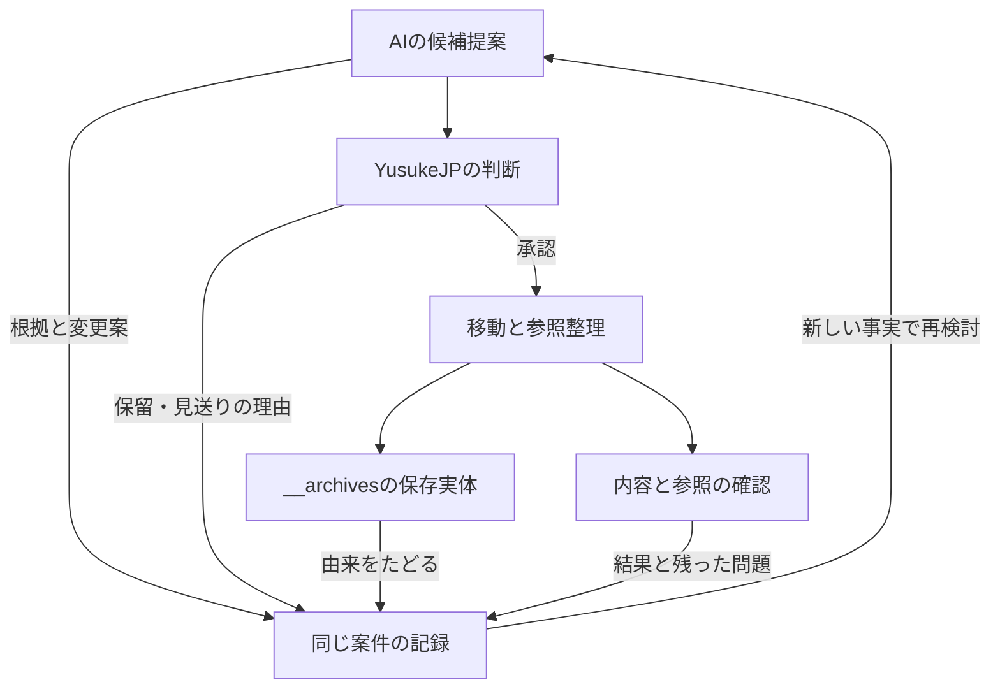

# アーカイブ案件 — 提案・判断・実施・記憶

**今後も使う資料を見通しやすくするため、役割を終えた現役配置を根拠から選び、YusukeJPの承認後に `__archives/` へ移す。提案から実施後の見直しまで、同じ案件で理由を辿れるようにする。**

最初の具体案は[ARC-001](#arc-001)。全体の目的と形成史は[README](README.md)、診断と優先順位は[PLAN](PLAN.md)、保存実体への入口は[__archives](../__archives/README.md)にある。本書は個別案件の判断・承認・結果を所有する。一般的な会話ログ、全ProjectのTask台帳、全作業の追加Boot条件にはしない。

## 1. なぜ記録するか

以下はYusukeJPとのこの構成を決めた対話の編集要約であり、逐語録ではない。

Player系三Repositoryのアーカイブから継承するSeedは、役割を終えることと知恵を渡すことを両立させる整理方法である。Humanはai-project全体のスパゲッティ構成を、整理整頓→レイヤー構造→関係の構造化→interface化へ進めたいと考え、不要になった現役配置のアーカイブを優先した。

さらに、既存の `__archives/` があることを重視し、AIが候補と理由を具体例付きで提案し、YusukeJPが承認した後に実体を移すことを明示した。その記録と記憶をMarkdownに残す理由は、他AI・Future AIが「何を移したか」に加え、「なぜ作られ、なぜ退役を選び、何を残したか」を理解するためである。

原文の要点は「archive候補とその理由を詳細明確に」「人間側YusukeJPが承認後__archivesに放り込む」「その記録と記憶を取るMarkdownが必要」。本書はこの意味を具体化する。GitHub上に元会話への検証可能なURLは記録していないため、上記対話の出典はこのThreadのHuman発言として区別する。

「不要」は現在の運用に置く必要がないという判断であり、知恵の無価値を意味しない。古さ、ファイル名、空ファイル、重複、検索結果がないことだけで退役を決めない。現在の役割と依存、維持・修正・移動それぞれの利益を比較する。たとえば現行Plan Modeと明示されたrollback用の旧版には異なる役割があり、重複に見えるだけでまとめて退役させない。

## 2. HumanとAIの役割

AIは読取、根拠確認、候補選定、代案比較、影響範囲・保存先・復元方法の具体化を担う。Humanへ「どれが不要か」を説明なしに返さず、推奨と理由を判断可能な形にする。

このアーカイブ方針では、YusukeJPが具体的な対象と変更範囲を承認した後に、その範囲を移動する。関連ファイルを一案件にまとめて承認することもできる。承認済み範囲では、必要な参照整理・保存先照合・記録まで続け、同じ許可を反復して求めない。文書への掲載、方向性への賛同、歴史的な削除予定を、別の対象への移動承認に拡張しない。

通常の権限はCurrent Human Requestと[AGENTS](../AGENTS.md)に従う。これはHumanが今回指定したアーカイブの運用であり、無関係な修正・読取・作業へ新しい承認工程を課す意味ではない。新しいHumanの訂正・STOP・承認範囲の変更があれば、その差を案件へ記録する。

実行担当は依頼に応じてAIまたはHumanとなる。Humanが手動移動した場合は報告とRemote確認を分けて残す。保存されたMarkdownが、他AIの読解やアカウント設定へ自動反映されたとは扱わない。

## 3. 一案件に残す意味

案件IDは、提案・保留・承認・実施・復元を同じ経緯へ結ぶために用いる。パス名を後で変えても、以前のIDから到達できるようにする。

- 対象、元の役割、確認時点、根拠のパス・節・版。
- 何が現在の判断を難しくし、なぜ維持や局所修正よりアーカイブを勧めるか。
- 保存する内容・Seed・由来、移動先、影響する参照、対象外として残す資料。
- Humanの判断、対象範囲、条件、記録できる原文または編集要約。未確認の日時・承認・会話URLは補完しない。
- 実施前後の差、変更commit、保存内容・参照の確認結果、未実施・未観測の範囲。
- 期待した効果と実際の結果、失敗・訂正・保留理由、再検討や復元の条件。

状態は、例えば「候補→提案済み→承認済み→移動済み→確認済み」と区別できる。保留・見送り・一部実施・復元等も、実際の出来事に合う語で記録する。この語彙や項目数を全案件の固定Schemaにはしない。特に、承認と実施、保存と別AIの理解を一つの完了表示へまとめない。

案件冒頭に現在の判断を置き、後段に重要な形成・訂正の順序を残す。新しい事実で判断が変わっても、以前の理由を無言で消さない。案件を分割する必要が育った場合は本書を索引にできるが、同じ内容の独立原本を増やさない。

アーカイブでは、現役として使う案内を外し、判断の由来へつなぎ直す。保存原本の古い `current`・承認・起動指示は当時の記述として読む。フォルダ名だけでは実行・書込みを技術的に禁止できず、実効的な呼出し元や通常案内が残る場合は案件の対策に含める。

## ARC-001

**提案：撤回済み実験のchecker一つを、通常のtoolsから__archivesへ移す。**

- **現在の状態**：提案済み。Humanの訂正により、移動前に既存Ark27:05へ補足接続する。個別移動の承認は未取得、移動は未実施。案件の却下ではなく、直近の順序変更である。合流内容と受入れ状態は[PLANの補足接続](PLAN.md#reconnect-ark27-05)を参照する。
- **提案日・確認日**：2026-09-22。
- **Human判断対象**：下記の一ファイル移動と、それに必要な索引・案件記録・診断の更新。
- **全体診断との関係**：[PLANのD06](PLAN.md#d06)。
- **調査基点**：[commit d8c744d](https://github.com/yusukefujiijp/ai-project/commit/d8c744dd68d5a366855bb33e3167147adfc213cd)、Tree `aa85ce2f0a286c5c1891437a145c2301c6c99614`。再帰Treeは309ファイル、`truncated: false`。

### A. 対象と移動先

対象は `tools/check_repo_reality.py` の一つ。移動先案は `__archives/ARC-001/tools/check_repo_reality.py`。移動先はまだ存在せず、提案パスである。

対象blobは `9ae7c177a78f081d816a25da4d92021c5c582fec`、7,346 bytes。同じblobは[既存sandbox保存版][sandbox-checker]にもある。今回は現役側の実体を移す案であり、既存sandboxをまとめて移す・消す案ではない。

移動後も元の相対パス `tools/check_repo_reality.py` を案件フォルダ内に保ち、由来の対応を見通せるようにする。原本のコードは内容を変更せず保存し、退役の意味と扱いは本案件・__archives入口で説明する。現役側へ別コピーを残す案ではない。

### B. なぜ存在し、なぜ退役を勧めるか

[実験の記録][sandbox]によると、2026-08-20にCURRENT_BOARD、checker、GitHub ActionsをRepositoryの通常配置へ接続した後、Human訂正でRoot READMEを復元し、実験資料をsandboxへ隔離した。当時の手動削除予定にはcheckerも含まれる。この予定は歴史的な根拠であり、今回の操作権限ではない。

今回確認した[checkerのコード][checker]は、`REQUIRED_FILES`で `CURRENT_BOARD.md` と `.github/workflows/reality-check.yml` を必須にする。しかし両方とも調査基点Treeにない。またRoot READMEがCURRENT_BOARDを案内しなければ警告を出す。

そのため、通常の `tools/` にあるcheckerを現在の正常判定と受け取ったAIが、撤回済みの仕組みを再作成することを「修復」と誤認する可能性がある。これは誤用経路の推論であり、今回実際に別AIが復活させたという観測ではない。

今回の推奨は、通常配置からの退役と理由の保存である。古い判定を現在の仕様へ書き直すには、新たな正常条件と用途の設計が必要になる。いまの目的は撤回済み実験の現役配置を整理することであり、そのツールの再開発を同時に始める必要はない。

### C. 参照関係の調査

GitHubの既定branchコード検索で `check_repo_reality` を検索し、9ファイルを取得した。結果URLはすべて上記基点commitを指していた。関連語 `reality-check` も検索し、7ファイルを取得した。下表は前者の9ファイルを意味別に整理したもの。検索断片だけで判断せず、必要なIdentity・該当節・コードと、既読資料の同一blobを確認した。

| Node | Edge | 確認した意味と移動時の扱い |
|---|---|---|
| [toolsのchecker][checker] | 自分自身と旧Board・Workflowを必須とする | 対象本体。通常配置から退役させる |
| [sandboxのchecker][sandbox-checker] | 同じ必須条件を保持する | 同一blobの歴史保存版。そのまま保持する |
| [sandbox README][sandbox] | 当時の配置・撤回理由・原型を記録する | 非現役の実験記録。歴史的なパスを一括置換しない |
| [sandboxのBoard][sandbox-board] | 実験当時の起動コマンドと配置を案内する | 親sandboxの隔離記録と組で読む歴史資料 |
| [sandboxの旧Root README][sandbox-root] | 実験当時の通常入口からcheckerへ案内する | 保存された旧Rootであり、現在のRoot READMEではない |
| [sandboxのWorkflow][sandbox-workflow] | Pythonコマンドでcheckerを呼ぶ | 保存資料内の実行定義。現行.github/workflows配下の定義ではない |
| [Ark21:06 Session記録][session] | 当時の未実施・Scope外候補として言及する | 経緯の原本として保持。実パスは小文字のark21-06 |
| [2026-09-19レビュー][review] | 当時の残存checkerを固定Evidenceで説明する | 日付付き観測。現在の状態へ書き換えない |
| [PLANのD06](PLAN.md#d06) | 残存配置の問題を診断し本案件へ案内する | 実施後に診断結果と残存範囲を更新する。固定Evidenceは保持 |

調査基点の `tools/` は対象一ファイルだけ。`.github/workflows/` には改行のみのREADMEだけがあり、同配下にYAMLのWorkflow定義はない。検索で見つかった実行コマンドはsandboxの歴史資料に属する。

**調査の限界**：これはTreeの全配置確認と、指定語による参照検索・対象箇所の意味確認である。全309ファイルの全文意味読解、全Git履歴、外部サービス・別Repository・個人端末の呼出し調査ではない。検索で一致しない動的呼出しや外部利用は未確認。検索結果だけから「どこからも絶対に使われていない」とは断定しない。

checkerは今回実行していない。レビューにある過去の実行結果を今回の検証結果として転記しない。

### D. 比較した案と保存するSeed

- **採用を勧める案**：現役コピーを__archivesへ移し、既存sandboxと本案件へ由来をつなぐ。現役側の見通しと歴史保存を両立できる。
- **維持して注意書きだけ追加**：通常配置のまま誤用可能性が残り、不要な現役配置を減らすHumanの目的への効果が弱い。
- **現役コピーを除きsandboxへの索引だけ残す**：内容保存は可能だが、Humanが今回指定した__archivesへの実体移動とは異なる。前段のAI案から今回の推奨を改めた理由として残す。
- **checkerを再設計**：将来の選択肢として残るが、退役の完了に必要な作業ではない。

保存するSeedは、検査の着眼点、当時のコード、仮説を正常条件にした経緯、早い通常運用への接続を撤回した理由である。「失敗したから消す」「現在のcheckerが要求するから旧仕組みを復活させる」のどちらにも単純化しない。Future AIは新しい目的と根拠で再利用・再設計を提案できる。

移動自体でRepository全体のファイル数は減らない。現役側の `tools/` がなくなり、対象の実体と理由へ到達できることが、この案件の具体的な整理成果となる見込みである。

### E. 承認対象の作業範囲

1. `tools/check_repo_reality.py` を `__archives/ARC-001/tools/check_repo_reality.py` へ、内容を変えずに移す。
2. `__archives/README.md` に保存実体と本案件への索引を追加する。
3. 本案件へHuman判断・移動前後の対応・実行commit・保存確認・残点を追記する。
4. `control-center/PLAN.md` のD06を実施結果に合わせて更新する。提案段階で解消済みにしない。

この具体案では、歴史資料のパス記述はそのまま残す。PLAN・本案件が使う固定commitへのEvidenceリンクは、元のパスがmainからなくなっても当時の内容を参照できる。現行の新しい案内は実際の保存先へ向ける。

対象外はsandbox全体、Root README、他のtools、他のProject・Runtime、Workflowの新設・起動である。移動直前に対象や参照関係が実質的に変わっていた場合は影響を再評価し、承認範囲を広げる変更が必要ならその差分を示す。

### F. 承認後の実施・確認・復元

まずmain・対象blob・移動先の空き・関連する参照を再確認する。Contents APIで段階的に移す場合は、移動先の作成とRemote全文照合を先に完了し、その後に元ファイルを取り除く。途中で止まったら、保存先だけ存在する等の実状態を記録し、完了と扱わない。使用可能な手段と依存関係に合う実施方法を選べる。

完了時は、保存先の内容が承認対象と一致すること、元のパスが通常配置に残らないこと、索引から実体・由来・本案件へ届くこと、対象外に意図しない変更がないことを確認する。保存内容、参照整理、別AIの実理解は別の観測として報告する。

外部利用等の予想外の依存が見つかれば、その呼出し目的と現在の必要性を確認し、案内の修正、移動の見直し、復元を比較する。復元時は、保存実体または移動前の固定commitから同じ内容を元のパスへ戻し、関連案内と本案件へ理由を追記する。復元可能性と、古い判定基準を現役へ再採用してよいかは別に判断する。履歴の書換えを復元の前提にしない。

### G. 判断と実施の履歴

- **2026-08-20のHistorical Source**：sandboxに撤回・隔離と手動削除予定が記録された。今回の承認ではない。
- **2026-09-22・Human訂正**：現役配置のアーカイブを優先し、AI提案→YusukeJP承認→__archivesへの移動→理由と経緯の記録を指定。
- **同日・AI案の修正**：既存sandboxへの索引中心の案から、現役コピーを__archivesへ移しsandboxの文脈を保持する案へ変更。
- **同日・文書整備の実行依頼**：構成案提示後のHuman「OK！Very Good! 早速、やってみましょう！」を受領。README・PLAN・本書・__archives入口の整備と、候補の参照調査を実施する範囲として扱った。
- **同日・具体案の作成**：本案件に対象・理由・参照調査・保存先・実施と復元の方法を記録。個別移動の承認・実施・移動後の確認はまだ記録されていない。

- **同日・移動前の本流合流を指定**：四文書の保存・具体案の提示後、YusukeJPが「ここまでで一旦、Ark27：05の最新ark-projectに合流させよう！」と指示。移動後では接続が複雑になるという理由を説明した。これを[SUPPORT_RECONNECTの補足](PLAN.md#reconnect-ark27-05)へ反映し、移動を先行させず、成果・理由・未承認の範囲を既存05へ渡す。
- **Source準備と実体の区別**：今回の補足保存はPLANと本書に限定する。checkerの現役パス、既存sandbox、__archivesの保存実体を変更しない。Target受入れはPLANの補足接続で観測を区別し、そこから移動承認を自動推定しない。

後続のHuman判断とActual Resultはこの履歴へ追記し、冒頭の状態を更新する。実施前の期待を成功実績へ置き換えない。

[checker]: https://github.com/yusukefujiijp/ai-project/blob/d8c744dd68d5a366855bb33e3167147adfc213cd/tools/check_repo_reality.py
[sandbox]: https://github.com/yusukefujiijp/ai-project/blob/d8c744dd68d5a366855bb33e3167147adfc213cd/ark-project/ark21/Ark21-06/sandbox/README.md
[sandbox-checker]: https://github.com/yusukefujiijp/ai-project/blob/d8c744dd68d5a366855bb33e3167147adfc213cd/ark-project/ark21/Ark21-06/sandbox/check-repo-reality-v001-experimental.py
[sandbox-board]: https://github.com/yusukefujiijp/ai-project/blob/d8c744dd68d5a366855bb33e3167147adfc213cd/ark-project/ark21/Ark21-06/sandbox/current-board-v001-experimental.md
[sandbox-root]: https://github.com/yusukefujiijp/ai-project/blob/d8c744dd68d5a366855bb33e3167147adfc213cd/ark-project/ark21/Ark21-06/sandbox/root-readme-v002-experimental-mistake.md
[sandbox-workflow]: https://github.com/yusukefujiijp/ai-project/blob/d8c744dd68d5a366855bb33e3167147adfc213cd/ark-project/ark21/Ark21-06/sandbox/reality-check-v001-experimental.yml
[session]: https://github.com/yusukefujiijp/ai-project/blob/d8c744dd68d5a366855bb33e3167147adfc213cd/ark-project/ark21/ark21-06/README.md
[review]: https://github.com/yusukefujiijp/ai-project/blob/d8c744dd68d5a366855bb33e3167147adfc213cd/repository-reviews/reports/2026-09-19.md

EOF::AI_PROJECT_CONTROL_CENTER_ARCHIVE::v0.1.1
