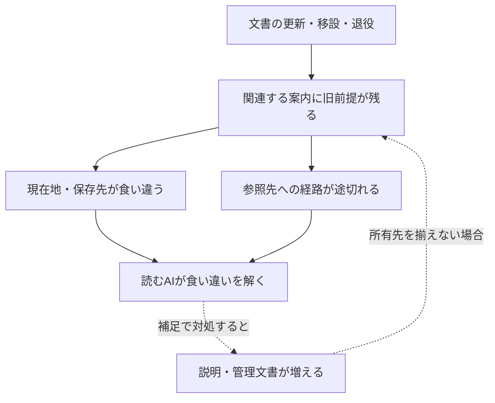

# ai-project構造整理 — 診断から改善へ

**最初に解くのは、どこがどう絡まり、読むAIのどの判断を難しくしているか。その診断を、変更対象・影響・完了条件へ接続する。**

目的と形成経緯は[README](README.md)が所有する。本書は構造整理の判断と作業状態を扱い、別Projectの全TaskやThreadのCurrent Stateを二重管理しない。

## 1. 現在地と最初の成果

Humanは、Plan-onlyでの調査・診断・二文書の設計を経て、Next stepのGitHub実行と検証までの継続を明示した。初回実装の対象は `control-center/README.md` と本書である。

初版の出発点ではREADMEが改行のみ、本書は未作成だった。今回は、消えやすい会話内の診断を、次のAIが根拠から再検討できるRepository資料へ変える。下記D01–D07の既存文書自体の修正、移設、退役処理は、この二文書の保存とは別の実装として残す。

- **現在の診断**：D01–D07は基準snapshotで確認された未解消事項。
- **今回の成果**：司令塔の入口、根拠付き診断、改善計画の初版。
- **続く実務候補**：通常入口と保存先案内の整合。優先順は§5で比較する。
- **実利用の確認**：別AIの独立読解、利用頻度、Humanの再説明回数の変化は未観測。
- **初版保存の状態**：二文書を保存し、再取得による全文一致を確認した。初版の完了観測と未実施範囲は§8に記録する。

本書の「未実施」は、対応が無価値であることや、永久に禁止されることを意味しない。次の作業ではCurrent Human Requestと既存承認の適用範囲を読み、具体的な対象と影響に応じて進める。

## 2. 調査基点・根拠・時間

調査基点は[commit cc560d1](https://github.com/yusukefujiijp/ai-project/commit/cc560d14284d99fd9b8a6e6aa896843e73b0c53d)、Tree `099f41ea407e6d8549c9c93a192cae2e0f16d678`。GitHubの再帰Treeは `truncated: false`、308ファイル。初版保存前にもmainがこのcommitであることを確認した。

全体の配置を取得し、RootのREADME・AGENTS・ARK、Ark Domain、章README、System、Plan Mode、経験索引、成功事例、Project入口、既存レビュー等の主要資料を読解した。OKF QueryのIdentity・起動先、Sandboxの撤回経緯、Ark-Voice Systemの身分は対象箇所を確認した。全308ファイルの全文意味読解、全Git履歴、全外部リンクの検査を完了したという主張ではない。

現在の指摘と、以前の成果をつなぐ資料：

- [2026-09-19の全体比較基点](../repository-reviews/reports/2026-09-19.md)：当時の問題と、保持すべき構造を記録。
- [同日の限定改善後レビュー](../repository-reviews/reports/2026-09-19-02.md)：Root・Domain・AGENTSの改善と残存範囲を記録。最新という理由だけで全体レビューを代替しない。
- [レビューの入口](../repository-reviews/README.md)：観測を残す方法と読取範囲を所有。

各診断のEvidenceは上記基点の固定commitへ向く。後のAIは、その観測を再現したうえで必要なCurrent版との差分を扱う。基点のファイル数やThread番号を恒久的な正常条件にしない。不存在の判断はこのTreeにおける所在の確認であり、過去にも存在しなかったという意味ではない。

Confirmedは直接確認した記載・配置、Candidateは原因の解釈や改善案、Unknownは未測定の利用や効果。Historicalは確かさとは別に、その情報が属する時点を表す。

## 3. 構造診断

### D01

**開始・終了の案内が、存在しないパスへ向かう。状態：未修正。**

- **Node / Edge**：`_system/ark-system.md`がThread開始・終了の入口を案内する。
- **Confirmed**：§9 Gate Indexの `_thread-start/thread-start_query.md` と `_thread-end/thread-end_query.md` は基点Treeにない。[_note/README §2][note]にも、当該Treeにない `_thread-end/ark/` を保存先に推奨する記載がある。[System §8–9][system]
- **判断への影響**：開始・継承・保存の案内を信頼して進むと行き止まりになり、代替経路の探索が必要になる。
- **原因の見立て**：現在の配置へ変わった後も、旧経路を通常案内として残している箇所がある。
- **改善案**：Current Humanの目的、明示Handoff、現在の共通移行契約、旧Thread-End固有の用途を照合して、それぞれの正しい入口を示す。`_thread-end/`を名前の似た `thread-end/`へ機械的に置換しない。
- **変更と保持**：現在のGate・保存先説明が対象。Systemの歴史的Growth Entryにある当時の作成パス・commitは、当時の根拠として扱う。
- **完了条件**：修正した各通常案内が実在し、目的と役割も一致する。歴史参照を現在の起動命令に変えていない。
- **Unknown**：通常入口ごとの実際の利用頻度と、この断線が起こした停止回数。

### D02

**学びの保存先について、ARKとAGENTSの説明が一致しない。状態：未修正。**

- **Node / Edge**：`ARK.md` §12と`AGENTS.md` §1が、学びを保存する資料へ案内する。
- **Confirmed**：ARKのFile Ecologyは `_tasks/lessons.md` を学習台帳として紹介する。AGENTSは不存在を明記し、出来事・成功事例・承認された方法改訂をそれぞれの所有先へ案内する。Treeに `_tasks/lessons.md` はない。[ARK §12][ark]、[AGENTS §1][agents]
- **判断への影響**：同じ「学びを残す」依頼でも、読む資料により保存先の理解が変わり、二つ目の台帳を作る可能性がある。
- **原因の見立て**：一部の一般入口で行った所有先の修正が、他の役割説明へ揃って反映されていない。既存レビューは、この残存範囲を明記している。
- **改善案**：ARKのFile Ecologyを、現在の内容別の所有先へ整合させる。経験・成功事例・方法の区別を保持し、Task Recordsを全領域の学習台帳にしない。
- **変更と保持**：案内の意味を更新する。ARK全体のIdentityや共通権限を、この修正のついでに再定義しない。
- **完了条件**：ARKとAGENTSの双方から、出来事・成功事例・方法改訂について整合する保存判断ができる。不在の旧台帳を埋めるためだけの新設を必要としない。
- **Unknown**：Task以外の全経験領域の保存先を網羅した調査。今回の局所修正の前提に全解消を課さない。

### D03

**同じDomain READMEの中で、現在地が05と04に分かれている。状態：未修正。**

- **Node / Edge**：`ark-project/README.md`の複数箇所が、通常のCurrent entryを指定する。
- **Confirmed**：§0.1・front matter・末尾はArk27:05を案内する。一方、§3.1末尾は「現在のDomain通常入口」をArk27:04と記載する。[Domain README][domain]
- **判断への影響**：同一文書内で、現在地の整合判断を読み手へ返す。
- **原因の見立て**：変化する番号を複数箇所へ直接記載し、移行後の同期が一部に残っている。
- **改善案**：一般入口を所有する§0.1へ他の現在地説明を参照させる。次番号への移行でも、同じ情報を何箇所も更新する必要を減らす。
- **変更と保持**：通常の現在地説明が対象。Ark23当時の出来事や、明示指定された旧Handoffの契約は保持する。D04の固定章文書の編集を混ぜない。
- **完了条件**：通常入口を示す箇所から整合した所有先へ到達する。旧Thread番号が歴史に残ることを検出エラーにせず、「現在」という適用範囲を確認する。
- **Unknown**：Targetの現在のUI採用・実読解状態。Domainの案内だけから補完しない。

### D04

**更新したい現在地と、固定して継承する資料が同居する。状態：設計上の制約として未解消。**

- **Node / Edge**：`ark-project/ark27/README.md`は章IdentityとCurrent Entryを保持し、01–05の継承資料から固定参照される。
- **Confirmed**：章READMEは `current_thread: ark27-01` と旧01のCurrent Entryを保持する。Domain §0.1は通常入口を05へ向ける一方、章文書の固定参照を残存制約として説明する。章blobは `e7caf9882a212cbda186362001e49791cff8a8ce`。[章README][chapter]、[Domainの固定資料との境界][domain]
- **判断への影響**：章READMEへ直接入ると旧入口が見える。現在地の一行だけを直してもblobが変わり、固定参照する引継ぎ条件へ影響し得る。
- **原因の見立て**：安定させたい章の意味と、頻繁に動く現在地が、同じ固定対象に含まれる。
- **改善案**：可変の入口と固定の由来を分ける設計を比較する。外側の案内で当面の経路を整える案と、章・HandoffのBindingを明示的に移行する案を別の変更として扱う。
- **変更と保持**：実装前に、影響を受けるHandoff・State等のCurrent契約と固定参照を確認する。旧資料の全SHAを一括で新しい値へ合わせたことを、継承成功の証拠にしない。
- **完了条件**：選んだ入口と保存する履歴の役割が明確で、対象となる引継ぎ契約の整合を確認できる。通常案内の改善だけなら、この章直入口の制約を解消済みにしない。
- **Unknown**：Binding移行の最適な方法、全ての直接入口の利用状況。この初版では固定資料を変更していない。

### D05

**Queryの現在配置と、本文で起動する本体のパスが違う。状態：未修正。**

- **Node / Edge**：`prompts/ark-open-knowledge-format_query.md`が対応するRuntimeを起動する。
- **Confirmed**：Queryの `canonical_path`、`paired_ssot`、§0–2の起動先は旧 `s_special/` を指す。Treeにそのディレクトリはなく、`prompts/ark-open-knowledge-format.md`は存在する。[OKF Query §0–2][okf]
- **判断への影響**：Queryを見つけても、本文どおりの読取先へ進めない。
- **原因の見立て**：配置と、本文・metadataが持つ参照の更新が揃っていない。
- **改善案**：本体のCurrent IdentityとPair条件を読んで正しい対応先を確定し、Queryの起動先・自己パス・正本宣言を整合させる。今回の診断はQueryの起動を意味しない。
- **変更と保持**：現役の起動経路を修正する。旧版を説明する引用や歴史的パスまで一括置換しない。
- **完了条件**：Query→本体→必要Sourceの経路と意味が一致する。Markdownリンクだけでなく、YAMLやコードブロック内の実効パスも確認する。
- **Unknown**：他の全Queryの同種問題。既存レビューの指摘は候補として再確認し、未調査部分を修正済みにしない。

### D06

**撤回した実験のcheckerが、通常のtoolsに残る。状態：退役・役割整理が未実施。**

- **Node / Edge**：`tools/check_repo_reality.py`がRepositoryの正常条件を判定する。
- **Confirmed**：コードの `REQUIRED_FILES` は `CURRENT_BOARD.md` と `.github/workflows/reality-check.yml` を要求する。両ファイルは基点Treeにない。Sandbox §0–2は、このBoard・checker・Workflowの実験を撤回・隔離し、当時の手動削除対象とした経緯を記録する。[checker][checker]、[撤回・隔離記録][sandbox]
- **判断への影響**：通常配置のツールを現在の正しい判定基準と受け取ると、撤回された仕組みを復活させることを「修復」と誤認し得る。
- **原因の見立て**：実験の退役理由と、実体の配置・利用案内が一致していない。
- **改善案**：履歴に保存済みの実験知識を確認し、通常配置からの退役、隔離、明示的な用途説明を比較する。ツールが要求するという理由で旧Boardを復活させない。
- **変更と保持**：過去の撤回理由を残す。古い削除予定は現在の削除命令ではなく、今回の変更範囲に即して扱う。
- **完了条件**：通常経路から過去の判定基準をCurrent規則として誤用しない構成になり、実験の由来と再検討の根拠へ到達できる。
- **Unknown**：現行CIでの実行・利用状況。この作業ではコードを読んだだけで実行していない。過去レビューの検査件数を今回の実行結果として転記しない。

### D07

**Projectの存在案内が、実際の候補版の存在へ追随していない。状態：未修正。**

- **Node / Edge**：`projects/ark-voice/README.md`がProject内の資料を案内する。
- **Confirmed**：§6 Current Topologyは確認済みファイルをREADMEのみとし、Persistent System Markdownを今後の対象とする。一方、`ark-voice-system.md`は存在し、Identity部分で `v001-candidate`、`pending Human content seal`、`field_test_status: not_started` と宣言する。[Voice README §6][voice]、[SystemのIdentity][voice-system]
- **判断への影響**：既存候補を発見しにくく、同じ役割の文書をもう一度作る可能性がある。
- **原因の見立て**：資料の存在と成熟段階の更新が、Current Topologyへ反映されていない。
- **改善案**：Systemの存在と候補としての身分を案内へ反映する。採用や稼働の未確認を維持する。
- **変更と保持**：Projectの所在案内が対象。存在確認を研究再開・採用・実地成功へ昇格させない。
- **完了条件**：READMEから既存の候補へ到達し、その採用・検証段階を正しく説明できる。
- **Unknown**：記録外の後続採用・試験・UIの状況。古い `not_started` 表記だけで現在まで未実行と断定しない。

## 4. 原因仮説と、残すべき構造

初期の原因仮説は、**作成・更新・移設・退役を行った文書と、それを案内・参照する文書の変更が揃わないこと**。D01–D07の不整合は観測できるが、発生原因の全履歴や誤動作件数を確定したわけではない。

点線部分は再発経路の仮説である。control-centerも、正本を複製して独立に更新する構成にすれば同じ問題を増やし得る。そのため入口・診断・根拠・実体の所有先を分けて接続する。

反例も保持する。

- [Plan Mode][plan-mode]は現行の専用フォルダ内ペアと、明示rollbackの旧ペアを区別している。旧版の存在だけで削除候補にしない。
- [経験索引][experience]は各Threadの原本へ案内し、最新状態を二重管理しない。索引と原本の別配置には役割がある。
- [Projects][projects]は固有名Projectと番号付きArkの系譜を区別する。名称が似ることだけを理由に統合しない。
- 成功事例、方法、原本に同じ出来事が現れても、由来・学び・現在使う方法の役割が違う。同じ経験を独立した複数実証として数えない。

上位の命名、ディレクトリ数、全保存領域の重複については追加調査の余地がある。これらを、名前だけから確定した欠陥として扱わない。

## 5. 実行計画と優先順位

優先度は、現在の依頼への影響、根拠の強さ、変更による波及、検証可能性から判断する。D番号は診断の識別子であり実行順ではない。独立した作業を不必要な直列工程にせず、必要な依存だけを保持する。

| Node | Edge | 次の作業と完了条件 | 初版の状態 |
|---|---|---|---|
| E00：司令塔初版 | 会話の診断→共有資料 | READMEとPLANを保存し、本文・参照・保存先を照合する | 完了。初版の保存後観測は§8 |
| E01：入口への接続 | Root README→control-center | 既存のPublic Front Doorに目的の分かる入口を加える。新しい全作業Boot条件を作らない | 計画。初版二文書の保存後の候補 |
| E02：通常案内の整合 | D02・D03→保存先・現在地 | 内容別の保存先と§0.1への現在地参照を整え、参照元側も照合する | 有力な最初の修正候補。D04を先行必須にしない |
| E03：実効経路の修復 | D01・D05→目的に合う現存資料 | 起動・継承の用途と本体Identityを確かめ、本文内の実効パスも修正する | 計画。置換先の役割確認が必要 |
| E04：存在と退役の説明 | D06・D07→現在使える資料 | checkerの扱いとVoice候補の所在を整理し、歴史・候補・稼働を区別する | 計画。両件は独立して判断可能 |
| E05：固定参照の設計 | D04→章・継承契約 | 可変入口と固定資料の関係を決め、影響する契約を検証する | 設計候補。一般案内の修正へ便乗させない |
| E06：物理的な整理 | 残存する具体的な不便→移動・統合 | 所有先・参照元・移行先・戻し方を明らかにし、実際の到達性と保守性を確認する | 未選定。最終Tree案を既成事実にしない |
| E07：観測の継承 | 各実装→レビュー→再判断 | 変更した意味、検証、未解消範囲を既存レビューへ接続し、PLANの状態を更新する | 各実装に伴う作業。独立AIの成功は別に観測 |

E01–E07は、今回の二文書を保存しただけでは実施済みにならない。次のCurrent Requestが実行を含む場合、承認済み範囲を再利用して必要な整合・検証まで進める。ここに列挙したこと自体を、将来の全操作の承認にしない。

最初の修正候補は、根拠が明確なD02・D03と入口の接続である。D01・D05は参照先の目的と契約を確認して進める。D04を含む大きな変更も選択肢として開き、必要な設計を「いつか」のまま消さない。

## 6. 検証・完了・失敗からの更新

完了は変更の目的に即して判断する。ファイル数の減少、リンク検査のPASS、文書保存だけから、Repository全体の整理や別AIの理解を宣言しない。

実装時には次を必要な範囲で確認する。

1. **構造**：相対リンク、実効パス、metadata、EOFが対象の実体と整合する。
2. **意味**：案内先が目的の役割を持ち、現行・候補・履歴・固定参照の区別が保持される。
3. **変更の波及**：参照元、Pair、対象契約を確認する。古い引用や無関係な原本の変更を必要としないか判断する。
4. **保存**：変更先をGitHubから直接再取得し、意図した本文と一致することを確認する。
5. **利用**：別AIの実読解やHumanの利用結果が得られた場合、その観測を保存・机上確認と分けて残す。

他AIの読解で確かめたい問いは、「何が問題か」「どのSourceで確認できるか」「何を変えると何へ影響するか」「何がまだ未実施か」「次の依頼で何を扱えるか」。これは現在の全AIへ課す新しいBoot試験ではない。

失敗や予想外の成功があれば、期待とActual、詰まったEdge、条件、修正した判断を残す。失敗を理由に一律の禁止規則を増やさず、変更・縮小・撤回・別案を比較する。元の事実とHumanの意味を保持し、後の解釈は訂正可能にする。

## redesign

**現在の構成を参考資料として、一から設計するならどうするか。継続して育てる計画領域。**

Humanは、既存構成への継続的な継ぎ足しだけでなく、AIが自由に一から設計する案をMarkdownで成熟させ、必要に応じて実験でBottleneckを検出する方向も求めた。Player系のアーカイブ後は、既存のai-projectを改善する目的へ接続する。

初期の設計仮説は次のとおり。

- 章・Threadの履歴は由来を保存し、変化する通常入口は明確な所有先から案内する。
- 方法、経験原本、事例、計画は役割を分け、索引から同じ正本へ到達できるようにする。
- ある資料を更新するとき、案内・Pair・固定参照への影響を辿れるようにする。
- 候補・試行・採用・退役は、読み手が必要な箇所で判断できるようにする。全ファイルへ同じ巨大Schemaを強制するかは別の設計判断。
- 作成AIの解釈に依存せず、目的・原文・根拠・Correctionを残し、Future AIが別の構成を提案できるようにする。

案を育てる際は、解きたいBottleneck、捨てる前提、提案構成、期待する利益、既存資料との対応、未解決、比較方法を必要な密度で残す。同じ読取・保存・現在地更新の課題を使い、既存構成の改善案と再設計案を比較できる。

独立した構想の密度が育てば、このcontrol-center配下にblueprintsやexperimentsの資料を設けられる。現時点でそのフォルダや新Repositoryを作成したという意味ではない。実験は選んだ目的・範囲・観測条件に応じて具体化し、過去の撤回例も参照して、実験と通常運用への採用を区別する。

「今のAIなら作り直した方がよい」という期待は探索の動機として保持する。優位性は読解・変更・移行・利用の結果から判断し、モデルの肩書きだけで確定しない。Codeの作成を、この計画領域の存在条件にしない。

## 8. 初版の実装・検証記録

2026-09-22、二文書の初版をmainへ保存し、それぞれをGitHubから再取得して意図した全文との一致を確認した。その保存後観測に基づき、本節とE00の完了状態を追記した。以下のPLANのblobは追記前の観測版であり、Current PLANを固定するBindingではない。

- [PLANの初回保存](https://github.com/yusukefujiijp/ai-project/commit/37ce4b0770e50715a3c7ee5a786ef1ad3f79e18b)：blob `b55fef970c01813365be092572c635abc19f222c`。新規作成後に全文一致を確認。
- [READMEの実装](https://github.com/yusukefujiijp/ai-project/commit/ad80c0cf4a2ef6a92279ef2287f2dee9c9d88fe6)：blob `8b07a59eee7330e0ae4f570a7b1fad585c7e7f63`。Humanの改行のみの原本を保存直前にも確認して更新し、全文一致を確認。
- 二文書保存後の観測commit：`ad80c0cf4a2ef6a92279ef2287f2dee9c9d88fe6`、Tree：`90862d08f621d585c3a1a104fb9adc654fd98230`。基点との変更は `control-center/README.md` と `control-center/PLAN.md` の二つ。その他の既存307ファイルは同じblobだった。
- 文書検査：両文書のYAML、canonical_path、版とEOF、UTF-8を確認。初版のリンク39出現について、相対参照・参照形式・固定EvidenceのRepository内パス・新規文書内の参照見出しを照合し、不一致なし。全外部サイトの稼働や全Repositoryのリンクを検査した意味ではない。
- 意味の確認：執筆AIが、対象はai-project全体であること、役割と由来、現行と履歴、D01–D07の根拠、変更時の影響、未修正の状態、次の候補を本文から辿れるか点検した。別AIによる独立試験ではない。

**完了したのは司令塔の初版保存。D01–D07の修正、Root READMEからの追加案内E01、物理移設、実験ツールの退役、別AIの実理解は未実施・未観測として残る。**

自己の最終blobを本文へ埋め込む循環を作らず、本節追記後の版はGit履歴と再取得で確認する。二文書保存後のTreeは初期成果の観測であり、将来の全Repositoryを309ファイルへ固定する条件ではない。

## 9. 継続時の更新方法

各D項目は、その問題の状態・修正理由・Evidence・残存範囲を更新する。過去の観測や撤回理由を消して「最初から整っていた」ことにしない。日付付きの詳細な実装観測はRepository Reviewsへ接続し、本書は現在の整理判断へ戻れる入口を保つ。

優先度はCurrent Humanの目的、新しいReality、参照先の変更で改められる。計画の順序を守るためだけの作業、全Unknownの解消待ち、毎回の全資料再読は課さない。必要な元資料を読んで判断する余地と、明示された契約・権限を両立させる。

[system]: https://github.com/yusukefujiijp/ai-project/blob/cc560d14284d99fd9b8a6e6aa896843e73b0c53d/_system/ark-system.md
[note]: https://github.com/yusukefujiijp/ai-project/blob/cc560d14284d99fd9b8a6e6aa896843e73b0c53d/_note/README.md
[ark]: https://github.com/yusukefujiijp/ai-project/blob/cc560d14284d99fd9b8a6e6aa896843e73b0c53d/ARK.md
[agents]: https://github.com/yusukefujiijp/ai-project/blob/cc560d14284d99fd9b8a6e6aa896843e73b0c53d/AGENTS.md
[domain]: https://github.com/yusukefujiijp/ai-project/blob/cc560d14284d99fd9b8a6e6aa896843e73b0c53d/ark-project/README.md
[chapter]: https://github.com/yusukefujiijp/ai-project/blob/cc560d14284d99fd9b8a6e6aa896843e73b0c53d/ark-project/ark27/README.md
[okf]: https://github.com/yusukefujiijp/ai-project/blob/cc560d14284d99fd9b8a6e6aa896843e73b0c53d/prompts/ark-open-knowledge-format_query.md
[checker]: https://github.com/yusukefujiijp/ai-project/blob/cc560d14284d99fd9b8a6e6aa896843e73b0c53d/tools/check_repo_reality.py
[sandbox]: https://github.com/yusukefujiijp/ai-project/blob/cc560d14284d99fd9b8a6e6aa896843e73b0c53d/ark-project/ark21/Ark21-06/sandbox/README.md
[voice]: https://github.com/yusukefujiijp/ai-project/blob/cc560d14284d99fd9b8a6e6aa896843e73b0c53d/projects/ark-voice/README.md
[voice-system]: https://github.com/yusukefujiijp/ai-project/blob/cc560d14284d99fd9b8a6e6aa896843e73b0c53d/projects/ark-voice/ark-voice-system.md
[plan-mode]: https://github.com/yusukefujiijp/ai-project/blob/cc560d14284d99fd9b8a6e6aa896843e73b0c53d/ai-plan-mode/README.md
[experience]: https://github.com/yusukefujiijp/ai-project/blob/cc560d14284d99fd9b8a6e6aa896843e73b0c53d/task-mode-system/experience/README.md
[projects]: https://github.com/yusukefujiijp/ai-project/blob/cc560d14284d99fd9b8a6e6aa896843e73b0c53d/projects/README.md

EOF::AI_PROJECT_CONTROL_CENTER_PLAN::v0.1.0
