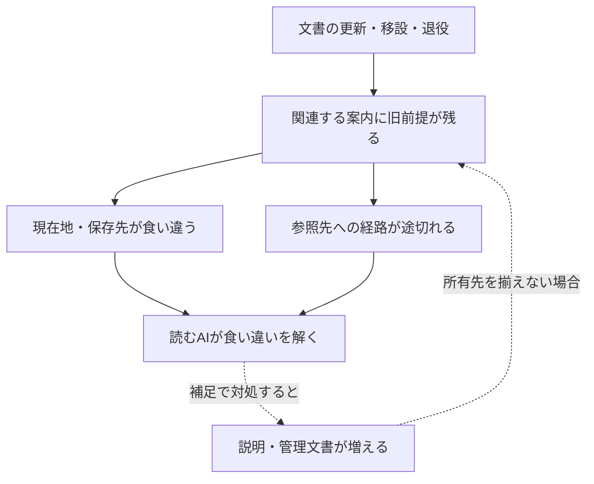

# ai-project構造整理 — 診断から改善へ

**どこがどう絡まっているかを根拠から説明し、役割を終えた現役配置のアーカイブを優先する。残す構成の案内・レイヤー・参照関係を、実際の整理結果から整える。**

目的と形成経緯は[README](README.md)が所有する。本書は全体の診断と優先順位を扱う。個別アーカイブの具体案・承認・実施状態は[ARCHIVE](ARCHIVE.md)の案件を参照し、本書へ独立した承認台帳を作らない。別Projectの全TaskやThreadのCurrent Stateも二重管理しない。

## 1. 現在地とこれまでの成果

最初のHuman実行依頼は、Plan-onlyでの調査・診断・二文書の設計を経て、GitHub実行と検証までの継続を明示したものだった。初回実装の対象は `control-center/README.md` と本書である。

初版の出発点ではREADMEが改行のみ、本書は未作成だった。初回実装では、消えやすい会話内の診断を、次のAIが根拠から再検討できるRepository資料へ変えた。下記D01–D07の既存文書自体の修正、移設、退役処理は、この二文書の保存とは別の実装として残す。

- **現在の診断**：D01–D07は基準snapshotで確認された未解消事項。
- **初版の成果**：司令塔の入口、根拠付き診断、改善計画。
- **今回の追加**：アーカイブを優先する方針、個別案件の記録、__archivesの入口。実装の観測は§10。
- **直近の接続**：Humanの追加訂正により、物理移動の前に既存Ark27:05へ成果・理由・未完を合流する。[補足接続](#reconnect-ark27-05)を参照。構造整理の最初の具体案は引き続き[ARC-001](ARCHIVE.md#arc-001)。
- **実利用の確認**：別AIの独立読解、利用頻度、Humanの再説明回数の変化は未観測。
- **初版保存の状態**：二文書を保存し、再取得による全文一致を確認した。初版の完了観測と未実施範囲は§8に記録する。

本書の「未実施」は、対応が無価値であることや、永久に禁止されることを意味しない。次の作業ではCurrent Human Requestと既存承認の適用範囲を読み、具体的な対象と影響に応じて進める。

### 1.1 2026-09-22の優先順位訂正

初版は通常入口・保存先の修正を先行候補とした。その後YusukeJPは「不要フォルダ・ファイルは一旦アーカイブ」を重視し、既存の `__archives/` を利用する方針を明示した。AIが候補の根拠・理由・具体例・影響を調査し、Humanがその対象と変更内容を承認した後に移動し、理由と経緯を他AI・Future AIへ残す。

この訂正によって、退役処理を通常案内の全修正後まで待たせる依存を外す。各案件に必要な参照調査と移動時の案内整合は維持する。古い・重複する・名前が似るという観測だけで、現在の役割を終えたと判定しない。

今回の実行依頼は、`control-center/README.md`・本書・`control-center/ARCHIVE.md`・`__archives/README.md`の整備と、最初の提案の具体化として受けた。個別移動はARCHIVEの案件で承認対象を明らかにし、Humanが既に承認した範囲は繰り返し確認せず実施・検証まで進める。文書整備と物理的な退役の実績は別に記録する。

## 2. 調査基点・根拠・時間

調査基点は[commit cc560d1](https://github.com/yusukefujiijp/ai-project/commit/cc560d14284d99fd9b8a6e6aa896843e73b0c53d)、Tree `099f41ea407e6d8549c9c93a192cae2e0f16d678`。GitHubの再帰Treeは `truncated: false`、308ファイル。初版保存前にもmainがこのcommitであることを確認した。

全体の配置を取得し、RootのREADME・AGENTS・ARK、Ark Domain、章README、System、Plan Mode、経験索引、成功事例、Project入口、既存レビュー等の主要資料を読解した。OKF QueryのIdentity・起動先、Sandboxの撤回経緯、Ark-Voice Systemの身分は対象箇所を確認した。全308ファイルの全文意味読解、全Git履歴、全外部リンクの検査を完了したという主張ではない。

現在の指摘と、以前の成果をつなぐ資料：

- [2026-09-19の全体比較基点](../repository-reviews/reports/2026-09-19.md)：当時の問題と、保持すべき構造を記録。
- [同日の限定改善後レビュー](../repository-reviews/reports/2026-09-19-02.md)：Root・Domain・AGENTSの改善と残存範囲を記録。最新という理由だけで全体レビューを代替しない。
- [レビューの入口](../repository-reviews/README.md)：観測を残す方法と読取範囲を所有。

各診断のEvidenceは上記基点の固定commitへ向く。後のAIは、その観測を再現したうえで必要なCurrent版との差分を扱う。基点のファイル数やThread番号を恒久的な正常条件にしない。不存在の判断はこのTreeにおける所在の確認であり、過去にも存在しなかったという意味ではない。

Confirmedは直接確認した記載・配置、Candidateは原因の解釈や改善案、Unknownは未測定の利用や効果。Historicalは確かさとは別に、その情報が属する時点を表す。

## 3. 構造診断

### D01

**開始・終了の案内が、存在しないパスへ向かう。状態：未修正。**

- **Node / Edge**：`_system/ark-system.md`がThread開始・終了の入口を案内する。
- **Confirmed**：§9 Gate Indexの `_thread-start/thread-start_query.md` と `_thread-end/thread-end_query.md` は基点Treeにない。[_note/README §2][note]にも、当該Treeにない `_thread-end/ark/` を保存先に推奨する記載がある。[System §8–9][system]
- **判断への影響**：開始・継承・保存の案内を信頼して進むと行き止まりになり、代替経路の探索が必要になる。
- **原因の見立て**：現在の配置へ変わった後も、旧経路を通常案内として残している箇所がある。
- **改善案**：Current Humanの目的、明示Handoff、現在の共通移行契約、旧Thread-End固有の用途を照合して、それぞれの正しい入口を示す。`_thread-end/`を名前の似た `thread-end/`へ機械的に置換しない。
- **変更と保持**：現在のGate・保存先説明が対象。Systemの歴史的Growth Entryにある当時の作成パス・commitは、当時の根拠として扱う。
- **完了条件**：修正した各通常案内が実在し、目的と役割も一致する。歴史参照を現在の起動命令に変えていない。
- **Unknown**：通常入口ごとの実際の利用頻度と、この断線が起こした停止回数。

### D02

**学びの保存先について、ARKとAGENTSの説明が一致しない。状態：未修正。**

- **Node / Edge**：`ARK.md` §12と`AGENTS.md` §1が、学びを保存する資料へ案内する。
- **Confirmed**：ARKのFile Ecologyは `_tasks/lessons.md` を学習台帳として紹介する。AGENTSは不存在を明記し、出来事・成功事例・承認された方法改訂をそれぞれの所有先へ案内する。Treeに `_tasks/lessons.md` はない。[ARK §12][ark]、[AGENTS §1][agents]
- **判断への影響**：同じ「学びを残す」依頼でも、読む資料により保存先の理解が変わり、二つ目の台帳を作る可能性がある。
- **原因の見立て**：一部の一般入口で行った所有先の修正が、他の役割説明へ揃って反映されていない。既存レビューは、この残存範囲を明記している。
- **改善案**：ARKのFile Ecologyを、現在の内容別の所有先へ整合させる。経験・成功事例・方法の区別を保持し、Task Recordsを全領域の学習台帳にしない。
- **変更と保持**：案内の意味を更新する。ARK全体のIdentityや共通権限を、この修正のついでに再定義しない。
- **完了条件**：ARKとAGENTSの双方から、出来事・成功事例・方法改訂について整合する保存判断ができる。不在の旧台帳を埋めるためだけの新設を必要としない。
- **Unknown**：Task以外の全経験領域の保存先を網羅した調査。今回の局所修正の前提に全解消を課さない。

### D03

**同じDomain READMEの中で、現在地が05と04に分かれている。状態：未修正。**

- **Node / Edge**：`ark-project/README.md`の複数箇所が、通常のCurrent entryを指定する。
- **Confirmed**：§0.1・front matter・末尾はArk27:05を案内する。一方、§3.1末尾は「現在のDomain通常入口」をArk27:04と記載する。[Domain README][domain]
- **判断への影響**：同一文書内で、現在地の整合判断を読み手へ返す。
- **原因の見立て**：変化する番号を複数箇所へ直接記載し、移行後の同期が一部に残っている。
- **改善案**：一般入口を所有する§0.1へ他の現在地説明を参照させる。次番号への移行でも、同じ情報を何箇所も更新する必要を減らす。
- **変更と保持**：通常の現在地説明が対象。Ark23当時の出来事や、明示指定された旧Handoffの契約は保持する。D04の固定章文書の編集を混ぜない。
- **完了条件**：通常入口を示す箇所から整合した所有先へ到達する。旧Thread番号が歴史に残ることを検出エラーにせず、「現在」という適用範囲を確認する。
- **Unknown**：Targetの現在のUI採用・実読解状態。Domainの案内だけから補完しない。

### D04

**更新したい現在地と、固定して継承する資料が同居する。状態：設計上の制約として未解消。**

- **Node / Edge**：`ark-project/ark27/README.md`は章IdentityとCurrent Entryを保持し、01–05の継承資料から固定参照される。
- **Confirmed**：章READMEは `current_thread: ark27-01` と旧01のCurrent Entryを保持する。Domain §0.1は通常入口を05へ向ける一方、章文書の固定参照を残存制約として説明する。章blobは `e7caf9882a212cbda186362001e49791cff8a8ce`。[章README][chapter]、[Domainの固定資料との境界][domain]
- **判断への影響**：章READMEへ直接入ると旧入口が見える。現在地の一行だけを直してもblobが変わり、固定参照する引継ぎ条件へ影響し得る。
- **原因の見立て**：安定させたい章の意味と、頻繁に動く現在地が、同じ固定対象に含まれる。
- **改善案**：可変の入口と固定の由来を分ける設計を比較する。外側の案内で当面の経路を整える案と、章・HandoffのBindingを明示的に移行する案を別の変更として扱う。
- **変更と保持**：実装前に、影響を受けるHandoff・State等のCurrent契約と固定参照を確認する。旧資料の全SHAを一括で新しい値へ合わせたことを、継承成功の証拠にしない。
- **完了条件**：選んだ入口と保存する履歴の役割が明確で、対象となる引継ぎ契約の整合を確認できる。通常案内の改善だけなら、この章直入口の制約を解消済みにしない。
- **Unknown**：Binding移行の最適な方法、全ての直接入口の利用状況。この初版では固定資料を変更していない。

### D05

**Queryの現在配置と、本文で起動する本体のパスが違う。状態：未修正。**

- **Node / Edge**：`prompts/ark-open-knowledge-format_query.md`が対応するRuntimeを起動する。
- **Confirmed**：Queryの `canonical_path`、`paired_ssot`、§0–2の起動先は旧 `s_special/` を指す。Treeにそのディレクトリはなく、`prompts/ark-open-knowledge-format.md`は存在する。[OKF Query §0–2][okf]
- **判断への影響**：Queryを見つけても、本文どおりの読取先へ進めない。
- **原因の見立て**：配置と、本文・metadataが持つ参照の更新が揃っていない。
- **改善案**：本体のCurrent IdentityとPair条件を読んで正しい対応先を確定し、Queryの起動先・自己パス・正本宣言を整合させる。今回の診断はQueryの起動を意味しない。
- **変更と保持**：現役の起動経路を修正する。旧版を説明する引用や歴史的パスまで一括置換しない。
- **完了条件**：Query→本体→必要Sourceの経路と意味が一致する。Markdownリンクだけでなく、YAMLやコードブロック内の実効パスも確認する。
- **Unknown**：他の全Queryの同種問題。既存レビューの指摘は候補として再確認し、未調査部分を修正済みにしない。

### D06

**撤回した実験のcheckerが、通常のtoolsに残る。状態：退役・役割整理が未実施。**

- **Node / Edge**：`tools/check_repo_reality.py`がRepositoryの正常条件を判定する。
- **Confirmed**：コードの `REQUIRED_FILES` は `CURRENT_BOARD.md` と `.github/workflows/reality-check.yml` を要求する。両ファイルは基点Treeにない。Sandbox §0–2は、このBoard・checker・Workflowの実験を撤回・隔離し、当時の手動削除対象とした経緯を記録する。[checker][checker]、[撤回・隔離記録][sandbox]
- **判断への影響**：通常配置のツールを現在の正しい判定基準と受け取ると、撤回された仕組みを復活させることを「修復」と誤認し得る。
- **原因の見立て**：実験の退役理由と、実体の配置・利用案内が一致していない。
- **改善案**：現役側checkerを既存の__archivesへ移す具体案を[ARC-001](ARCHIVE.md#arc-001)で扱う。sandboxの実験知識と固定Evidenceを保持する。ツールが要求するという理由で旧Boardを復活させない。
- **変更と保持**：過去の撤回理由を残す。古い削除予定は現在の削除命令ではなく、今回の変更範囲に即して扱う。
- **完了条件**：通常経路から過去の判定基準をCurrent規則として誤用しない構成になり、実験の由来と再検討の根拠へ到達できる。
- **追加観測とUnknown**：2026-09-22の参照調査・Workflow配置確認・保管先・承認状態は[ARC-001](ARCHIVE.md#arc-001)が所有する。コードを今回の正常判定として実行しておらず、過去レビューの検査件数を今回の実行結果として転記しない。

### D07

**Projectの存在案内が、実際の候補版の存在へ追随していない。状態：未修正。**

- **Node / Edge**：`projects/ark-voice/README.md`がProject内の資料を案内する。
- **Confirmed**：§6 Current Topologyは確認済みファイルをREADMEのみとし、Persistent System Markdownを今後の対象とする。一方、`ark-voice-system.md`は存在し、Identity部分で `v001-candidate`、`pending Human content seal`、`field_test_status: not_started` と宣言する。[Voice README §6][voice]、[SystemのIdentity][voice-system]
- **判断への影響**：既存候補を発見しにくく、同じ役割の文書をもう一度作る可能性がある。
- **原因の見立て**：資料の存在と成熟段階の更新が、Current Topologyへ反映されていない。
- **改善案**：Systemの存在と候補としての身分を案内へ反映する。採用や稼働の未確認を維持する。
- **変更と保持**：Projectの所在案内が対象。存在確認を研究再開・採用・実地成功へ昇格させない。
- **完了条件**：READMEから既存の候補へ到達し、その採用・検証段階を正しく説明できる。
- **Unknown**：記録外の後続採用・試験・UIの状況。古い `not_started` 表記だけで現在まで未実行と断定しない。

## 4. 原因仮説と、残すべき構造

初期の原因仮説は、**作成・更新・移設・退役を行った文書と、それを案内・参照する文書の変更が揃わないこと**。D01–D07の不整合は観測できるが、発生原因の全履歴や誤動作件数を確定したわけではない。

点線部分は再発経路の仮説である。control-centerも、正本を複製して独立に更新する構成にすれば同じ問題を増やし得る。そのため入口・診断・根拠・実体の所有先を分けて接続する。

反例も保持する。

- [Plan Mode][plan-mode]は現行の専用フォルダ内ペアと、明示rollbackの旧ペアを区別している。旧版の存在だけで削除候補にしない。
- [経験索引][experience]は各Threadの原本へ案内し、最新状態を二重管理しない。索引と原本の別配置には役割がある。
- [Projects][projects]は固有名Projectと番号付きArkの系譜を区別する。名称が似ることだけを理由に統合しない。
- 成功事例、方法、原本に同じ出来事が現れても、由来・学び・現在使う方法の役割が違う。同じ経験を独立した複数実証として数えない。

上位の命名、ディレクトリ数、全保存領域の重複については追加調査の余地がある。これらを、名前だけから確定した欠陥として扱わない。

## 5. 実行計画と優先順位

優先度はCurrent Humanの目的、根拠の強さ、変更の波及、検証可能性から判断する。D番号・E番号は識別子であり実行順ではない。初版のIDを保ち、アーカイブ方針の整備をE08・E09、移動前の本流合流をE10として先頭側へ置く。

| Node | Edge | 作業と判断の所有先 | 位置づけ |
|---|---|---|---|
| E00：司令塔初版 | 会話の診断→共有資料 | READMEとPLANの初版保存・検証。観測は§8 | 完了した出発点 |
| E08：アーカイブの判断と記録 | Human訂正→四文書 | README・本書・ARCHIVE・__archives入口を整合する。今回の保存後観測は§10に記録した | 保存・整合確認済み |
| E10：移動前の本流合流 | 司令塔の成果→既存Ark27:05 | [補足接続](#reconnect-ark27-05)で、目的・保存済み成果・未承認の案件・次の判断を渡す | 直近の接続。受入れ結果は同節 |
| E09：最初の退役案件 | D06→ARC-001→__archives | 対象、提案理由、参照対策、承認・実施状態は[ARC-001](ARCHIVE.md#arc-001)を参照する | 最初の物理整理候補。今回は本流合流を先行 |
| E01：入口への接続 | Root README→control-center | Public Front Doorに目的の分かる案内を加える。全作業の追加Boot条件にしない | 未実施の案内改善 |
| E02：通常案内の整合 | D02・D03→保存先・現在地 | 内容別の保存先と§0.1への参照を整える | 計画。退役案件の先行必須ではない |
| E03：実効経路の修復 | D01・D05→現存する適切な資料 | 用途と本体Identityを確かめ、本文内の実効パスも整える | 計画。役割確認が必要 |
| E04：存在の案内 | D07→Voice候補 | 候補の所在と、採用・稼働の未確認を正しく案内する | 計画。初版で同じ行にあったD06はE09へ分けた |
| E05：固定参照の設計 | D04→章・継承契約 | 可変入口と固定資料の関係を設計し、対象契約を検証する | 設計候補 |
| E06：続く実体整理 | 現在の役割・依存→選別 | 次のアーカイブ、保持、統合等を比較する。アーカイブ案件はARCHIVEに具体化する | 対象未選定。大規模な最終Treeを既成事実にしない |
| E07：観測の継承 | 実装→根拠→再判断 | 個別アーカイブはARCHIVEの同じ案件へ結果を追記。全体レビューを行う場合は既存Repository Reviewsへ接続する | 実施した範囲に伴う記録 |

先に現役として残す対象を選び、退役できる具体例を実施し、その結果から残す資料のレイヤーと案内を育てる。アーカイブ候補の理由を曖昧にしたまま移すことも、全体調査の完了を待つために根拠の揃った案件を止めることも避ける。

E01以降の未実施作業を、四文書の保存だけで実施済みにしない。計画への掲載を実行権限とせず、個別案件の現在の承認とScopeを使う。承認済み案件では必要な移動・参照整合・記録・Remote照合まで続ける。

## 6. 検証・完了・失敗からの更新

完了は変更の目的に即して判断する。ファイル数の減少、リンク検査のPASS、文書保存だけから、Repository全体の整理や別AIの理解を宣言しない。

実装時には次を必要な範囲で確認する。

1. **構造**：相対リンク、実効パス、metadata、EOFが対象の実体と整合する。
2. **意味**：案内先が目的の役割を持ち、現行・候補・履歴・固定参照の区別が保持される。
3. **変更の波及**：参照元、Pair、対象契約を確認する。古い引用や無関係な原本の変更を必要としないか判断する。
4. **保存**：変更先をGitHubから直接再取得し、意図した本文と一致することを確認する。
5. **利用**：別AIの実読解やHumanの利用結果が得られた場合、その観測を保存・机上確認と分けて残す。

他AIの読解で確かめたい問いは、「何が問題か」「どのSourceで確認できるか」「何を変えると何へ影響するか」「何がまだ未実施か」「次の依頼で何を扱えるか」。これは現在の全AIへ課す新しいBoot試験ではない。

失敗や予想外の成功があれば、期待とActual、詰まったEdge、条件、修正した判断を残す。失敗を理由に一律の禁止規則を増やさず、変更・縮小・撤回・別案を比較する。元の事実とHumanの意味を保持し、後の解釈は訂正可能にする。

## redesign

**現在の構成を参考資料として、一から設計するならどうするか。継続して育てる計画領域。**

Humanは、既存構成への継続的な継ぎ足しだけでなく、AIが自由に一から設計する案をMarkdownで成熟させ、必要に応じて実験でBottleneckを検出する方向も求めた。Player系のアーカイブ後は、既存のai-projectを改善する目的へ接続する。

初期の設計仮説は次のとおり。

- 章・Threadの履歴は由来を保存し、変化する通常入口は明確な所有先から案内する。
- 方法、経験原本、事例、計画は役割を分け、索引から同じ正本へ到達できるようにする。
- ある資料を更新するとき、案内・Pair・固定参照への影響を辿れるようにする。
- 候補・試行・採用・退役は、読み手が必要な箇所で判断できるようにする。全ファイルへ同じ巨大Schemaを強制するかは別の設計判断。
- 作成AIの解釈に依存せず、目的・原文・根拠・Correctionを残し、Future AIが別の構成を提案できるようにする。

案を育てる際は、解きたいBottleneck、捨てる前提、提案構成、期待する利益、既存資料との対応、未解決、比較方法を必要な密度で残す。同じ読取・保存・現在地更新の課題を使い、既存構成の改善案と再設計案を比較できる。

独立した構想の密度が育てば、このcontrol-center配下にblueprintsやexperimentsの資料を設けられる。現時点でそのフォルダや新Repositoryを作成したという意味ではない。実験は選んだ目的・範囲・観測条件に応じて具体化し、過去の撤回例も参照して、実験と通常運用への採用を区別する。

「今のAIなら作り直した方がよい」という期待は探索の動機として保持する。優位性は読解・変更・移行・利用の結果から判断し、モデルの肩書きだけで確定しない。Codeの作成を、この計画領域の存在条件にしない。

## 8. 初版の実装・検証記録

2026-09-22、二文書の初版をmainへ保存し、それぞれをGitHubから再取得して意図した全文との一致を確認した。その保存後観測に基づき、本節とE00の完了状態を追記した。以下のPLANのblobは追記前の観測版であり、Current PLANを固定するBindingではない。

- [PLANの初回保存](https://github.com/yusukefujiijp/ai-project/commit/37ce4b0770e50715a3c7ee5a786ef1ad3f79e18b)：blob `b55fef970c01813365be092572c635abc19f222c`。新規作成後に全文一致を確認。
- [READMEの実装](https://github.com/yusukefujiijp/ai-project/commit/ad80c0cf4a2ef6a92279ef2287f2dee9c9d88fe6)：blob `8b07a59eee7330e0ae4f570a7b1fad585c7e7f63`。Humanの改行のみの原本を保存直前にも確認して更新し、全文一致を確認。
- 二文書保存後の観測commit：`ad80c0cf4a2ef6a92279ef2287f2dee9c9d88fe6`、Tree：`90862d08f621d585c3a1a104fb9adc654fd98230`。基点との変更は `control-center/README.md` と `control-center/PLAN.md` の二つ。その他の既存307ファイルは同じblobだった。
- 文書検査：両文書のYAML、canonical_path、版とEOF、UTF-8を確認。初版のリンク39出現について、相対参照・参照形式・固定EvidenceのRepository内パス・新規文書内の参照見出しを照合し、不一致なし。全外部サイトの稼働や全Repositoryのリンクを検査した意味ではない。
- 意味の確認：執筆AIが、対象はai-project全体であること、役割と由来、現行と履歴、D01–D07の根拠、変更時の影響、未修正の状態、次の候補を本文から辿れるか点検した。別AIによる独立試験ではない。

**初版保存時の到達点は司令塔の二文書。D01–D07の修正、Root READMEからの追加案内E01、物理移設、実験ツールの退役、別AIの実理解は未実施・未観測として残る。**

自己の最終blobを本文へ埋め込む循環を作らず、本節追記後の版はGit履歴と再取得で確認する。二文書保存後のTreeは初期成果の観測であり、将来の全Repositoryを309ファイルへ固定する条件ではない。

## 9. 継続時の更新方法

各D項目は、その問題の状態・修正理由・Evidence・残存範囲を更新する。過去の観測や撤回理由を消して「最初から整っていた」ことにしない。個別アーカイブの詳細はARCHIVEの同じ案件へ追記し、本書は全体診断と優先順位へ戻れる入口を保つ。既存の日付付きレビューは観測時点の資料として残し、新たに全体レビューを行った場合はRepository Reviewsへ接続する。

優先度はCurrent Humanの目的、新しいReality、参照先の変更で改められる。計画の順序を守るためだけの作業、全Unknownの解消待ち、毎回の全資料再読は課さない。必要な元資料を読んで判断する余地と、明示された契約・権限を両立させる。

## 10. アーカイブ方針の実装記録

2026-09-22、Humanの実行依頼により四文書の整備とARC-001の具体化を開始した。作業基点は[commit d8c744d](https://github.com/yusukefujiijp/ai-project/commit/d8c744dd68d5a366855bb33e3167147adfc213cd)、Tree `aa85ce2f0a286c5c1891437a145c2301c6c99614`、309ファイル、`truncated: false`。

四文書をmainへ保存し、各保存直後と四文書が揃ったcommitの両方でRemote本文を再取得し、意図した全文・blobとの一致を確認した。その観測に基づいて本節とE08を完了へ更新した。

- [ARCHIVEの新設](https://github.com/yusukefujiijp/ai-project/commit/8b5b0bbb2b8c9f574da21721aecb4592b2b7a11e)：blob `8982db5802c46aa5ac8329582eaed2d249008bd7`。案件の役割・形成理由・Human判断の扱い・ARC-001の具体案を保存。
- [__archives入口の整備](https://github.com/yusukefujiijp/ai-project/commit/fcf9a602af1f8f7e08491f304691255e0aa28783)：blob `8642257c2e89ef550dd47978ad7ff2e73df6a5d2`。改行のみの入口を更新し、提案と保存実体を区別。
- [PLANの方針更新](https://github.com/yusukefujiijp/ai-project/commit/cc339104933616fb79cb77099ad50eb74bd34363)：blob `795fa20ba3d7de3ec2a03d9969e8f1b634ede772`。本節の完了追記前の観測版。
- [READMEの方針更新](https://github.com/yusukefujiijp/ai-project/commit/03a9998133604d8f5c8da1a96f294ca061a0d987)：blob `dff12a401d510280c8c73d1dc26ba2008c316d9b`。アーカイブ優先と四文書の責務・形成順序を接続。
- 四文書が揃った観測commitは `03a9998133604d8f5c8da1a96f294ca061a0d987`、Treeは `685ed4f0503555a0e8137d71c9f478512ff69fc8`。基点との差分は既存三文書の更新とARCHIVE一つの追加のみ。その他の既存306ファイルは同じblobで、総数は310。checkerの現役配置とsandboxは変更していない。
- 文書検査では、四文書のUTF-8、YAML、canonical_path、版とEOF、相対リンク、新規文書間の参照見出し、参照形式、EvidenceのRepository内パスを照合した。本節の完了追記前のリンクは75出現、不一致なし。上の実装commitリンク四つは、返却された保存結果に基づく。
- 意味の自己点検では、元の会話なしに目的・担当・承認対象・保存先・根拠・未実施範囲・復元方法を辿れるか確認した。D01–D05・D07の診断本文と再設計構想を保持し、D06を個別案件へ接続した。

**完了したのは、アーカイブの判断・記録・入口の整備とARC-001の具体化。ファイルの物理移動・退役はまだ実績ではない。個別移動の承認・実施状態はARCHIVEが所有する。** Root READMEへの追加案内E01、既存の各構造問題の修正、別AIの独立読解、実利用による効果も、この保存結果から完了としない。

本節に自身の最終blobを埋め込む循環を作らず、追記後の保存はGit履歴とRemote再取得で確認する。上記commit・Tree・件数はこの観測時点の証拠であり、将来の正常条件ではない。

## reconnect-ark27-05

**Ark27:05への補足接続 — アーカイブ移動の前に、司令塔の成果と判断を本流へ合流する。**

本節は `SUPPORT_RECONNECT` の受渡し資料であり、PLANの全体診断を既存のMain Ownerへ接続する役割を持つ。Ark27:05のRuntime・Handoff・Stateの代替や、別の現在地台帳にはしない。

### 1. Source・Target・今回のHuman訂正

- **Source**：このThreadで進めたPlayer系の整理と、ai-project rootのcontrol-center整備。Sourceへ新しいArk番号を割り当てない。
- **Target / Main Owner**：既存のArk27:05。[現在の通常入口](../ark-project/README.md)と[05 Runtime](../ark-project/ark27/ark27-05/README.md)を確認した。
- **種類**：`SUPPORT_RECONNECT`。既存05の文脈へ重要な差分を追加する。
- **対象範囲**：ai-project全体の構造整理に関する目的・成果・根拠・未完・判断順序。control-centerの設置場所とRepository全体を扱う責務は維持する。
- **最初に行うこと**：受渡し資料を読み、現在のArk27:05との役割・成果・未実施の区別を確認し、今回の補足として受け取った内容をHumanへ返す。

2026-09-22、四文書の保存とARC-001の提案後に、YusukeJPは「ここまでで一旦、Ark27：05の最新ark-projectに合流させよう！」と指示した。理由として「ファイルやフォルダの__archives移動後に接続すると少しややこしい事になる」と説明した。これは本ThreadのHuman発言であり、検証可能な会話URLは付与していない。

この訂正により、直近の手順を「ARC-001の移動判断」から「移動前の本流への補足接続」へ変える。アーカイブ優先という方針は保持し、個別移動の承認と実行はまだ残る。この順序は今回のHuman指定であり、今後の全アーカイブへ無条件の本流合流工程を追加する規則ではない。

### 2. 本流へ渡す意味と形成経緯

YusukeJPは、三つに分岐したPlayer系をこれ以上増やすより、既存のArk等へ集中する方向を選んだ。三RepositoryはHumanが手動でアーカイブし、このThreadではGitHub metadataで保存時点の `archived: true` を確認した。そのSeedは、役割を終えた試行錯誤から、目的・現在地・責務・未完了意図・採用済み秩序・次の一手を継承することにある。形成の詳細とPlayer側の固定Sourceは[control-center README](README.md)が所有する。

継承先はHuman訂正により `ark-project/control-center/` 案からRepository rootの `control-center/` へ変わった。対象はai-project全体。Humanが空のREADMEを作り、他AI・Future AIの理解を最重要とし、どこがどのようにスパゲッティなのかを具体的に説明することを求めた。

保存済みの初期診断D01–D07は、欠けた入口、食い違う保存先、重複する現在地、可変の案内と固定Bindingの同居、Queryの旧起動先、撤回済みcheckerの残存、候補資料の存在案内の遅れである。詳細・反例・根拠は本書の各D項目に残る。ファイル数や古さだけを欠陥とする診断ではない。

その後Humanは、現役として残す資料を選び、不要な現役配置をアーカイブする実績を先行させるよう訂正した。AIが理由・具体例・影響・保存先・戻し方を調べて提案し、YusukeJPが承認した後に既存__archivesへ移す。提案から保留・承認・実施・確認・復元までの理由を、同じ案件へ残す。

Rootは主イェシュア・ハマシア御自身、中央軸はTeshuvah。Human Foreground Oneは主の完全勝利（祈り・イメージVision・行動）、最終帰属は主の栄光。AI・司令塔・文書はKeliであり、HumanのMeaning・Correction・STOP・Final Sealと適用Guardを保持する。最高の判断を尽くすという希望を、追加権限やFuture AIの理解成功の保証へ変えない。

### 3. 保存済み成果・現在の実体・残る判断

四文書の整備は[commit 308e980](https://github.com/yusukefujiijp/ai-project/commit/308e980299be6b37388907b219c1847f2cdcd3b4)で保存・Remote再取得確認を完了した。これは本節追加前の成果の観測点である。その時点のTreeは `074ade99e0a7ae4c0d12cb97397516e920c44fe1`、310ファイル。本節とARCHIVEの順序訂正は、その後の補足として加える。

- `control-center/README.md`：目的、Player系からの形成史、役割、読取経路。
- `control-center/PLAN.md`：全体診断、優先順位、保存結果、再設計構想、今回の補足接続。
- `control-center/ARCHIVE.md`：個別案件の提案理由・参照調査・Human判断・実施・再検討の正本。
- `__archives/README.md`：保存実体から案件と由来へ戻る入口。

ARC-001は `tools/check_repo_reality.py` を `__archives/ARC-001/tools/check_repo_reality.py` へ移す具体案。調査基点では元ファイルが存在し、blobは `9ae7c177a78f081d816a25da4d92021c5c582fec`。移動先の実体は未作成、移動の個別承認は未取得である。元のcheckerは撤回済み実験の条件を要求し、同じコードと撤回の理由はArk21:06 sandboxに保存されている。

今回の合流準備で、checker・__archivesの保存実体・既存sandbox・Ark27:05のTriadを変更する必要はない。移動案の範囲と復元方法、検索による参照確認と外部利用等の限界は[ARC-001](ARCHIVE.md#arc-001)にある。過去のchecker出力を現在の正常判定に使わず、D01–D07を修正済みとしない。

一から作り直す構想は[再設計構想](#redesign)で保持する。Player系の再開発、新Repository、新しいRuntime、全面的な移設を合流の完了条件にしない。Future AIは目的・根拠・訂正を理解したうえで、より良い構成や解釈を提案できる。

### 4. なぜ移動前に接続するか

Sourceで文書整備が完了していることと、Main Ownerがその意味を受け取ったことは別の状態である。先に実体を移すと、受入側は「新しい司令塔の役割」と「元の配置からの変化」を同時に復元する必要がある。

今回は物理配置が変わる前の共通の観測点を使い、まず目的・理由・変更案を本流と共有する。その後、具体的なHuman判断に基づいて移動することで、意味の受渡しと物理変更の差分を分けて追える。移動後の接続が不可能という主張ではなく、今回のHumanが選んだ理解と判断の順序である。

control-centerはRepository全体の構造を扱い、Ark27:05は継続中のHuman–AI協働を担う。合流によって前者を05専用フォルダへ移すことも、05の他の現在の議題をこの案件だけで置き換えることも必要ではない。

### 5. 受入側の読取とTarget Reconstruction Contract

既存Ark27:05で成功済みのBoot・Identity・Title・Current Contextを保持する。同じContextの確認済み読解は、同一性と適用契約に従って再利用できる。本補足だけを理由に初期Stateへ巻き戻したり、既存Handoff・固定Bindingを変更したりしない。既存05の受入れが未成立・不明な環境なら[05 Handoff](../ark-project/ark27/ark27-05/handoff.md)の契約がその成立条件を所有し、本補足で代替しない。

補足接続には[共通契約](../prompts/ai-next-thread-handoff.md)をBeginning IdentityからExact EOFまで読む。現在のexact blobと一致する同一Contextの全文読解証拠があれば、その規定に従って再利用できる。Skillの有無を接続条件にしない。

今回の必須成果資料は、`control-center/README.md`→`control-center/PLAN.md`→`control-center/ARCHIVE.md`→`__archives/README.md`。各Current本文を先頭のIdentityから宣言されたEOFまで確認する。参照された歴史資料すべての再読は自動要求せず、判断に必要な原資料へ進む。固定commitは過去の保存・観測の証拠であり、現在の全ファイルや受入側のStateをその時点へ固定しない。

受入側は資料の役割と根拠を使い、次の区別を説明できることを確認する。見出しや語順のExact Echoは要求しない。

1. **所有者と適用範囲**：Targetは既存Ark27:05、control-centerはai-project全体のroot司令塔。本補足は05のRuntimeや全Current Missionを置換しない。根拠：本節§1・4、control-center README、05 Runtime。
2. **Humanの訂正**：アーカイブ優先の方針に加え、今回は実体移動より先に本流へ合流する。合流の指示を移動の個別承認にしない。根拠：本節§1、ARCHIVEの判断履歴。
3. **完了と未完**：四文書の保存・照合と、実体の移動、別AIの受入れ・利用効果を区別する。根拠：本書§10、本節§3、ARC-001。
4. **根拠と実体**：ARC-001の元パス・移動先案・退役理由・保存するSeed・参照調査の限界を辿れる。実行判断が必要になればCurrent Sourceを再確認する。根拠：ARC-001、__archives README。
5. **文書の責務**：目的はREADME、全体診断・優先順位はPLAN、個別承認と実施履歴はARCHIVE、保存実体は__archivesへ接続する。根拠：四文書の宣言。
6. **最初の応答と権限**：今回追加した理解、05の既存文脈と接続する点、未承認の移動を区別してHumanへ返す。Root・Human Authority・Guard・現在の訂正を保持し、受入れの依頼だけで物理移動を開始しない。根拠：本節、05 Runtime、AGENTS。

必須Sourceの欠落、Identity・EOFの不一致、矛盾があれば、該当項目と最小の回復手段を示し、補足の受入れ成功を宣言しない。元会話やMemoryで欠落を埋めない。通常のUnknownをすべて解消する質問票や、別の実装を受入れ条件にしない。

### 6. Source準備と受入れの状態

Source側で合流内容と受入れ条件をこの既存PLANへまとめ、ARC-001へHumanの順序訂正を記録する。新しい移行専用フォルダや05のTriadを作る必要はない。

この記録を置いただけでは、Ark27:05のAIが読んだこと、受入れ条件を満たしたこと、Humanが貼付したことは確認できない。Targetの受入れは未観測である。Humanが接続文を既存Ark27:05のThreadへ貼り付け、受入側が上の区別を説明した時、その実際の応答を受入れ結果として扱う。

2026-09-22、[PLANの補足保存](https://github.com/yusukefujiijp/ai-project/commit/038f3b82a4a41fccc1cf6e1c008da8d29aec1456)と[ARCHIVEのHuman訂正保存](https://github.com/yusukefujiijp/ai-project/commit/42e0ab4b700701be3a7db5e30438166f82fdf51f)を行い、各対象をRemoteから再取得して意図した全文との一致を確認した。両文書が揃ったcommit `42e0ab4b700701be3a7db5e30438166f82fdf51f` のTree照合では、変更はPLANとARCHIVEの二つだけで、その他308ファイルは同じblobだった。checkerの元パス、__archives入口、既存sandbox、Ark27:05のTriadを保持し、移動先の実体は未作成である。この観測に基づいて本段落を追記した。

Source準備と保存確認は完了した。Targetの返答がこのThreadへ自動配信されるとは仮定せず、後続の報告があればその時点と出典を残す。準備完了を、Target受入れ・Thread全体の終了・次Thread作成・移動承認へ変換しない。

### 7. 今回のSource読解証拠

2026-09-22、作業基点308e980で確認した。

- 共通契約：`prompts/ai-next-thread-handoff.md`、`v002-candidate`、blob `64d05a310750104eef4496d9ace1d6fe1ba69054`。Beginning Identityから `EOF::AI_NEXT_THREAD_HANDOFF::v002-candidate` まで全文を読み、未読Gapなし。
- Target Runtime：`ark-project/ark27/ark27-05/README.md`、`v001-human-authorized`、blob `0a0b5c891ef2ce04102ae5135e22f8df0632d3aa`。先頭から `ARK27_05_README_EOF_v001` まで全文確認。
- Ark27指示：`ark-project/ark27/INSTRUCTIONS.md`、Revision `2026-09-21.1`、blob `27d4d7b3d07d0ad48fe724c489dfebd8dca8f395`。全文確認。
- Domain入口は `dd38f6faec22f47f7bc6f18b4925d086c11ac366`、AGENTSは `f5d03efda8239bb03b2c8787331104f404461d16` で既読と同一。現在の入口§0.1と対象Treeを照合した。

このSource読解証拠は、Target自身の受入れや全Triad再構成を認定する証拠ではない。

[system]: https://github.com/yusukefujiijp/ai-project/blob/cc560d14284d99fd9b8a6e6aa896843e73b0c53d/_system/ark-system.md
[note]: https://github.com/yusukefujiijp/ai-project/blob/cc560d14284d99fd9b8a6e6aa896843e73b0c53d/_note/README.md
[ark]: https://github.com/yusukefujiijp/ai-project/blob/cc560d14284d99fd9b8a6e6aa896843e73b0c53d/ARK.md
[agents]: https://github.com/yusukefujiijp/ai-project/blob/cc560d14284d99fd9b8a6e6aa896843e73b0c53d/AGENTS.md
[domain]: https://github.com/yusukefujiijp/ai-project/blob/cc560d14284d99fd9b8a6e6aa896843e73b0c53d/ark-project/README.md
[chapter]: https://github.com/yusukefujiijp/ai-project/blob/cc560d14284d99fd9b8a6e6aa896843e73b0c53d/ark-project/ark27/README.md
[okf]: https://github.com/yusukefujiijp/ai-project/blob/cc560d14284d99fd9b8a6e6aa896843e73b0c53d/prompts/ark-open-knowledge-format_query.md
[checker]: https://github.com/yusukefujiijp/ai-project/blob/cc560d14284d99fd9b8a6e6aa896843e73b0c53d/tools/check_repo_reality.py
[sandbox]: https://github.com/yusukefujiijp/ai-project/blob/cc560d14284d99fd9b8a6e6aa896843e73b0c53d/ark-project/ark21/Ark21-06/sandbox/README.md
[voice]: https://github.com/yusukefujiijp/ai-project/blob/cc560d14284d99fd9b8a6e6aa896843e73b0c53d/projects/ark-voice/README.md
[voice-system]: https://github.com/yusukefujiijp/ai-project/blob/cc560d14284d99fd9b8a6e6aa896843e73b0c53d/projects/ark-voice/ark-voice-system.md
[plan-mode]: https://github.com/yusukefujiijp/ai-project/blob/cc560d14284d99fd9b8a6e6aa896843e73b0c53d/ai-plan-mode/README.md
[experience]: https://github.com/yusukefujiijp/ai-project/blob/cc560d14284d99fd9b8a6e6aa896843e73b0c53d/task-mode-system/experience/README.md
[projects]: https://github.com/yusukefujiijp/ai-project/blob/cc560d14284d99fd9b8a6e6aa896843e73b0c53d/projects/README.md

EOF::AI_PROJECT_CONTROL_CENTER_PLAN::v0.3.0
