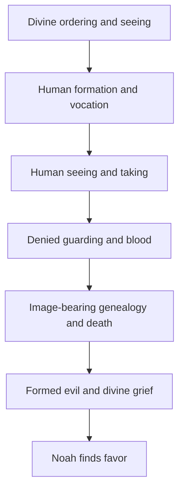

# Ark-WTP Artifact Benchmark

## 0. Decision / このFileの結論

Ark-WTPは削除・拡張・再調査を急がず、今回の`Bereshit Full-Parasha × Hebrew Word Lens v0.3`を**Frozen Benchmark**として保存し、より高いAI能力、明示的なHuman Review、またはMethod／SourceのMaterial Changeが到来した時だけ同一条件で再実行して比較する。

```yaml
current_decision:
  mode: "FREEZE_AND_WAIT"
  meaning: "放置ではなく、比較可能なBaselineとして凍結保存する。"
  automatic_next_lens: false
  automatic_matrix_expansion: false
  repository_research_redo: false
  human_review_available: true
```

## 1. Why This File Exists

このFileは、Future AIが今回のArk-WTPについて次の作業を一からやり直すことを防ぐためのCurrent Coordinate／Benchmark Capsuleである。

- Ark-WTPの意味を再推測すること
- 旧`ark-wtp.md`とCurrent Weekly Torah Portion Projectを再び混同すること
- 存在しないPeshat v0.3本文を再探索または記憶から再構築すること
- Bereshit × Hebrew Word Lensを同じ条件で無目的に再生成すること
- 今回の成果・限界・Guard・Next Gateを過去Threadから復元すること

このFileはSeed Unit本文の複製ではない。本文成果物、Benchmark記録、Workflow、Routerの所有権を分離する。

## 2. Artifact Ownership and Routes

| Coordinate | Owner Role | Current State |
|---|---|---|
| [`../README.md`](../README.md) | Ark-WTP Current Identity／Router | Current |
| [`../lens-dimensions_workflow.md`](../lens-dimensions_workflow.md) | Method／Checkpoint／Resume Protocol | Current |
| [`../seed-units/_template.md`](../seed-units/_template.md) | one-Parasha × one-Lens Contract | v001-candidate |
| [`../seed-units/bereshit.md`](../seed-units/bereshit.md) | Full Hebrew Word Lens Artifact Body | v0.3／PROVISIONAL_PASS |
| [`README.md`](./README.md) | Frozen Benchmark／Current Coordinate／Comparison Contract | This File |
| [`../ark-wtp.md`](../ark-wtp.md) | Predecessor-generation migration evidence | Historical-only／deletion gated |

```yaml
ownership_rule:
  router_owns: "Identity and navigation"
  workflow_owns: "Method and resumable state"
  seed_unit_owns: "Full textual observation body"
  artifact_readme_owns: "Frozen result, evidence coordinate, benchmark contract, and rerun trigger"
  duplication_guard: "Do not copy the complete Seed Unit body into this Benchmark README."
```

## 3. Frozen Reality Snapshot

```yaml
frozen_snapshot:
  unit: "Bereshit Full-Parasha × Hebrew Word Lens v0.3"
  substrate: "Genesis 1:1–6:8"
  result: "PROVISIONAL_PASS"
  human_final_seal: false
  chapter_coverage: [1, 2, 3, 4, 5, 6]
  selected_anchor_count: 8
  selected_lens_remained_distinct: true
  allowed_absence_respected: true
  unsupported_wordplay_rejected: true
  evidence_locations_named: true
  exact_recurrence_and_literary_inference_separated: true
```

### 3.1 Eight-Anchor Snapshot

| ID | Hebrew Anchor | Main Range | Frozen Observation | Review Sensitivity |
|---|---|---|---|---|
| A1 | `ראה＋טוב／רע` | Genesis 1／3／6 | Divine seeing of created good → creaturely seeing and taking what appears good → divine seeing of human evil | Strongest anchor／low ambiguity |
| A2 | `בדל／קרא／שם` | Genesis 1–6 | Divine separation and naming → human naming → genealogy, city, and human renown | Literary trajectory requires review |
| A3 | `אדם／אדמה／עפר／דם` | Genesis 2–6 | Human origin, vocation, curse, blood-witness, and erasure remain bound to the ground | Do not claim one strict historical etymology |
| A4 | `צלם／דמות／תולדות` | Genesis 1／2／5 | Image／likeness vocabulary enters human genealogy after creation | Do not complete systematic theology from recurrence alone |
| A5 | `עבד／שמר／אח` | Genesis 2／4 | Entrusted garden service and guarding → Cain's denied brother-guarding | Literary connection, not a direct command proof |
| A6 | `תשוקה／משל` | Genesis 3:16／4:7 | Rare desire／rule construction links two crisis scenes | Preserve exact parallel; debated gloss remains open |
| A7 | `יצר` | Genesis 2／6 | Divine forming of creatures → formed inclination of human thought | Verb／noun senses must not be collapsed |
| A8 | `עצב／נחם／נוח` | Genesis 3／5／6 | Pain and toil → hoped-for comfort in Noah → divine regret／grief | Naming wordplay is textual; strict root identity is not asserted |

## 4. Full-Parasha Result Tree



このTreeはPlot Summaryではなく、選択されたHebrew WordがParasha全域で形成したLexical Trajectoryの圧縮である。

## 5. Confirmed Bottleneck and Unexpected Success

### 5.1 First Bottleneck

```yaml
first_bottleneck:
  name: "Dangling Peshat Baseline"
  predecessor_claim: "Peshat Lens v0.3 completed and available in Ark05:04 thread draft"
  repository_observation: "Referenced Ark05:04 artifact contains no Bereshit／Peshat／Genesis／Torah／Lens body."
  current_treatment: "UNAVAILABLE／DO_NOT_INVENT"
  future_rule: "Do not search again unless a rerun trigger in §7 is satisfied or a new artifact path is supplied."
```

### 5.2 Unexpected Success

```yaml
unexpected_success:
  name: "Parasha-Scale Lexical Trajectory"
  discovery: "Full-Parasha substrate revealed linked lexical movements that the Genesis 1:1 pilot could not expose."
  strongest_anchor: "ראה＋טוב／רע"
  design_consequence: "The formal Ark-WTP unit should remain one full Parasha × one Lens."
```

## 6. Evidence and Guard Baseline

### 6.1 High-Confidence Evidence

- `תשוקה／משל` exact paired construction: Genesis 3:16／4:7
- `צלם／דמות` recurrence: Genesis 1:26–27／5:1–3
- `יצר` recurrence: Genesis 2:7, 19／6:5
- `שמר` recurrence: Genesis 2:15／4:9
- `ראה＋טוב／רע` trajectory: Genesis 1／3／6
- `עצב／נחם` proximity: Genesis 5:29／6:6

### 6.2 Deliberately Rejected Claims

- `נֹחַ／חֵן`の文字反転を語源的・神学的証明として使わない。
- `אדם／אדמה／דם`を一つの厳密な歴史語源として断定しない。
- すべての`טוב`を一つの善悪Formulaへ平板化しない。
- Hebrew similarityだけからMessiah、Covenant、Israelの結論を生成しない。
- 欠落Peshat Artifactを記憶から再構築しない。

## 7. Benchmark Revalidation Contract

### 7.1 Rerun Triggers

次のいずれかが成立した時だけCapability Revalidationを再実行する。

```yaml
rerun_triggers:
  - "Human explicitly requests a new Ark-WTP benchmark run."
  - "A materially more capable AI／model／toolchain becomes available."
  - "A new primary-text, morphology, lexicon, or commentary capability materially changes the method."
  - "The missing Peshat artifact is actually recovered with a verifiable path."
  - "Current files become inconsistent, broken, or materially revised."
```

時間が経過したこと、Threadが新しくなったこと、Future AIが初見であることだけでは再実行Triggerにならない。

### 7.2 Fixed Comparison Conditions

```yaml
fixed_conditions:
  parasha: "Bereshit"
  substrate: "Genesis 1:1–6:8"
  lens: "Hebrew Word Lens"
  declared_unit: "one full Parasha × one Lens"
  baseline_artifact: "projects/ark-wtp/seed-units/bereshit.md"
  baseline_benchmark: "projects/ark-wtp/artifact/README.md"
  required_guards:
    - "Allowed Absence"
    - "Evidence-or-Demote"
    - "No unsupported wordplay"
    - "Exact recurrence vs literary inference separation"
    - "No automatic Human Final Seal"
```

### 7.3 Comparison Axes

新しいRunはBaselineを上書きせず、次の軸ごとに`IMPROVED／SAME／REGRESSED／INCOMPARABLE`を記録する。

1. Hebrew textual accuracy
2. Full-Parasha coverage
3. Lens distinctness
4. Exact evidence vs inference separation
5. Handling of uncertainty and debated Hebrew
6. Unsupported etymology rejection
7. Structural compression and Future-AI readability
8. Discovery of genuinely new high-leverage lexical trajectories

### 7.4 Future Output Rule

```yaml
future_output:
  preserve_baseline: true
  overwrite_this_file_without_human_instruction: false
  suggested_new_run_path: "projects/ark-wtp/artifact/benchmarks/<date>-<model-or-capability>.md"
  required_result: "Comparison against v0.3, not an isolated new answer"
```

## 8. Future AI Reboot Contract

### 8.1 Minimal Read Order

```yaml
future_ai_read_order:
  1: "projects/ark-wtp/README.md"
  2: "projects/ark-wtp/artifact/README.md"
  3: "projects/ark-wtp/seed-units/bereshit.md — only when full body review is needed"
  4: "projects/ark-wtp/lens-dimensions_workflow.md — only when workflow continuation is authorized"
```

### 8.2 Do

- このFileのCurrent DecisionとRerun Triggersを先に読む。
- Current stateを`FROZEN_BENCHMARK_WAIT`として復元する。
- Full bodyが必要な場合のみCanonical Seed Unitを読む。
- 新しい能力検証では同一条件を保ち、Baselineとの差分を明示する。

### 8.3 Do Not

- 過去Thread、Memory、Git履歴からCurrent stateを再構築しない。
- Ark-WTPの意味を再推測しない。WTPはWeekly Torah Portionである。
- Repository全体を再検索してPeshat v0.3を探し直さない。
- 同一Artifactを新しい文章で再生成しただけで「進化」と判定しない。
- 8 Anchorの数をQuotaとして固定しない。追加・統合・削除にはEvidence Deltaを要求する。
- Human指示なしに次のLensや540 Matrixへ拡張しない。

## 9. Current State and Next Gate

```yaml
current_state: "FROZEN_BENCHMARK_WAIT"
current_artifact_result: "PROVISIONAL_PASS"
automatic_action: "NONE"

next_gate:
  primary: "WAIT_FOR_CAPABILITY_DELTA_OR_EXPLICIT_HUMAN_REVIEW"
  optional_human_action: "Accept, refine, or reject the eight anchors."
  separate_retirement_gate: "Delete predecessor ark-wtp.md only after Human confirms Local backup."
```

「様子見」は何もしないことではない。Baseline、比較条件、再実行Trigger、禁止事項を固定して初めて、将来のAI進化を測定できるWaitingになる。

## 10. 一文定義

```text
"Ark-WTP凍結Benchmark待機（Ark-WTP Frozen Benchmark Wait: Bereshit全Parasha×Hebrew Word Lens v0.3の成果・限界・Evidence・Guard・比較条件を上書き不能なBaselineとして保存し、時間経過や新Threadだけでは再調査せず、明示的Human Reviewまたは実質的AI能力差が到来した時のみ同一条件で再実行して進化量を比較する待機状態である)"
```

<!-- ARK_WTP_ARTIFACT_BENCHMARK_EOF_v001-candidate -->
