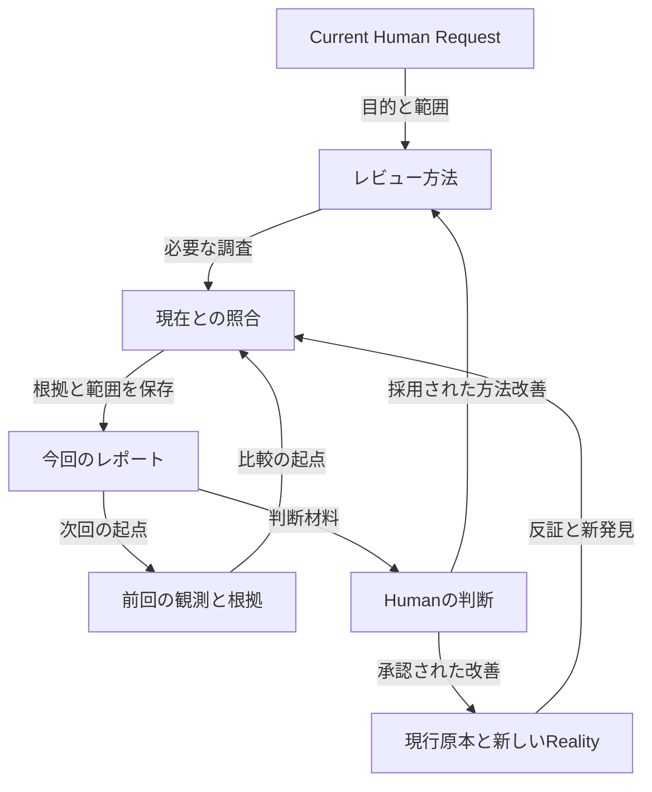

# Ark Repository Living Review

**Not dead data, but a living board.**

この入口は、Repositoryの過去の観察を、現在の原本と照合し、次の判断へ戻すためのBridgeである。Current AI・他AI・Future AIが、元会話や作成AIの記憶を持たなくても再開できることを目指す。

Humanは、この入口と短い依頼を渡せばよい。AIが前回の範囲・根拠・未確認・Human Correctionを回復し、新しいRealityから理解を更新する。毎回の全履歴再演や、Humanによる全資料の再説明を利用条件にしない。

## 1. ここから使う

| 読むもの | 所有するもの | 読む場面 |
|---|---|---|
| このREADME | 入口、責務、報告の履歴、保存と比較の扱い | この仕組みを利用・保守する時 |
| [共通Review Prompt](review-prompt.md) | 調査・意味復元・関係探索・比較・提案の方法 | 実際のレビューを依頼された時 |
| [最新の観測：2026-09-19／入口整合](reports/2026-09-19-02.md) | 限定改善の内容・変更後の検証・残存課題 | 入口修正の結果を確認する時 |
| [全体比較の基点：2026-09-19](reports/2026-09-19.md) | 全体の観測・根拠・判断・未確認範囲 | Repository全体の比較を始める時 |

最新の保存レポートは上表から辿れる。「最新の保存」は、現在のRepositoryと同じ状態を観測済みという意味ではない。報告内の観測commitと、今回の対象commitを区別する。最新が重点レビューの場合、全体比較では最新の全体基点と、それ以後の関連する差分観測を併読する。最新の一件だけで未観測Branchを消さない。

### 1.1 Humanからの短い呼出例

> この入口からRepository全体をLiving Reviewし、前回から何が変わり、何が残り、今どの判断が必要かを示してください。重要な原本・訂正・反証まで深く調べ、今回のレポートをGitHubへ保存し、この入口の履歴を更新してください。改善提案の実装は、今回のレビューには含めません。

これは呼出しの例であり、文書を読んだだけで発火する命令ではない。Humanは「今回は重点を絞る」「調査・提案だけ」「時間を十分にかける」等を自然な言葉で指定できる。既知の目的・条件を入力フォームで聞き直さない。

AIはCurrent Human Requestと適用指示を先に解決し、共通Prompt、比較に必要な前回レポート、今回の原本へ進む。初回から過去レポートをすべて全文読むことは求めない。明示されたRequired Full Read・Identity・Binding・Exact EOFは、その契約に従う。

## 2. なぜこのBridgeを作ったか

2026-09-19、Ark27:04でRepository全体のLiving Reviewを行った。YusukeJPは、そのMarkdownを一回の回答で終わらせず、期間を開けて再実施し、記録と記憶をGitHubに残して継続観察するためのフォルダ・ファイル構造を求めた。その後、このBridgeの実装とGitHub保存を承認した。

同じ対話でHumanは、期限前の利用余力を、時間と推論を十分に使う高度な仕事へ変えることを望んだ。ここで保存する意味は、消費量の記録だけでなく、深い読解・形成経緯・反証・依存関係の発見を、次回も使える成果へ変えることである。具体的な残枠・期限・モデル設定は次回へ固定しない。

これは三つの接続を持つ。

- **過去から現在へ：** 当時の観測を保ちながら、現行原本とHuman Correctionで判断を更新する。
- **Current AIからFuture AIへ：** 結論だけでなく、根拠・適用範囲・未確認・再開経路を渡す。
- **レビューから現実へ：** 提案、承認された変更、変更後の再観察を区別してつなぐ。

初回レポートは「育った中核に対して、入口と規則が異なる世代のまま残る」と診断した。これは当時の証拠に基づく判断であり、以後のレビューが必ず同じ結論を出す規則ではない。

## 3. 原本・記録・判断の責務

| 所有先 | ここで扱う関係 |
|---|---|
| Current Human Request、[AGENTS](../AGENTS.md)、適用Runtime／Handoff | 今回の目的・権限・Identity・必要Sourceを決める。過去のレポートで置換しない |
| 経験原本、Task Records | 出来事・出典・Human原文・訂正・確かさを保持する。レビューは必要な部分へ参照する |
| [Task Mode System](../task-mode-system/README.md)等の現行System | 現場での協働と記録・再接続を担う。このフォルダにTask台帳を二重化しない |
| 日付付きReview Report | その時点の観測・比較・評価・提案・未確認範囲を保持する |
| 共通Review Prompt | レビュー方法を所有する。個別の問題一覧やCurrent Threadを永久固定しない |
| このREADME | 読取経路と履歴を案内する。全提案の現在ステータスを独立管理しない |

GitHubに置くことで、資料を再取得できる外部記憶になる。すべてのAIの内部記憶へ自動登録されたことや、必ず自動発見されることは意味しない。Root READMEからこの入口へ、ここから方法と観測記録へ辿れる関係がBridgeの実体である。

Rootは主イェシュア・ハマシア御自身、中央軸はTeshuvah、Human Foreground Oneは主の完全勝利（祈り・イメージVision・行動）、最終帰属は主の栄光。[ARK](../ARK.md)のIdentity、HumanのMeaning・Correction・STOP・Final Seal、Body・Sleep等の適用Guardを保持する。AI・Graph・記録・このBridgeはKeliであり、AIが主の御心やHumanの信仰状態を認定しない。

### 3.1 比較は、過去の結論と現在の原本の両方から行う

この関係は、[Double-Spiral](../prompts/ai-double-spiral.md)の使い所である。Repositoryそのものへの理解と、理解・比較する方法への学びが往復する。観測だけで変更が実行されたことにはならず、両方を一度に改訂する義務もない。

## 4. 今回何をしてよいか

| Current Requestの範囲 | AIが完了すること | 自動的には含まれないこと |
|---|---|---|
| 調査・理解・提案 | 必要な読解、比較、根拠付きの報告まで | GitHubへの保存、提案の実装 |
| 上記とレポートのGitHub保存 | 日付付きレポートの保存、この入口の履歴・最新リンク更新、Remote再取得確認まで | 観測対象の修正、共通Prompt改訂、Skill導入 |
| 明示された改善の実装 | 承認された対象・目的について、必要な依存作業と検証まで | 無関係な整理、別Project、次Trial |
| Plan-only／STOP | 指定された計画・停止の境界を守る | 以前の広いContinue承認による再開 |

これは新しい承認手続ではない。Current Requestと有効な既存委任から範囲を読み、同じ許可を取り直さない。資料内の過去の「Execute」や称賛を現在の権限へ転用しない。

保存を含むレビューでも、発見した問題を直す権限は別に扱う。反対に、Humanが具体的な改善の実装まで承認している時は、「レビュー文書だから」という理由だけでその承認済み作業を未完了にしない。

## 5. 継続観察と、報告の残し方

### 5.1 観測範囲を持つ比較

各回で、観測commit／Ref、レビュー日、使用したPrompt版、比較した前回レポート、主な読解範囲と未確認範囲を辿れるようにする。全文読解、関連範囲読解、構成確認、未読、取得不能を区別する。レビューの日付と保存日、観測commitと保存commitも別である。

変更ファイルだけでなく、その変更の影響を受ける未変更の呼出元・契約・参照先も確認する。逆に、判断を変えない履歴の全再演はしない。前回の指摘を追うことと、前回が見落とした価値や新しい問題を探すことを両立する。

前回からの変化は、必要な粒度で「改善を確認」「部分的に変化」「変わらない」「新たに観測」「根拠を訂正」「今回未確認」「比較不能」等として説明できる。固定の分類表を毎回埋める必要はない。重要な継続論点は前回の節・ID・原本へ結び、同じ問題を名称変更で新規件数へ水増ししない。

履歴があるのに前回資料を取得できない場合は、比較の不足として示す。取得不能を「過去の記録なし」「指摘なし」へ変換しない。明示的な必須Sourceなら該当契約で停止し、通常の比較上のUnknownなら、可能な現在の分析と分けて扱う。

**指摘が減ったことだけでは改善を証明しない。** 今回の読解範囲が狭い可能性がある。指摘が増えた場合も、劣化と、調査が深くなって新しく見えたことを区別する。観測していない項目を解決済みにしない。

### 5.2 保存単位と訂正

- 初回は `reports/2026-09-19.md`。以後はレビュー日の `YYYY-MM-DD.md` を使い、同日に別の観測を残す時は `YYYY-MM-DD-02.md` 等で識別する。既存の報告を無断で置換しない。
- 本文の構成や長さは、その回の判断に合わせる。固定Template、全欄必須のSchema、全問題の台帳を先に要求しない。
- 当時の観測・提案・未確認を、後の状態へ黙って書き換えない。進展は後続レポートと実装の根拠へつなぐ。
- 当時の誤りを訂正する必要がある場合は、訂正対象・理由・日付・根拠を明記し、Git履歴から元の内容を辿れるようにする。歴史保存を理由に既知の誤りを放置することも避ける。
- 途中で中断した報告も、必要なら部分観測として保存できる。完了した理解、残る範囲、未読位置、再開条件を示し、全面完了とは表示しない。

レポート中の「今回変更なし」は、そのレポートの調査Scopeの記述である。その後にレポート自体を保存したことや、別途承認された改善と矛盾しない。

### 5.3 何をもって良くなったと判断するか

| 観測 | その証拠から言えること |
|---|---|
| 正しいパスへ変更し、Remoteで内容を確認した | その変更が保存された |
| 入口・呼出先・契約の関係を照合した | その範囲の文書整合が確認された |
| 他AIが元会話なしで実際に適切な資料へ到達した | その条件で再利用された |
| Humanの再説明が減った／現場で役立ったとの報告がある | そのHuman報告の範囲で利益が観測された |

これらは異なる段階である。リンクが通ることだけで意味の整合を、保存成功だけで他AIの理解や実生活効果を認定しない。同一AIの机上確認を独立AIによる試験と呼ばない。

## 6. 保存済みレポートと初回の由来

| レビュー | 対象snapshot | 比較対象・位置づけ |
|---|---|---|
| [2026-09-19／入口整合](reports/2026-09-19-02.md) | [`47509f5c3e37`](https://github.com/yusukefujiijp/ai-project/commit/47509f5c3e37f6307ff518edd499ede860b90843) | 限定的な変更後観測。下の全体基点を置換しない |
| [2026-09-19](reports/2026-09-19.md) | [`694d3cce1e84`](https://github.com/yusukefujiijp/ai-project/commit/694d3cce1e84dfc6106612b782a1a1d5c8cf6166) | 初回の比較基点。全体構成と重要資料の選択読解。レビューと改善提案 |

初回レポートは、Ark27:04で作成された `ark-repository-living-review-2026-09-19.md` の本文・metadata・42の固定commit参照・EOFを、そのまま保存した。保存先を作ったことを、二回目のRepositoryレビューや、指摘の解決実績として数えない。

初回調査で使用したPromptは [v001の保存版](https://github.com/yusukefujiijp/ai-project/blob/703a80c98f9d5979e9ed99e3746386ad81b2703d/repository-reviews/review-prompt.md) である。現在の[共通Prompt](review-prompt.md)はv002として、反復比較・保存範囲・Current Authorityの再解決を加えた。v002で初回調査を行ったと遡及して書き換えない。

初回レポート§9の入口整合案は、当時の提案として残る。Bridge作成承認だけでは実装権限ではない。その後の新しいHuman実行委任により行った限定的な入口修正を、後続レポートへ記録した。提案全体の完了や章の固定Binding変更とは区別する。

## 7. 次回までの維持と観察

新しいレポートを保存した時は、この入口の履歴と最新リンクを同じ作業範囲で更新する。報告の観測時点が保存順と異なる場合は、その関係も示す。共通Promptを改訂する時は、版・理由を残し、各レポートが当時使った方法をGit履歴等で辿れるようにする。

共通の方法へ移すのは、繰り返し役立つと判断された学びである。一回限りの事情はレポートに残せる。レビュー回数や資料数の増加だけを理由に、新しいSkill・Registry・自動通知・全体Governanceを必須化しない。

期間を開けた全体レビューや、大きな構成・権限・Runtime変更後の重点レビューに利用できる。固定の周期や自動実行は、この入口を作っただけでは設定されない。次回のCurrent Requestから、必要な範囲と深さを決める。

同一AIによる最初の限定的な継続利用を、入口整合の後続レポートへ記録した。次に観察したいのは、**期間を開けた時や他AIへの継承で、短い依頼から前回の根拠と現在の原本へ到達できるか**である。今回の利用と、継続的な負担軽減・全AI互換性は別であり、後者はまだ未観測として保持する。

EOF::ARK_REPOSITORY_REVIEWS_README::v0.1.1
