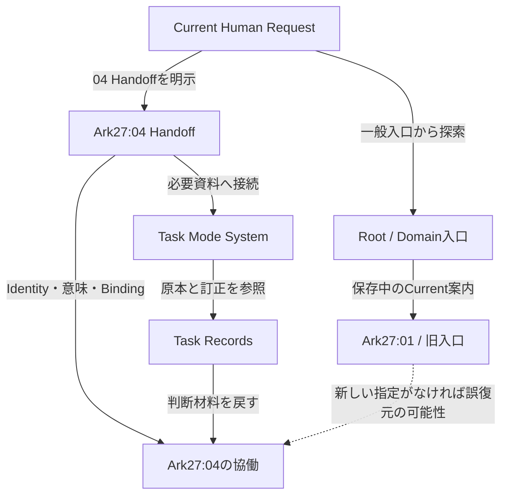

# Ark Repository Living Review

## 1. 今回の判断

**Arkの中核は育っている。現在の大きな摩擦は、育った中身へ案内する入口と、そこで使う規則が、異なる世代のまま併存していることである。**

今回の調査では、単にファイルが多いことよりも、次のAIが「どこから入ったか」によって現在地・適用する方法・承認条件を違って読めることが問題として強く現れた。既存の良い経験・方法・記録を大移動するより、**現在を案内する役割と、過去を保存する役割の境界を整えること**を最初の改善候補として推奨する。

ただし、章READMEの現在地を一行変えるだけでも、固定SHAを要求するHandoffへ影響する。変更量の小ささと、影響の小ささは一致しない。これは想像上の注意点ではなく、現行Ark27のBindingと、Ark21:06の撤回実験の両方に根拠がある。[現行Handoff §2.1][handoff04]、[実験のHuman Correction §0–2][sandbox]

### 1.1 Humanへ返す最小の盤面

| 項目 | 現在の判断 |
|---|---|
| 最も守りたいもの | Humanの短い入力からAIが必要な意味と根拠を回復し、使える応答へつなぐ分担 |
| 既に強いところ | 現行Handoff、Task Mode System、Task Records、成功事例、最近の共有Skillにおける責務と証拠の区別 |
| 主要Bottleneck | 入口・適用規則・文書の役割の更新が、原本の進歩と揃っていない箇所 |
| 最初の改善候補 | 既存の一般入口と現行の意味の所有先を整合させる。固定Bindingは無断で変更しない |
| 今回完了したこと | Repository全体の構成把握、重要資料と経緯の読解、構造検査、利用場面の机上照合、改善候補の比較 |
| 今回行っていないこと | GitHub変更、削除・移動、Commit・PR、Skill改訂、Runtime更新、新Trial、Canonical化 |

時間と利用枠を多く使ってよいという依頼は、原本・訂正・反証・変更の波及を確かめるために用いた。モデルの優位性そのものを成果の根拠にはせず、調査で得た根拠と、そこからの推論を区別する。

## 2. 現在のArkをどう復元したか

### 2.1 一つの巨大文書ではなく、違う仕事を持つ資料がつながっている

| 層・役割 | 主な所在 | 保持する意味 |
|---|---|---|
| Root・Identity | `ARK.md`、章・ProjectのIdentity | Rootは主イェシュア・ハマシア御自身。中央軸はTeshuvah。器とRootを混ぜない |
| 現在の権限・協働条件 | `AGENTS.md`、適用Runtime、Current Human Request | HumanのMeaning・Correction・STOP・Final Seal、継続委任の範囲、Guard |
| 現在地と引継ぎ | Domain／章入口、各ThreadのREADME・Handoff・State | どのThread・契約・時点を扱い、最初に何をしてよいか |
| 現場支援 | `task-mode-system/` | 短いHuman入力を受け、Task化・文脈判断・応答・Feedbackへつなぐ |
| 経験原本 | `ark-project/ark27/ark27-*/task-records.json`等 | 出来事、Human原文、訂正、採用理由、時点、確かさ、Unknown |
| 方法と利用入口 | `prompts/`、`skills/`、用途別Subsystem | 再利用可能な方法と、現在の環境から使うための接続 |
| 学びとしての事例 | `success-cases/` | 当時の成功、その成立条件、喜び、形成経緯、再利用できる問い |
| 探索・履歴・保留 | Arkの各章、`_note/`、Seed群、各Project、Sandbox | 未完成の価値、撤回理由、比較基準、次に開く条件 |

Task Modeは、意図と現場を扱えるTask・関係・優先順位・実行支援へつなぐ。Task Recordsは、その過程の出典と意味を保持する。Task Mode Systemは、対話・記録・改善・次の現場への再接続を機能させる。この三者を同じTask台帳へ潰さない。[System入口][tms]、[形成経緯][formation]、[保守 §2・6][maintenance]

現在の実践の中心がTask Mode Systemであることと、Repository全体の価値が生活Taskだけで決まることは別である。Torah・Israel・Covenant・Hebrew／Jewish Context、研究Project、文章化の知恵、過去の失敗から得たGuardにも、それぞれの価値と所有先がある。Human Foreground Oneは主の完全勝利（祈り・イメージVision・行動）、最終帰属は主の栄光。AI・Ark・文書・SystemはKeliであり、AIは主の御心やHumanの信仰状態を認定しない。

### 2.2 いま機能している経路と、一般入口のずれ

実際に成功した03→04移行は、明示されたHandoffから入る経路である。その成功を、一般入口の古さを理由に否定しない。一方、元会話を持たずRepositoryから入るAIにまで、同じ復元が自動的に成立するとは言えない。この二つの入口条件を分けることが、今回の診断の中心である。[移行成功事例 §3–4][transition-case]、[Domain入口 §0.1][domain]

## 3. 次の判断を変える主要な問題

### 3.1 現在地の案内が複数時点を混在させている

**観察。** `ark-project/README.md`のfront matterと§0.1はArk27:01をCurrent entryとする。§0.1には、それ以降のArk23記述を歴史的Sourceとして読む説明もある。しかし§3.1末尾と§13では、Ark23:15をCurrent authoritative entry／current Front-Lineと再び表現している。`ark-project/ark27/README.md`も`current_thread: ark27-01`のままである。[Domain入口][domain]、[Ark27章README][chapter27]

**現在との関係。** Ark27:04 HandoffとStateは、04がMain Ownerであり、章の旧01入口や03初期Stateへ巻き戻さないことを明記している。今回のHuman指定とも整合する。[Handoff §1・5–6][handoff04]、[State bindings.entry_policy][state04]

**判断。** 上書きすべきは過去の出来事ではなく、Currentを名乗る案内の適用範囲である。Domain入口の一部が古いからといって、Ark23の全記録を削除する必要はない。

**見落としやすい依存。** 章READMEのblob `e7caf9882a212cbda186362001e49791cff8a8ce`は、Ark27:01–04のHandoff／Stateから固定参照されている。04のREADME・Handoff・章の三つのSHAは、今回取得した実体と一致した。章の`current_thread`だけを編集してもblobは変わるため、04の既存契約のまま成功したとは扱えない。

ここには「更新される現在地」と「固定された継承資料」が同じ文書に入っている設計上の緊張がある。まず外側の既存Domain入口を現在の04へ整合させる案と、章のBinding方針まで明示的に移行する案を分ける。後者を前者の小さなついで作業にはしない。

なお、Ark23:15には旧Handoffを保存したまま、Runtime改訂後の明示的な再接続入口を用意した先例がある。State側ではDomainの旧pinを履歴とし、章移行後はCurrentを動的に読む方針も記録されている。既存の移行経験から学べるが、その契約を04へ無検討に複製はしない。[Ark23:15再接続 §1–2][reconnect23]、[同State bindings.domain_router][state23]

### 3.2 現行AGENTSと一般入口で、承認の読み方が違う

| 論点 | Root README等 | 現行AGENTS |
|---|---|---|
| 実行承認 | §0・7.2等で`Human Seal OK`と`Execute GitHub OK`をrequiredとして列挙 | §5で合言葉の一致ではなく依頼と既存承認の意味から判定 |
| Correction | README §8.2でMaterial CorrectionはRe-Sealが必要 | §5で訂正後の実行を含む依頼なら反映し、訂正という理由だけで再承認を課さない |
| Branch | README §7.1で別途明示Sealを要求 | §5.1でCurrent Request・競合・変更の性質から方法を選ぶ |
| 新規File・Skill等 | ARK.md §11.1のrequiredにRepeated Reality valueと小さなField Test | AGENTSでは初回の承認済み実験と、反復実証・恒久的昇格を区別 |

根拠：[Root README §7–8][root-readme]、[AGENTS §3–5・8][agents]、[ARK §11.1][ark-home]

**影響。** Currentの承認範囲を理解できていても、別の入口を読むと不要な確認停止や過剰な工程が再発し得る。逆に、これを直す目的でHumanのSTOPや本当に必要な範囲確認まで消してはいけない。

**改善候補。** 判断を所有するCurrent AGENTSへ一般入口の説明を合わせ、同じ承認規則を独立して維持する箇所を減らす。安全上必要な短い注意の反復は残せる。問題は文言が二回あることではなく、同じ依頼への結論が変わることである。

この観察は、旧文書すべての当時の承認経緯が誤りだったという意味ではない。現在の一般運用へ適用する説明だけを対象に判断する。

### 3.3 Plan Modeは、入口によって旧版へ戻れる状態にある

**観察。** `prompts/README.md` §3.3と`ai-plan-mode/README.md`は、専用フォルダ内のv004をActive routeとし、旧`prompts/ai-plan-mode*.md`をHumanが明示選択するrollback baselineとして残している。ところがRoot README §8.1のCurrent pairは旧ファイルを指す。旧Query本文も、新版への単純な案内ではなく旧Runtimeを起動する内容を持つ。[Prompt入口 §3.3][prompts-index]、[Plan Mode入口][plan-index]、[旧Query][old-plan-query]

Git履歴でも、v004のActive compatibility routeへの切替は2026-08-07のcommit `9a3065a4fbd5e85f1190cd9a827bccf01bd0687e`として確認できた。

**判断。** 旧ペアの存在は、復旧可能性を保つ意図的な設計であり、削除候補とはしない。直す対象は「通常入口が旧ペアをCurrentとして案内する関係」である。長い方・古い方を消す重複整理では、この区別を失う。

Thread-Endについても、Root側の旧`thread-end/`案内と、現在の共通移行契約・Skillとの役割を明確にする価値がある。ただし旧Thread-End群はFull／Mini等の独自責務を持つため、今回の読解だけで全面廃止とは判断しない。[旧Thread-End入口][thread-end]、[共通移行契約][transition-contract]、[移行Skill][transition-skill]

### 3.4 Task支援と経験への入口に、存在しない旧パスがある

**観察。** Root README §5.3は`_tasks/README.md`、AGENTS §1とARK.mdのFile Ecologyは`_tasks/lessons.md`を参照する。固定snapshotのTreeには両パスが存在しない。一方、現在のTask支援にはTask Mode Systemがあり、経験原本への索引も整っている。[Root README][root-readme]、[AGENTS][agents]、[経験索引][experience-index]

**影響。** 新しいAIが一般入口からTask支援や学習の保存先を探す時、存在しない場所へ進み得る。Task Mode Systemは04 Handoffから直接到達できるため、Systemそのものが取得不能という意味ではない。

**改善候補。** 現在のTask支援は現行入口へ案内する。旧lessonsの役割は、Task Records・success-cases・方法への反映など、何を保存するのかによって所有先を決める。失敗学習をすべてTask Recordsへ移すという機械的な置換はしない。新しい`_tasks`フォルダを作ってリンクだけ通す必要も、現時点では認められない。

### 3.5 撤回された整理実験のチェックツールが、現役に見える場所へ残っている

**形成経緯。** Ark21:06のSandboxは、CURRENT_BOARD・Python checker・GitHub Actionsを早くRootの運用へ接続しすぎた実験と、Human CorrectionによるRollback／隔離を記録している。Rootは復元され、三つの実験ファイルはHumanによる手動削除対象とされた。[Sandbox §0–3][sandbox]

**現在の観察。** `CURRENT_BOARD.md`と`.github/workflows/reality-check.yml`は現在のTreeにない。一方、`tools/check_repo_reality.py`は残っており、Sandboxの保存コピーとbyte単位で同一である。内容を読んだ上で一度だけローカル実行すると、削除対象だったBoardとWorkflowをrequired fileとして要求した。[残存checker][checker]

この実行結果は4 errors／31 warningsだった。しかし、そのまま「31箇所を直し、必要ファイルを復活させる」という計画へは進めない。出力には歴史文書や撤回済み設計の前提が含まれる。CurrentのGitHub Actionsでこのcheckerが動いていることも、確認していない。

**判断。** 本件は「ファイル欠落」よりも、廃止した実験の判定基準が現役に見える問題である。将来扱うなら、原本の教訓を残しつつ、現役ツールとして使ってよいかを先に整理する。古い削除予定を今回の削除権限へ転用しない。

**今回の提案への制約。** Repositoryを整えるための新しい巨大Boardや自動Governanceを最初の一手にしない。過去のHuman Correctionが、その案の影響を評価する具体的根拠になる。

### 3.6 物理的な配置変更と、内部の参照先変更が揃っていない

**観察。** 現在は`prompts/`にあるArk-OKF Queryが、本文の起動対象・paired SSOTを旧パスの`s_special/ark-open-knowledge-format.md`としている。Seed compile／pickupの旧ペアも`ark-project/prompts/`を指す。いずれの旧ディレクトリも固定snapshotにはない。[OKF Query §0–2][okf-query]、[Seed compile Query §0–1][compile-query]

これはfront matterの見た目だけの問題ではない。読み手が本文に従ってRuntimeへ進む場所にも旧パスが残る。関連する`canonical_path`のずれはKISS／N-Start-Stop、Claude資料等にも見られたが、全てを同じ優先度の起動不良とは扱わない。

`_thread-mission/README.md`には、まず配置を整え、内部metadataを後で直すというTopology-firstの段階設計がある。したがって、すべてを無秩序な事故と読むのも適切ではない。ただしCurrentの起動契約が不存在パスへ向かう場合、その未完段階は現在の利用へ影響する。[Thread Mission §3][mission-index]

**改善候補。** 現役として案内するQueryについて、実際の入口→本体→必要Sourceを確認し、同じ役割・Identityの正しい所在へ接続する。歴史資料の引用パスや意図的な旧版保存まで一括置換しない。

### 3.7 古いSystem入口と、新しい局所Systemの成熟がずれている

`_system/ark-system.md`は、学びを成長へつなぐ有益な発想を保持する一方、存在しない`_thread-start/`、`_thread-end/`、`_skills/`等への経路と、旧来のGrowth Ledger／Skill Seed中心の手順をCurrent向けに示す。[旧System入口 §8・12][system-legacy]

一方、現在のTask Mode Systemと共有Skillは、意味の所有先、継続委任、選択読解、保存成否、実際の呼出し・効果の区別を具体化している。これは旧Systemの価値を全否定する材料ではなく、**成長の知恵を残しながら、いま運用する経路を別に説明する必要**を示す。

またArk-Voice README §6は「GitHub上で確認済みなのはREADME」とするが、同じProject内にはSystem本文のcandidateが存在する。その本文はpending Human content seal／field test not startedと明示している。存在を案内へ反映することと、稼働・採用済みへ昇格させることを分ける必要がある。[Ark-Voice入口 §6][voice-index]、[System Identity][voice-system]

## 4. 整理で壊してはいけない強みとFruit

### 4.1 Human Correctionが、結論だけでなく形成過程として残っている

R03 `s16`–`s19`、`s28`–`s29`、`s33`は、内部をAIへ委ねる方向、AIを主読者とするCorrection、選択読解と必要情報保持の両立、他AIが運用できる必要な複雑さを保持する。`black-box-balance-proposal`はAI解釈、Humanの採用・実行承認は別Nodeである。[R03][r03]、[形成経緯 §4.5–4.11][formation]

これは、Future AIが現AIの結論を丸暗記するための記録ではない。なぜそう判断したかへ戻り、Current Realityで訂正できるための記録である。短文化してこの差を消すと、Humanが再説明を引き受けることになる。

### 4.2 B-Gateを単一の決め打ち行動にしていない

| 区別 | 原本・対応で保持されている内容 |
|---|---|
| 名称 | `Query組立困難: B-Gate検出状態`という採用名称 |
| 登録報告 | User辞書へ登録したというHuman報告。UI直接確認とは別 |
| 場面 | 休日自宅・Workout前、メイン後でマットが残る、全て終了後等 |
| 採用方針 | アフターをバイク→マットにする方針、全て終了後の帰宅準備等 |
| 実行 | 方針の採用だけでは、その順序の実施を証明しない |
| 効果 | Human評価、実行後の変化、再現性を同一にしない |

R02 `s19`–`s27`・`s36`と、R03の「発生時点は不定」というCorrectionが、現在の対応へつながっている。手を使えないこととQuery組立困難も区別される。[R02][r02]、[B-Gate対応 §1–5][b-gate]

今Threadの13:00頃の昼寝希望を伴う報告は、既存の「chocoZAP後」だけでは扱えない場面を示している。この入力を今回の会話で受け取ったこと、昼寝の実施、回復、支援の有効性は別である。今回のレビュー中に過去の昼寝希望を現在の就寝Triggerへ再発火しない。

### 4.3 Success Case・Prompt・Skillは、意味の異なる複数の入口になっている

起床時成功は、BBPを先に適用して作られた結果ではなく、経験・Human Correction・成功報告の後から関係の理解と命名が育った、と保存されている。BBP Promptを削除せず、success-casesへ経験の側から入る経路を作った設計は妥当である。[起床成功事例 §2–3・6–8][wake-case]

一つの出来事がPrompt・事例・原本に登場すること自体を重複欠陥にしない。原本は当時の材料、事例は形成と学び、Promptは方法、Skillは現在の依頼から使う入口である。参照関係が説明でき、同じ出来事を複数の独立実証と数えなければ、それぞれを保持する価値がある。

また、Humanが「完全完璧」と評価した移行成功と、時間・モデル設定・原因の独立測定がないことを併存させている。成功の喜びを消さず、証拠を誇張しない保存になっている。[移行成功事例 §1–6][transition-case]

### 4.4 小さな成功を独立した単位へ切り出せる

`one-transition-entry.md`は、実移行の成功全体と、「複数の移行場面へ一つの入口で対応する設計の成功」を分けている。これはHumanの望んだ細かい粒度に合う。内部の条件差を残したままHumanの選択負担を小さくする発想が、Markdown Writerへ転用された経路も残る。[一つの移行入口の事例][one-entry-case]

Future AIへ渡す最小単位は、文字数だけで決める必要がない。「何が変わり、どの判断へ使え、どの条件なら使えないか」を独立して説明できる一つの学びを単位にできる。全Branchを一ファイルへ詰め込むことも、根拠と訂正が切れるまで細分化することも避けたい。

### 4.5 個別情報と共有方法を分離したBedtime Recall

Skillは、登録・訂正・今回見送り・恒久取消し・実施報告・合図・STOPの解釈を所有する。耳揉み、スキンケア、就寝前用サプリという希望と根拠はR04原本が所有する。項目追加のたびにSkill本文を変えずに済む。[Bedtime Recall][bedtime-skill]、[R04][r04]

重要なのは、「全部保持する」と「就寝前に全部提示する」が分かれている点である。AI読者へ十分な情報を保持し、Humanにはその場で必要な案内を返せる。この設計上の利益と、実際の就寝前の想起成功・身体上の効果は分ける。

### 4.6 本流から離れた領域にも、現在に効く知恵がある

| 所在 | 保持したいFruit | 現在への接続候補と境界 |
|---|---|---|
| Ark11 README §7–10 | 2026-08-15のWake Core単回成功と、散歩への延長が未検証である区別 | 「流れの途中までは成功した」を全体完遂と混ぜない。現場の動線から次手が生まれる可能性。旧Routineの自動復活はしない |
| Ark22 README §0–3 | 前進によって後方へ残る整理負担を、Ownerへ成果を返す支援として扱う | 今回のRepository整理が本流を奪わない評価基準として役立つ。Ark22への移籍や新Task開始は不要 |
| Ark-WTP Artifact README | 成果・限界・比較条件を持つ意図的なFrozen Benchmark | 古い・未更新であることを欠陥としない。高性能AIを選んだことだけで今回の別Benchmarkを自動開始しない |
| Ark25 README §0–3 | 座標を安定させ、Evidenceと解釈の変更履歴を生かす設計 | 参照の安定と意味の更新を分ける参考。本文研究の再開や新規Torah Tree作成とは別 |
| Ark-Voice README §3–5 | 生成の流れを保持し、別の場面へ使える精密さを戻す設計 | 大量分析をHumanへ返す時の参考。現在の実地稼働や効果は未確認 |
| Thread Index／Missionの入口 | Sourceの深さと、下流で使う形への変換を区別 | 経験を目的に合わせて薄め過ぎない。全利用で旧形式を義務化しない |

根拠：[Ark11][ark11]、[Ark22][ark22]、[WTP Benchmark][wtp-benchmark]、[Ark25][ark25]、[Ark-Voice][voice-index]、[Thread Index][thread-index]、[Thread Mission][mission-index]

これらは今回新たにsuccess-casesへ登録した成果ではない。既存資料に確認できる価値と、そこからの転用候補である。

## 5. Living Reviewで、理解がどう変わったか

| 当初あり得た読み | 原本・検査で得た材料 | 更新した判断 |
|---|---|---|
| ファイルが多く、重複を削ればよい | byte完全一致は空READMEの一組と、実験checkerの一組。役割を分けた同一経験の記述が多い | 削除数より、意味の所有先とCurrentへの経路を評価する |
| リンク切れが20件あるので20件直す | 簡易検査の20出現のうち18は、移設保存された実験版Root README内の相対リンク | 現役入口の2件と歴史保存内の18件を分け、誤って歴史を修理しない |
| 章READMEを04に変えれば現在地問題は終わる | 章READMEのblobが01–04のHandoff／Stateに固定されている | 案内の改善と、Bindingの移行を別の変更として評価する |
| checkerが要求するファイルを復活させれば健全になる | Humanは当該実験のRoot接続を撤回し、隔離した | checkerの前提を先に評価する。検査のPASSを目的化しない |
| 古い資料はCurrentに役立たない | Ark11のActualと未検証延長、WTPの比較可能な凍結、Ark22のOwnerへの返却が残る | 過去の命令は発火せず、現在の判断に効く関係を取り出す |
| 高性能AIならすべての規則と履歴を一つにできる | 必要な複雑さ、別AIの運用可能性、責務の違いをHumanが明示 | 統合結論を強制せず、Humanの入口と内部の所有先を整合させる |

### 5.1 Double-Spiralから見える接続候補

一つ目の往復では、個別対象を原本・訂正・時点に戻して理解した。二つ目の往復では、対象間の関係を読み直した。たとえば、成功事例を読んだ後に入口を点検すると、「一択化」は単一のファイルへ全知識を押し込むことではなく、**その場で選び直す必要を減らしながら、内側に必要な違いを残すこと**として見える。

これは起床、移行、就寝前想起で同じ因果が証明されたという意味ではない。それぞれのEvidenceを保った比較仮説である。[起床事例 §6.2][wake-case]、[移行入口の事例 §2–4][one-entry-case]、[形成経緯 §4.8–5][formation]

そこからの私の見解は、**Humanの一択化が進むほど、AI側の入口と参照の保守は重要になる**、というものである。Humanが内部の古い道を毎回修正して案内する運用では、簡潔なI/Oの利益が失われる。反対に、Future AIが根拠へ戻れるなら、Humanは短い入力のまま訂正・停止・意味の判断を保持できる。

修正条件もある。実際に異なる入口から入ったAIが、説明負担を増やさず一貫した現在地へ到達していると観測されれば、入口整合の優先度を下げられる。今回、その全経路での実応答比較は行っていない。

### 5.2 不要になり得る前提

- 全履歴を読まなければ使えない、という前提。必要な資料を見つけ、条件・Correction・証拠を回復できる設計が既にある。ただし明示された全文読解契約は守る。
- 一つの入口には一つの内部手順しか置けない、という前提。共通の入口と文脈に応じた内部処理は両立できる。
- 新しい成功を保存するには、まず普遍的な方法へ昇格させなければならない、という前提。事例の価値と標準化の条件は別である。
- すべてのUnknownを閉じなければ前進できない、という前提。必須契約の不足と、通常の未観測事項を分ける仕組みがある。
- 最高AIへ任せるには、Human側のTaskも増やす必要がある、という前提。今回も調査の厚さを、Humanに返す同時Task数へ変換しない。

## 6. 他AIが使う場面からの机上照合

次は資料に基づく同一AIの机上確認であり、新しい別AI試験・実生活試験ではない。

| 場面 | 資料から復元する対応 | 重要な境界・残る問題 |
|---|---|---|
| 04 Handoffを明示して継続 | 指定されたIdentity・意味・Bindingから04へ入る。確認済みBootを無意味に再演しない | 現行一般入口の古さと、明示経路の成功を別に評価 |
| Repositoryリンクだけで「今のArk」を知る | 現在地のOwnerを解決する必要がある | Domainと章が01、本文一部が23:15をCurrentと呼ぶ。新規読者へのリスクが残る |
| B-Gate報告が届く | 現在の場所・進行・希望を既知のContextから使う。必要な不足だけ補う | 名称から即Workout・帰宅・重症度へ飛ばない。昼寝希望をchocoZAPへ変換しない |
| 「寝る前に耳揉みも」「今夜は済んだ」が混在 | 継続希望と今回の実施報告を分ける | 実施済みを永久削除にしない。引用されたTriggerで就寝支援を誤起動しない |
| 「もう寝る、終了」 | 閉じる意図を受け取り、追加項目や返信要求を積まない | 未実施を失敗と決めない。保存・通知・想起効果を混ぜない |
| 起床成功事例を現在へ使う | 両方のBenefit、事前判断、身体的な接続、Guardを復元 | 当時のカフェインガムを現在の無条件な指示へしない。今Threadのミント試行を上書きしない |
| 「System v0.3.0は確認済みか」 | 当時のRemote保存、Target再構成、Skill導入、UI、実生活を別々に答える | 一つの確認から全段階成功を導かない |
| 整理checkerが赤くなる | 検査が所有する規則と、現在の運用へ適用してよいか確認 | 撤回したBoardを自動復活させない |

以上から、最近のSystemとSkillは重要な意味の区別をかなり明示できていると判断する。ただし、それだけで全AIの自動選択、元会話なしの全ケース正答、実生活効果を確認したとは言わない。[System検証の証拠境界][validation]、[共有Skillの限定検証記録][skills-index]

## 7. 改善候補を比較する

### 7.1 三つの方向

| 案 | 得られる利益 | 失われ得るもの・負担 | 今回の評価 |
|---|---|---|---|
| 大規模に移動・改名・統合 | 見た目の統一、物理的な所在の整理 | 既存パス、固定Binding、履歴の読み方、本文の役割差への影響が大きい | 主因へ直接効く根拠が足りない。最初には選ばない |
| 新しい全体Board／統合Runtimeを追加 | 一つの画面で全体を案内できる可能性 | 新しいCurrentの所有先、同期負担、過去の撤回実験と同種の影響 | まず既存入口で足りないことを示す必要がある |
| 既存入口と、判断を所有する資料を整合 | 現行成果を保ったまま誤案内・不要な承認往復を減らせる | 固定Bindingと旧版互換性の扱いは必要。全履歴の不整合は一度に消えない | 最初の改善として推奨 |

### 7.2 推奨案の具体的な範囲

これは編集済み差分ではなく、次の実装計画へ進めるための範囲案である。

| 対象 | 変更する意味の候補 | 保持するもの |
|---|---|---|
| `README.md` | 現行AGENTSと承認説明を合わせる。Task支援、共有Skill、Plan Modeの現在入口へ案内する。旧Thread-Endの適用範囲を明確にする | Repositoryの役割、Root／Guard、歴史参照、必要な用途差 |
| `ark-project/README.md` | 現在の04への明示経路、旧章入口の位置づけ、Ark23のCurrent表現の範囲を整える | Arkの系譜、各Branch、未確認、01–04の固定資料 |
| `AGENTS.md` | 不存在のlessons案内について、現在の所有先または未整備という事実を示す | 現行の意味ベースの承認と継続委任 |
| 関連する現役入口のみ | 新旧Planペア、方法／経験／事例の到達先を整合する | 旧版の明示rollbackと原本 |

第一段階では、`ark-project/ark27/README.md`の固定blob、04 Handoff／README／Stateを安易に書き換えない。外側の入口から04へ案内する改善は、その中身を更新することと分けられる。ただし章READMEだけを直接渡す旧来の入口には制約が残るため、完全な解消と称しない。

章のCurrent案内も改訂する場合は、どの資料を固定の由来として保持し、どのCurrent所有資料を更新可能にするかを、明示的なBinding移行として別途設計する。単なる日付・番号差し替えにはしない。

### 7.3 続く候補と、意図的に保留するもの

| 候補 | 扱う理由 | 現段階の位置づけ |
|---|---|---|
| 現役Queryの旧パス整合 | 読取・起動先の不存在が現在の利用を妨げ得る | 実際に現役として案内するものから、同じ意味の所有先を確認して扱う |
| 残存checkerの役割整理 | 古い前提をCurrent修復として誤適用するリスク | 退役・隔離・説明の選択をHuman Reviewへ。復活や削除は未実行 |
| `_system`とArk-Voice等の入口説明 | 存在・成熟段階・Current運用の区別を戻す | 一律の全面書換えではなく、誤案内のある面を対象にする |
| Ark11等の小さなFruitの再利用 | 現実の成功と未完の延長を独立して学べる | 有益な発見として保持。新規success-caseへ自動登録しない |
| 全体自動検査・新Registry | 将来、反復する不整合の早期発見へ役立つ可能性 | 今は新しい必須基盤を増やさない。既存Ownerの説明で足りるかを先に見る |
| WTP、Ark25、Ark24等の再開 | 各領域に独立した価値が残る | 現在のレビューから研究・Frozen Trigger・次Trialへ進まない |

## 8. 証拠・調査範囲・限界

### 8.1 固定snapshotと取得確認

調査対象は`main`のcommit `694d3cce1e84dfc6106612b782a1a1d5c8cf6166`。Treeは`5fdaa92eb3df0c31ebcd41b4e40ffa0581117b83`で、調査終了時のmain再取得も同じcommitだった。取得した288ファイルについてGit blob SHAを照合し、相違は0件だった。

全体は4,979,902 bytes、Markdown 265、JSON 13、Python 2、YAML系6、SVG 2。これは取得した資料量であり、全本文の意味読解完了率ではない。

| 領域 | ファイル数 | 主に確認した役割・範囲 |
|---|---:|---|
| Repository root | 3 | README、AGENTS、ARKの本文と責務・権限の比較 |
| `ark-project/` | 142 | Domain、現在のArk27、主要章入口、R01–04、必要な旧Runtime・成功原本・実験記録 |
| `prompts/` | 37 | 全体索引、現行方法の確認済み読解、起動・移行・旧パスに関わる本文 |
| `skills/` | 19 | 共有索引、移行・Markdown作成・就寝前等の方法、manifestの宣言範囲 |
| `task-mode-system/` | 9 | 入口、運用、形成、対応、保守、検証、原本への案内 |
| `success-cases/` | 4 | 入口と三事例を全文確認 |
| `projects/` | 9 | Project入口、WTPの意図的凍結、Voiceの入口とSystem身分 |
| `ai-plan-mode/` | 6 | Active route、旧ペア保持、意味の所有先と切替の履歴 |
| `ai-ark-seed/` | 8 | 入口、Cardの役割、旧Next-Cycle BridgeのScope |
| `thread-end/` | 21 | 入口とFull／Mini等の責務。全本文を全面再監査してはいない |
| `_thread-index/`・`_thread-mission/` | 6 | 両入口を全文確認。Sourceの深さと下流変換の役割 |
| `_note/`・`mode/`・`claude/` | 13 | 入口・役割・配置と、判断に関係する参照先 |
| `_system/`・`ss_super-special/` | 6 | 旧System入口全文、上位指示に関わる関連箇所 |
| `formats/` | 2 | 確認済みTask Recordsガイド、Schemaと原本の構造照合 |
| `.github/`・`__archives/`・`tools/` | 3 | 現在の実体、残存checker、撤回実験との関係 |

### 8.2 本文の読解密度

**全文を確認した主要な資料。** Root README・AGENTS・ARK、Ark27章README、Task Mode Systemの入口・運用・形成・保守・検証・B-Gate対応・経験索引、success-cases四文書、共有Skill索引、移行Skill・Bedtime Recall、Prompt索引、Seed関連入口、WTP／VoiceのProject入口、WTP Benchmark、Thread Index／Mission入口、旧Thread-End入口、旧Plan Query、`_system/ark-system.md`、checker等。

**同一Contextの確認済み読解を再利用した資料。** Ark27:04 BootのRequired SourcesとT1–T12の再構成、共有移行契約、Task Recordsガイド、BBP／Double-Spiral等の方法、起床成功の原本、適用Skill等。現在の確認に必要なblob・本文を照合し、Bootを再実行したという報告にはしない。

**選択した本文を確認した資料。** R01–03は必要なNode・Source・Correction・収録範囲へ戻った。R04は全JSON本文を確認した。Ark11はActual・延長・Evidence・次Gate、Ark22／24／25はIdentity・Scope・保留境界、Sandboxは撤回経緯と実験の適用禁止、旧パスのQueryはIdentity・paired Runtime・起動範囲を確認した。Ark23:15再接続入口も本文を確認した。長い過去資料の全再演はしていない。

**構成・metadata中心、または本文未読の範囲。** 残る過去各Threadの全Handoff／研究本文、全Promptの全条件、Claude本文全体、WTPの言語学的根拠全体、全Git履歴等。全265 Markdownのmetadata等を機械的に走査したことを、全文理解と呼ばない。

明示的に確認した根拠を越えて「すべての入口が壊れている」「すべての過去Runtimeは不要」「全矛盾が解消済み」とは結論しない。

### 8.3 機械確認の結果と、その意味

| 確認 | 結果 | 言えないこと |
|---|---|---|
| 固定Treeと取得内容のGit blob SHA | 288件一致 | 内容の意味がすべて正しいこと |
| 全13 JSONの構文・重複キー | 検出エラーなし | 全Stateが現在の現実を表すこと |
| R01–04のSchema・format・ID・Source参照・Edge端点・質問対象・Schema位置 | 4件とも検出エラーなし。jsonschema 4.26.0使用 | Human発言の全忠実性、未収録事項なし、実生活効果 |
| コードブロック外のMarkdownリンク簡易検査 | 対象275出現、欠落20出現。うち18は保存された実験版README、2はRoot／AGENTSの旧Task案内 | YAML・本文の全リテラルパス、見出しanchor、外部URL、旧commitのリンク、意味の適合性の全検証 |
| byte完全一致 | 空README一組、checkerと実験保存コピー一組 | 意味の重複が他に存在しないこと |
| `skills/export-manifest.json` | 宣言された10ファイルのhashが一致 | 後から追加された全Skillの輸出・全環境への導入。manifestは当時の二SkillがScope |
| 現行04の固定Binding | README・Handoff・章の実blobとState参照が一致 | UI変更、今の身体状態、全過去Handoffの現行main適合 |
| checkerの限定ローカル実行 | 4 errors／31 warnings | その要求がCurrent方針として正しいこと、CIが稼働していること |

### 8.4 時点と保存範囲の注意

04 State revision 1の`target_boot: NOT_OBSERVED`や`target_reconstructed: false`はSource準備時点の状態である。後続のTarget受入れとHuman評価は成功事例に記録されている。旧Stateを理由に当時の成功を取り消さず、後の記録があるだけでStateを書き換えたとも言わない。[State][state04]、[移行事例 §4][transition-case]

R04 Task Recordsは就寝前想起に関する選択収録であり、ミント／カフェイン試行やダニ対策等の全履歴を対象外と明示する。この限定を記録漏れの自動判定にしない。一方、次の継承でそれらが判断を変えるなら、現在の会話だけにある新しい訂正・Realityをどこまで保存・案内するかは検討対象になる。今回その保存や次Handoffは行っていない。[R04 coverage][r04]

Root READMEの最終更新日と、Repository全体をReality Reviewした日付も区別する。部分的な入口追加を、全面監査済みという宣言へ読み替えない。

通常のUnknownは残る。各入口への実際の到達頻度、古い案内が起こした停止回数、利用負担の定量値、別AIの全場面での性能、生活効果、Project設定UIの状態は今回測定していない。これらは現在の根拠ある指摘を無効にはしないが、効果量や普遍的成功を断定する根拠にもならない。

## 9. 今回の一つの接続先

**Human Review：既存入口の現在性と権限説明を整えることを、次の改善の中心として採用するか。**

私の推奨は採用である。理由は、現在の良いSystem・経験原本・成功事例を保持したまま、次のAIの誤案内とHumanへの不要な確認往復へ直接働きかけられるからである。大きな新Systemの導入も、過去資料の大量削除も前提にしない。

採用後の具体化では、§7.2を起点に変更対象と参照への影響を絞る。そこで観察するRealityは、明示04 Handoffからの入口と一般入口が整合するか、通常Plan入口がv004へ向くか、Task支援へ実在する経路で届くか、承認済みの依頼を古い合言葉条件で止めないか、固定Bindingと歴史保存を壊さないか、である。

章の固定資料の変更、新しい権限判断、既存Sourceの移設など、提案範囲を実質的に広げる必要が出た場合は、その差分と理由をHuman Reviewへ戻す。現在のレビュー承認から実装承認を推測しない。今回の成果はこのレビューと提案で区切り、通常のUnknownをすべて解消するまでHumanを待たせず、別Task・次Trialへ自動接続しない。

---

本文のリンクは、今回確認した固定commitの資料を指す。将来実作業を行うAIはCurrent Human Requestとその時点のCurrent原本を確認し、このレビューや引用した過去承認を実行命令へ変換しない。

[root-readme]: https://github.com/yusukefujiijp/ai-project/blob/694d3cce1e84dfc6106612b782a1a1d5c8cf6166/README.md
[agents]: https://github.com/yusukefujiijp/ai-project/blob/694d3cce1e84dfc6106612b782a1a1d5c8cf6166/AGENTS.md
[ark-home]: https://github.com/yusukefujiijp/ai-project/blob/694d3cce1e84dfc6106612b782a1a1d5c8cf6166/ARK.md
[domain]: https://github.com/yusukefujiijp/ai-project/blob/694d3cce1e84dfc6106612b782a1a1d5c8cf6166/ark-project/README.md
[chapter27]: https://github.com/yusukefujiijp/ai-project/blob/694d3cce1e84dfc6106612b782a1a1d5c8cf6166/ark-project/ark27/README.md
[handoff04]: https://github.com/yusukefujiijp/ai-project/blob/694d3cce1e84dfc6106612b782a1a1d5c8cf6166/ark-project/ark27/ark27-04/handoff.md
[state04]: https://github.com/yusukefujiijp/ai-project/blob/694d3cce1e84dfc6106612b782a1a1d5c8cf6166/ark-project/ark27/ark27-04/state.json
[tms]: https://github.com/yusukefujiijp/ai-project/blob/694d3cce1e84dfc6106612b782a1a1d5c8cf6166/task-mode-system/README.md
[formation]: https://github.com/yusukefujiijp/ai-project/blob/694d3cce1e84dfc6106612b782a1a1d5c8cf6166/task-mode-system/experience/formation.md
[maintenance]: https://github.com/yusukefujiijp/ai-project/blob/694d3cce1e84dfc6106612b782a1a1d5c8cf6166/task-mode-system/maintenance.md
[validation]: https://github.com/yusukefujiijp/ai-project/blob/694d3cce1e84dfc6106612b782a1a1d5c8cf6166/task-mode-system/validation.md
[experience-index]: https://github.com/yusukefujiijp/ai-project/blob/694d3cce1e84dfc6106612b782a1a1d5c8cf6166/task-mode-system/experience/README.md
[b-gate]: https://github.com/yusukefujiijp/ai-project/blob/694d3cce1e84dfc6106612b782a1a1d5c8cf6166/task-mode-system/responses/b-gate.md
[r02]: https://github.com/yusukefujiijp/ai-project/blob/694d3cce1e84dfc6106612b782a1a1d5c8cf6166/ark-project/ark27/ark27-02/task-records.json
[r03]: https://github.com/yusukefujiijp/ai-project/blob/694d3cce1e84dfc6106612b782a1a1d5c8cf6166/ark-project/ark27/ark27-03/task-records.json
[r04]: https://github.com/yusukefujiijp/ai-project/blob/694d3cce1e84dfc6106612b782a1a1d5c8cf6166/ark-project/ark27/ark27-04/task-records.json
[transition-case]: https://github.com/yusukefujiijp/ai-project/blob/694d3cce1e84dfc6106612b782a1a1d5c8cf6166/success-cases/ark27-03-to-04-transition.md
[wake-case]: https://github.com/yusukefujiijp/ai-project/blob/694d3cce1e84dfc6106612b782a1a1d5c8cf6166/success-cases/wake-up-one-choice.md
[one-entry-case]: https://github.com/yusukefujiijp/ai-project/blob/694d3cce1e84dfc6106612b782a1a1d5c8cf6166/success-cases/one-transition-entry.md
[skills-index]: https://github.com/yusukefujiijp/ai-project/blob/694d3cce1e84dfc6106612b782a1a1d5c8cf6166/skills/README.md
[transition-skill]: https://github.com/yusukefujiijp/ai-project/blob/694d3cce1e84dfc6106612b782a1a1d5c8cf6166/skills/prepare-ark-transition/SKILL.md
[bedtime-skill]: https://github.com/yusukefujiijp/ai-project/blob/694d3cce1e84dfc6106612b782a1a1d5c8cf6166/skills/recall-bedtime-care/SKILL.md
[transition-contract]: https://github.com/yusukefujiijp/ai-project/blob/694d3cce1e84dfc6106612b782a1a1d5c8cf6166/prompts/ai-next-thread-handoff.md
[prompts-index]: https://github.com/yusukefujiijp/ai-project/blob/694d3cce1e84dfc6106612b782a1a1d5c8cf6166/prompts/README.md
[plan-index]: https://github.com/yusukefujiijp/ai-project/blob/694d3cce1e84dfc6106612b782a1a1d5c8cf6166/ai-plan-mode/README.md
[old-plan-query]: https://github.com/yusukefujiijp/ai-project/blob/694d3cce1e84dfc6106612b782a1a1d5c8cf6166/prompts/ai-plan-mode_query.md
[thread-end]: https://github.com/yusukefujiijp/ai-project/blob/694d3cce1e84dfc6106612b782a1a1d5c8cf6166/thread-end/README.md
[sandbox]: https://github.com/yusukefujiijp/ai-project/blob/694d3cce1e84dfc6106612b782a1a1d5c8cf6166/ark-project/ark21/Ark21-06/sandbox/README.md
[checker]: https://github.com/yusukefujiijp/ai-project/blob/694d3cce1e84dfc6106612b782a1a1d5c8cf6166/tools/check_repo_reality.py
[okf-query]: https://github.com/yusukefujiijp/ai-project/blob/694d3cce1e84dfc6106612b782a1a1d5c8cf6166/prompts/ark-open-knowledge-format_query.md
[compile-query]: https://github.com/yusukefujiijp/ai-project/blob/694d3cce1e84dfc6106612b782a1a1d5c8cf6166/prompts/ai-compile-ark-seed_query.md
[system-legacy]: https://github.com/yusukefujiijp/ai-project/blob/694d3cce1e84dfc6106612b782a1a1d5c8cf6166/_system/ark-system.md
[voice-index]: https://github.com/yusukefujiijp/ai-project/blob/694d3cce1e84dfc6106612b782a1a1d5c8cf6166/projects/ark-voice/README.md
[voice-system]: https://github.com/yusukefujiijp/ai-project/blob/694d3cce1e84dfc6106612b782a1a1d5c8cf6166/projects/ark-voice/ark-voice-system.md
[wtp-benchmark]: https://github.com/yusukefujiijp/ai-project/blob/694d3cce1e84dfc6106612b782a1a1d5c8cf6166/projects/ark-wtp/artifact/README.md
[ark11]: https://github.com/yusukefujiijp/ai-project/blob/694d3cce1e84dfc6106612b782a1a1d5c8cf6166/ark-project/ark11/README.md
[ark22]: https://github.com/yusukefujiijp/ai-project/blob/694d3cce1e84dfc6106612b782a1a1d5c8cf6166/ark-project/ark22/README.md
[ark25]: https://github.com/yusukefujiijp/ai-project/blob/694d3cce1e84dfc6106612b782a1a1d5c8cf6166/ark-project/ark25/README.md
[thread-index]: https://github.com/yusukefujiijp/ai-project/blob/694d3cce1e84dfc6106612b782a1a1d5c8cf6166/_thread-index/README.md
[mission-index]: https://github.com/yusukefujiijp/ai-project/blob/694d3cce1e84dfc6106612b782a1a1d5c8cf6166/_thread-mission/README.md
[reconnect23]: https://github.com/yusukefujiijp/ai-project/blob/694d3cce1e84dfc6106612b782a1a1d5c8cf6166/ark-project/ark23/ark23-15/runtime-upgrade-handoff.md
[state23]: https://github.com/yusukefujiijp/ai-project/blob/694d3cce1e84dfc6106612b782a1a1d5c8cf6166/ark-project/ark23/ark23-15/state.json

EOF::ARK_REPOSITORY_LIVING_REVIEW_2026_09_19::v0.1.0
